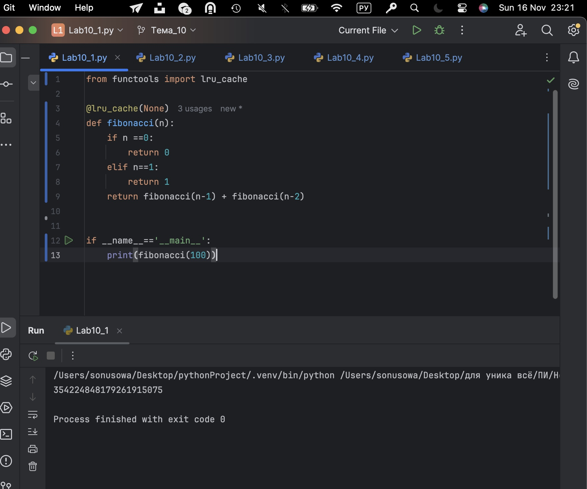
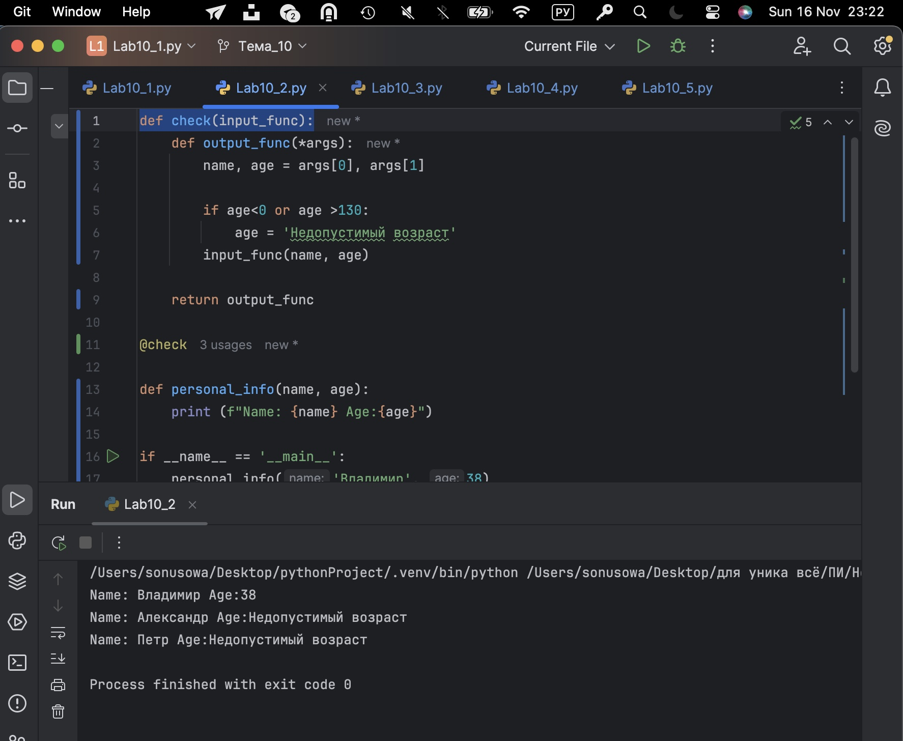
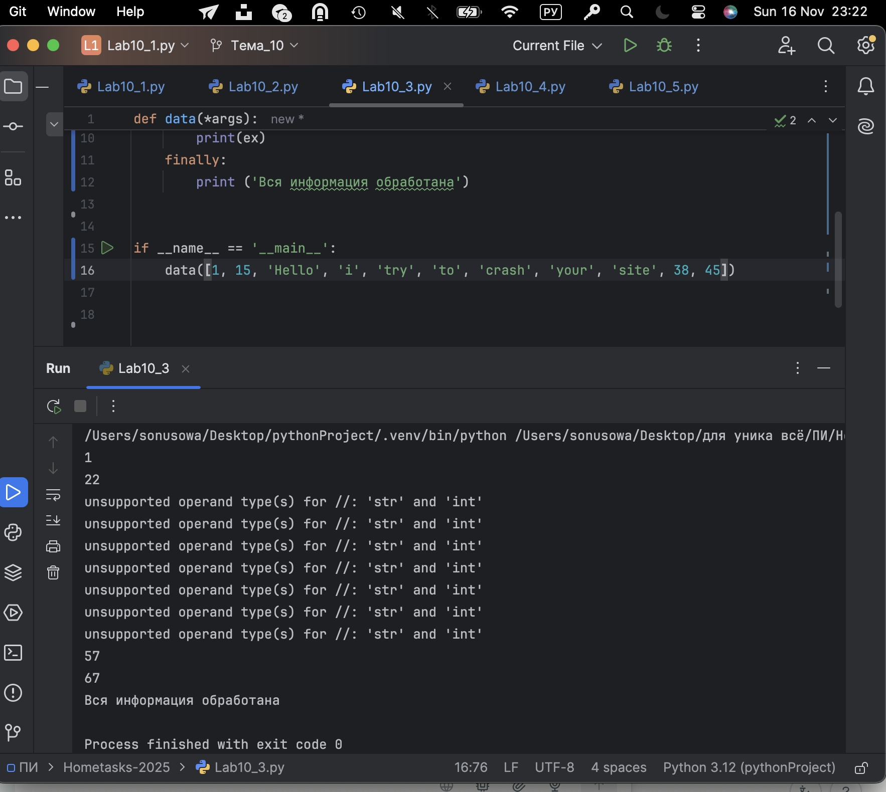
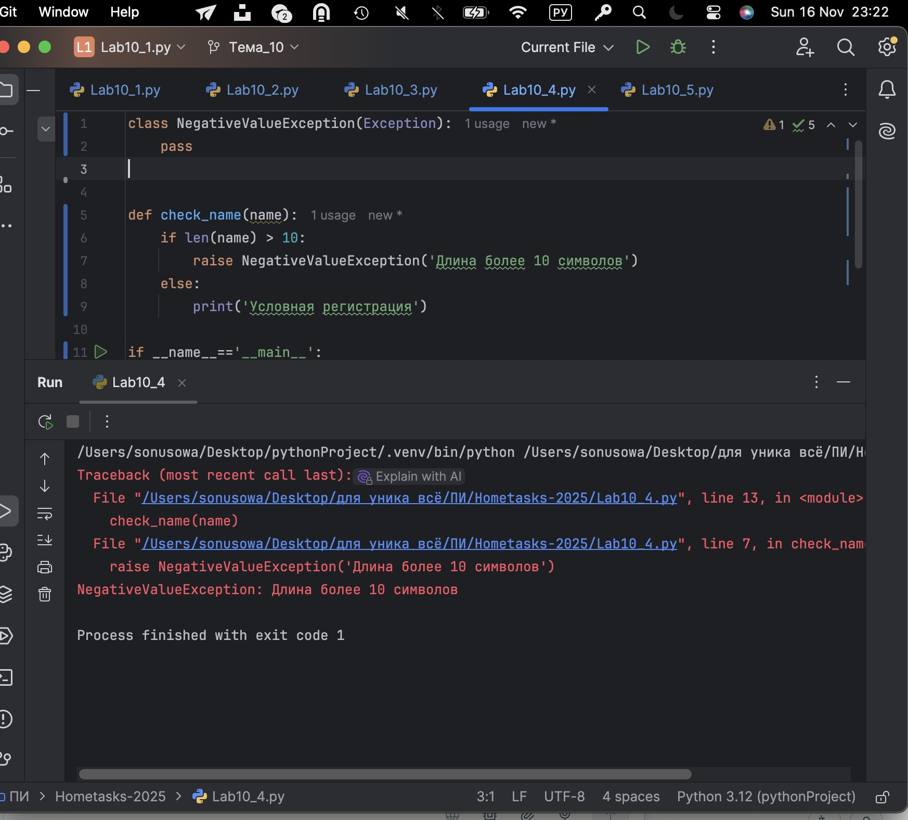
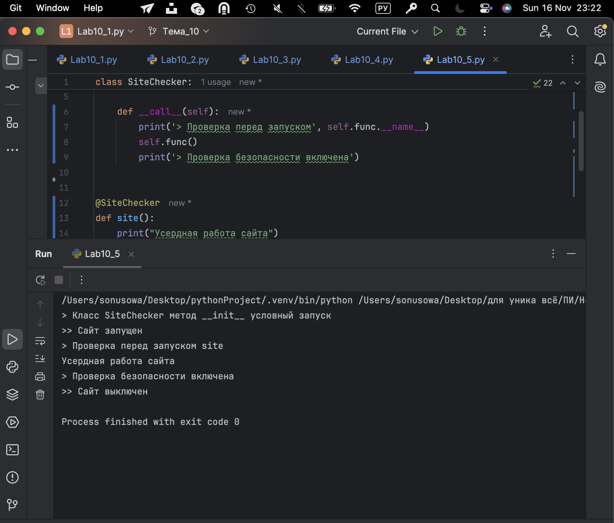
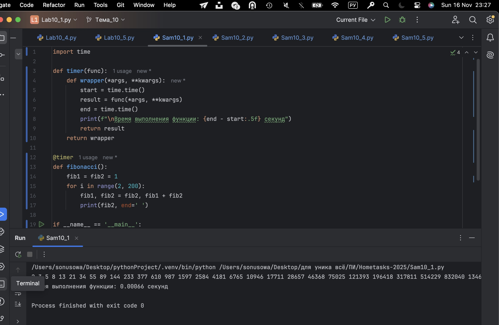
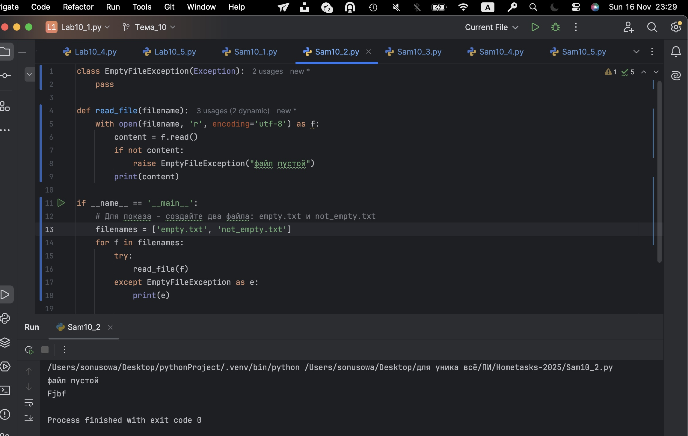
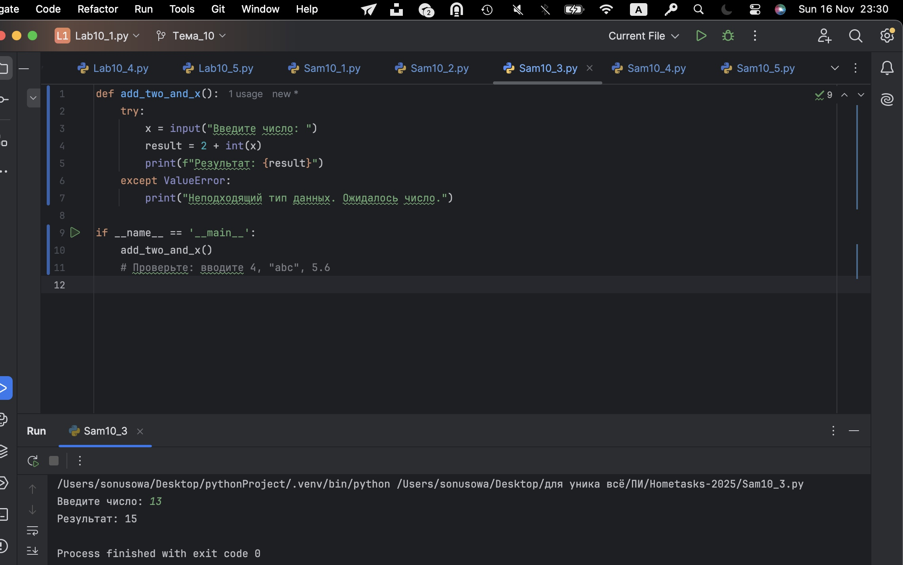
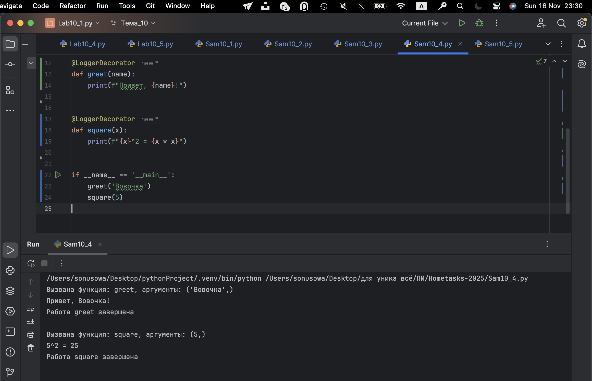
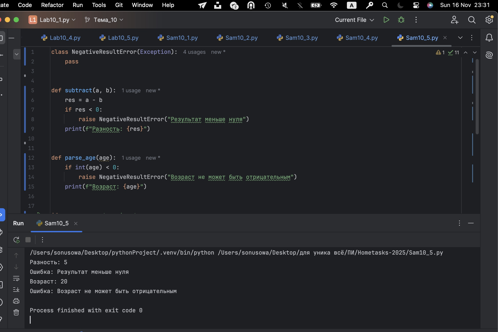

# Тема 10. Декораторы и исключения 
Отчет по Теме #10 выполнил(а):
- Усова Софья Сергеевна
- ИВТ-23-2

| Задание | Лаб_раб | Сам_раб |
| ------ | ------ | ------ |
| Задание 1 | + | + |
| Задание 2 | + | + |
| Задание 3 | + | + |
| Задание 4 | + | + |
| Задание 5 | + | + |

## Лабораторная работа №1
### Наверняка вы думаете, что декораторы – это какая-то бесполезная вещь, которая вам никогда не пригодится, но тут вдруг на паре по математике преподаватель просит всех посчитать число Фибоначчи для 100. Кто-то будет считать вручную (так точно не нужно), кто-то посчитает на калькуляторе, а кто-то подумает, что он самый крутой и напишет рекурсивную программу на Python и немного огорчится, потому что данная программа будет достаточно долго считаться, если ее просто так запускать. Но именно тут к вам на помощь приходят декораторы, например @lru_cache (он предназначен для решения задач динамическим программированием, если простыми словами, то этот декоратор запоминает промежуточные результаты и при рекурсивном вызове функции программа не будет считать одни и те же значения, а просто “возьмёт их из этого декоратора”). Вам нужно написать программу, которая будет считать числа Фибоначчи для 100 и запустить ее без этого декоратора и с ним, посмотреть на разницу во времени решения поставленной задачи. P.S. при запуске без декоратора можете долго не ждать, для наглядности хватит 10 секунд ожидания.


```python
from functools import lru_cache

@lru_cache(None)
def fibonacci(n):
    if n ==0:
        return 0
    elif n==1:
        return 1
    return fibonacci(n-1) + fibonacci(n-2)


if __name__=='__main__':
    print(fibonacci(100))
```
### Результат.


## Выводы

С помощью модуля time было реализовано измерение времени выполнения функции вычисления чисел Фибоначчи. Такой подход демонстрирует, как декораторы служат для удобного измерения производительности и могут применяться универсально ко многим функциям.

## Лабораторная работа №2
### Илья пишет свой сайт и ему необходимо сделать минимальную проверку ввода данных пользователя при регистрации. Для этого он реализовал функцию, которая выводит данные пользователя на экран и решил, что будет проверять правильность введённых данных при помощи декоратора, но в этом ему потребовалась ваша помощь. Напишите декоратор для функции, который будет принимать все параметры вызываемой функции (имя, возраст) и проверять чтобы возраст был больше 0 и меньше 130. Причем заметьте, что неважно сколько пользователь введет данных на сайт к Илье, будут обрабатываться только первые 2 аргумента.


```python
def check(input_func):
    def output_func(*args):
        name, age = args[0], args[1]

        if age<0 or age >130:
            age = 'Недопустимый возраст'
        input_func(name, age)

    return output_func

@check

def personal_info(name, age):
    print (f"Name: {name} Age:{age}")

if __name__ == '__main__':
    personal_info('Владимир', 38)
    personal_info('Александр', -5)
    personal_info('Петр', 138, 15, 48, 2)

```
### Результат.

## Выводы

Показано создание пользовательского исключения для обработки крайних случаев — пустоты файла. Такой прием помогает контролировать поток выполнения программы, предупреждая падение при отсутствии данных, и улучшает читаемость и поддержку кода. Конструкция try/except здесь помогает перехватить исключения и сообщить пользователю о проблеме.

## Лабораторная работа №3
### Вам понравилась идея Ильи с сайтом, и вы решили дальше работать вместе с ним. Но вот в вашем проекте появилась проблема, кто-то пытается сломать вашу функцию с получением данных для сайта. Эта функция работает только с данными integer, а какой-то недохакер пытается все сломать и вместо нужного типа данных отправляет string. Воспользуйтесь исключениями, чтобы неподходящий тип данных не ломал ваш сайт.Также дополнительно можете обернуть весь код функции в try/except/finally для того, чтобы программа вас оповестила о том, что выявлена какая-то ошибка или программа успешно выполнена.

```python
def data(*args):
    try:
        for i in range(len(*args)):
            try:
                result = (args[0][i]*15)//10
                print(result)
            except Exception as ex:
                print(ex)
    except Exception as ex:
        print(ex)
    finally:
        print ('Вся информация обработана')


if __name__ == '__main__':
    data([1, 15, 'Hello', 'i', 'try', 'to', 'crash', 'your', 'site', 38, 45])

```
### Результат.

## Выводы

Иллюстрирует использование стандартных исключений Python и конструкции try/except для безопасной работы с вводом пользователя. Защита кода от ошибок типа данных через обработку ValueError является базовой практикой, гарантирующей, что программа стабильно работает и выдаст понятное сообщение при неправильном вводе.

  
## Лабораторная работа №4
### Продолжая работу над сайтом, вы решили написать собственное исключение, которое будет вызываться в случае, если в функцию проверки имени при регистрации передана строка длиннее десяти символов, а если имя имеет допустимую длину, то в консоль выводиться “Успешная регистрация”

```python
class NegativeValueException(Exception):
    pass


def check_name(name):
    if len(name) > 10:
        raise NegativeValueException('Длина более 10 символов')
    else:
        print('Условная регистрация')

if __name__=='__main__':
    name ="12345678910"
    check_name(name)
```
### Результат.

## Выводы

Пприменяется собственное исключение для валидации входных данных — проверки длины имени. Создание своих классов исключений позволяет лучше структурировать код и логично разграничивать разные виды ошибок, что важно в больших проектах.


## Лабораторная работа №5
### После запуска сайта вы поняли, что вам необходимо добавить логгер, для отслеживания его работы. Готовыми вариантами вы не захотели пользоваться, и поэтому решили создать очень простую пародию. Для этого создали две функции: 		init		() (вызывается при создании класса декоратора в программе) и 	call	() (вызывается при вызове декоратора). Создайте необходимый вам декоратор. Выведите все логи в консоль.

```python
class SiteChecker:
    def __init__(self, func):
        print('> Класс SiteChecker метод __init__ условный запуск')
        self.func = func

    def __call__(self):
        print('> Проверка перед запуском', self.func.__name__)
        self.func()
        print('> Проверка безопасности включена')


@SiteChecker
def site():
    print("Усердная работа сайта")

if __name__=='__main__':
    print('>> Сайт запущен')
    site()  # Здесь вызовется метод __call__ объекта-декоратора SiteChecker
    print('>> Сайт выключен')

```
### Результат.

## Выводы

Демонстрируетсяс класс-декоратор с магическим методом __call__. Такой класс способен как обертка добавлять логи (логгирование вызовов), что полезно для трассировки работы программы, аудита и отладки. Класс-декораторы — мощный расширяемый способ влиять на поведение функций.

## Самостоятельная работа №1
### Вовочка решил заняться спортивным программированием на python, но для этого он должен знать за какое время выполняется его программа. Он решил, что для этого ему идеально подойдет декоратор для функции, который будет выяснять за какое время выполняется та или иная функция. Помогите Вовочке в его начинаниях и напишите такой декоратор.Подсказка: необходимо использовать модуль time Декоратор необходимо использовать для этой функции:


```python
import time

def timer(func):
    def wrapper(*args, **kwargs):
        start = time.time()
        result = func(*args, **kwargs)
        end = time.time()
        print(f"\nВремя выполнения функции: {end - start:.5f} секунд")
        return result
    return wrapper

@timer
def fibonacci():
    fib1 = fib2 = 1
    for i in range(2, 200):
        fib1, fib2 = fib2, fib1 + fib2
        print(fib2, end=' ')

if __name__ == '__main__':
    fibonacci()
```
### Результат.

## Выводы

Реализован декоратор на Python, использующий стандартный модуль time для точного замера длительности выполнения функции. Встроенные функции декоратора позволяют измерить время работы любого участка программы без изменения исходного кода алгоритма. Такой подход универсален, потому что декоратор можно навесить на любую функцию; именно это свойство актуально для спортивного программирования, где важно контролировать производительность решения. Вывод времени на экран происходит автоматически после завершения работы функции, что удобно для анализа эффективности.
  
## Самостоятельная работа №2
### Посмотрев на Вовочку, вы также загорелись идеей спортивного программирования, начав тренировки вы узнали, что для решения некоторых задач необходимо считывать данные из файлов. Но через некоторое время вы столкнулись с проблемой что файлы бывают пустыми, и вы не получаете вводные данные для решения задачи. После этого вы решили не просто считывать данные из файла, а всю конструкцию оборачивать в исключения, чтобы избежать такой проблемы. Создайте пустой файл и файл, в котором есть какая-то информация. Напишите код программы. Если файл пустой, то, нужно вызвать исключение (“бросить исключение”) и вывести в консоль “файл пустой”, а если он не пустой, то вывести информацию из файла.


```python
class EmptyFileException(Exception):
    pass

def read_file(filename):
    with open(filename, 'r', encoding='utf-8') as f:
        content = f.read()
        if not content:
            raise EmptyFileException("файл пустой")
        print(content)

if __name__ == '__main__':
    
    filenames = ['empty.txt', 'not_empty.txt']
    for f in filenames:
        try:
            read_file(f)
        except EmptyFileException as e:
            print(e)

```
### Результат.

## Выводы

Создан свой класс исключения, реализованный через наследование от стандартного Exception. Основная структурная идея — обернуть всё, связанное со чтением файла, в проверку на наличие данных, чтобы избежать дальнейших ошибок программы. Если файл пустой, вызывается и обрабатывается пользовательское исключение с пояснительным сообщением. Такой способ демонстрирует, как программно проверять предварительные условия для дальнейшего решения задачи и грамотно сообщать о проблеме в пользовательском интерфейсе.
  
## Самостоятельная работа №3
### Напишите функцию, которая будет складывать 2 и введенное пользователем число, но если пользователь введет строку или другой неподходящий тип данных, то в консоль выведется ошибка “Неподходящий тип данных. Ожидалось число.”. Реализовать функционал программы необходимо через try/except и подобрать правильный тип исключения. Создавать собственное исключение нельзя. Проведите несколько тестов, в которых исключение вызывается и нет. Результатом выполнения задачи будет листинг кода и получившийся вывод в консоль

```python
def add_two_and_x():
    try:
        x = input("Введите число: ")
        result = 2 + int(x)
        print(f"Результат: {result}")
    except ValueError:
        print("Неподходящий тип данных. Ожидалось число.")

if __name__ == '__main__':
    add_two_and_x()
   

```
### Результат.

## Выводы

Реализовано простое пользовательское взаимодействие с вводом данных и обязательной их проверкой перед арифметической операцией. Здесь используется стандартная конструкция try/except и проверка ValueError — наиболее подходящий тип исключения для проблемы преобразования строки в число. Такой подход гарантирует, что программа работает корректно даже при ошибках ввода, а сообщение об ошибке всегда понятно пользователю. Это хороший пример базовой защиты от некорректных данных, часто возникающей в реальных приложениях.

## Самостоятельная работа №4
### Создайте собственный декоратор, который будет использоваться для двух любых вами придуманных функций. Декораторы, которые использовались ранее в работе нельзя воссоздавать. Результатом выполнения задачи будет: класс декоратора, две как-то связанными с ним функциями, скриншот консоли с выполненной программой и подробные комментарии, которые будут описывать работу вашего кода.

```python
class LoggerDecorator:
    def __init__(self, func):
        self.func = func

    def __call__(self, *args, **kwargs):
        print(f"Вызвана функция: {self.func.__name__}, аргументы: {args}")
        result = self.func(*args, **kwargs)
        print(f"Работа {self.func.__name__} завершена\n")
        return result


@LoggerDecorator
def greet(name):
    print(f"Привет, {name}!")


@LoggerDecorator
def square(x):
    print(f"{x}^2 = {x * x}")


if __name__ == '__main__':
    greet('Вовочка')
    square(5)
```
### Результат.

## Выводы

Применяется собственный класс-декоратор, который используется для двух разных, но связанных функций. Этот декоратор реализован как полноценный класс с методом call, что позволяет добавлять к функциям дополнительное поведение при их вызове: например, фиксировать имена функций, аргументы и выводить сообщения до и после выполнения. Такой способ помогает реализовать расширяемое логирование или аудит действий, а также применять декоратор к множеству функций с общим дополнительным поведением без дублирования кода.
  
## Самостоятельная работа №5
### Создайте собственное исключение, которое будет использоваться в двух любых фрагментах кода. Исключения, которые использовались ранее в работе нельзя воссоздавать. Результатом выполнения задачи будет: класс исключения, код к котором в двух местах используется это исключение, скриншот консоли с выполненной программой и подробные комментарии, которые будут описывать работу вашего кода.

```python
class LoggerDecorator:
    def __init__(self, func):
        self.func = func

    def __call__(self, *args, **kwargs):
        print(f"Вызвана функция: {self.func.__name__}, аргументы: {args}")
        result = self.func(*args, **kwargs)
        print(f"Работа {self.func.__name__} завершена\n")
        return result


@LoggerDecorator
def greet(name):
    print(f"Привет, {name}!")


@LoggerDecorator
def square(x):
    print(f"{x}^2 = {x * x}")


if __name__ == '__main__':
    greet('Вовочка')
    square(5)

```
### Результат.

## Выводы

Показывает пример использования собственного исключения сразу в двух разных местах программы. Новый класс исключения создается в соответствии с практиками ООП и исключений Python, а затем используется для обработки различных ситуаций — например, отрицательного результата математической операции и некорректного пользовательского ввода. Такой подход помогает структурировать обработку ошибок и делает код более читаемым и сопровождаемым, потому что все связанные ошибки централизованы через один класс исключения, и обработка становится предсказуемой и надёжной.

## Общие выводы по теме

Задания демонстрируют базовые и важные подходы к эффективному программированию на Python, которые востребованы как в спортивном программировании, так и в профессиональной разработке. Ключевые идеи — умение использовать декораторы для решения типовых задач (например, замер времени работы функции), грамотная организация структуры кода через классы и исключения, а также навык корректной работы с пользовательским вводом и файлами. Все рассмотренные методы (декораторы, обработка типовых и пользовательских исключений, классы-функторы, обработка ошибок при работе с файлами и пользовательским вводом) объединяет принцип надежности, читаемости и расширяемости кода, который лежит в основе современного Python. Эти приемы помогают не только решать задачи быстрее и безопасней, но и организовать переносимый и удобный для сопровождения программный продукт, независимо от его масштаба и области применения.


