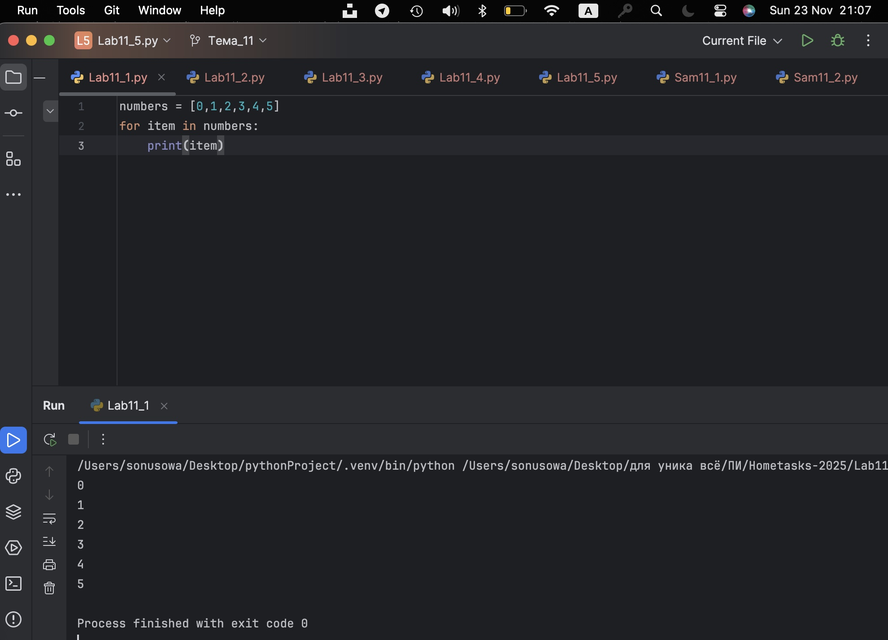
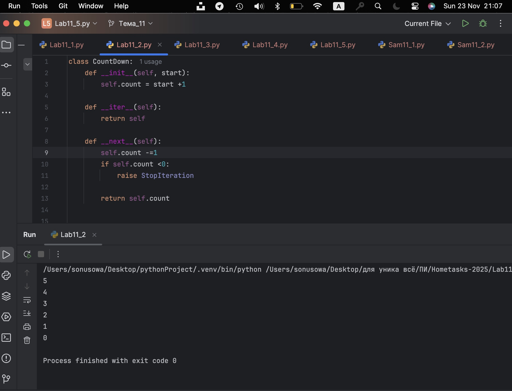
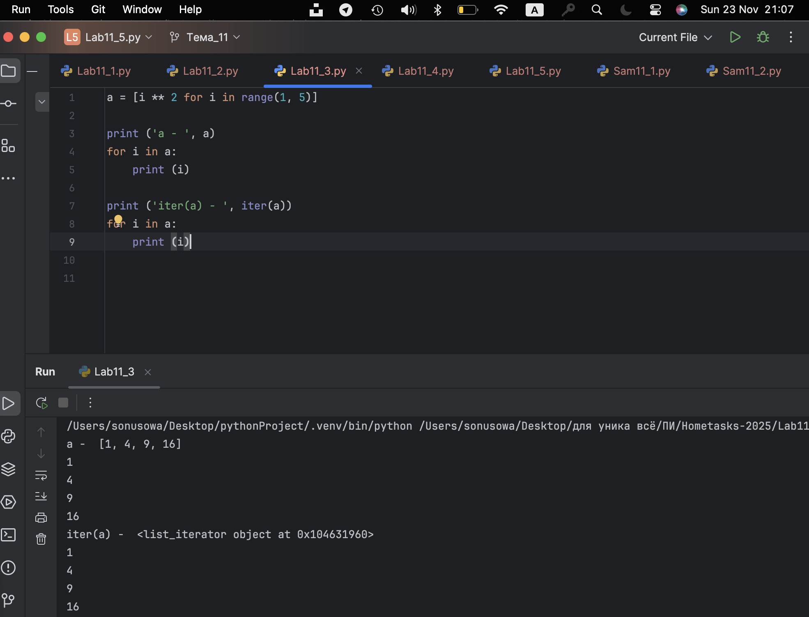
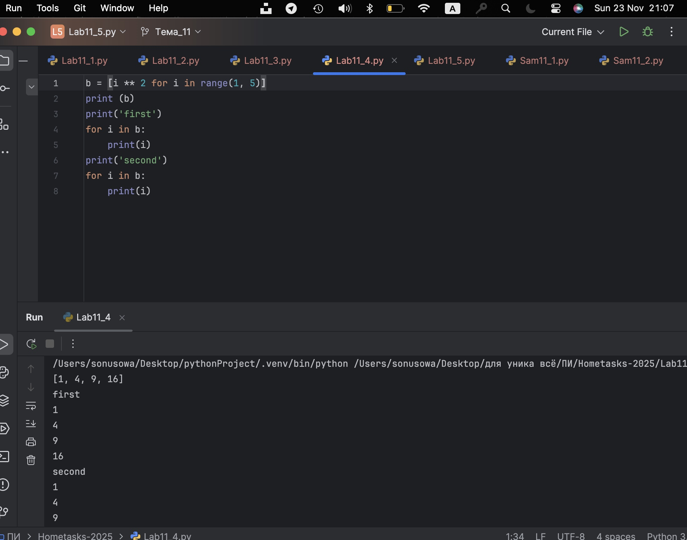
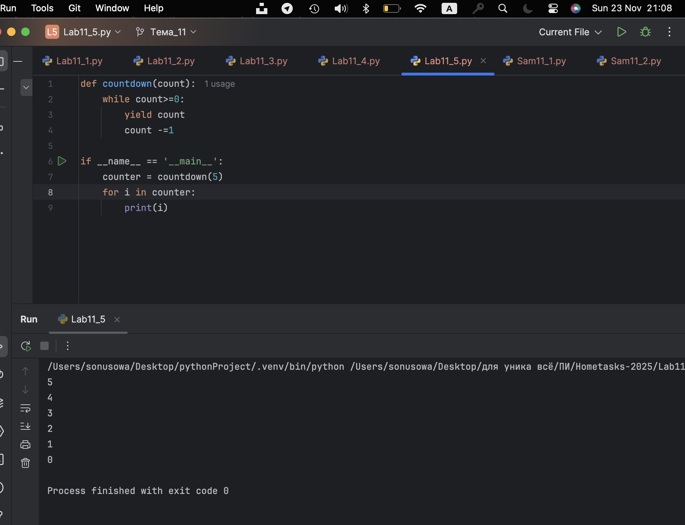
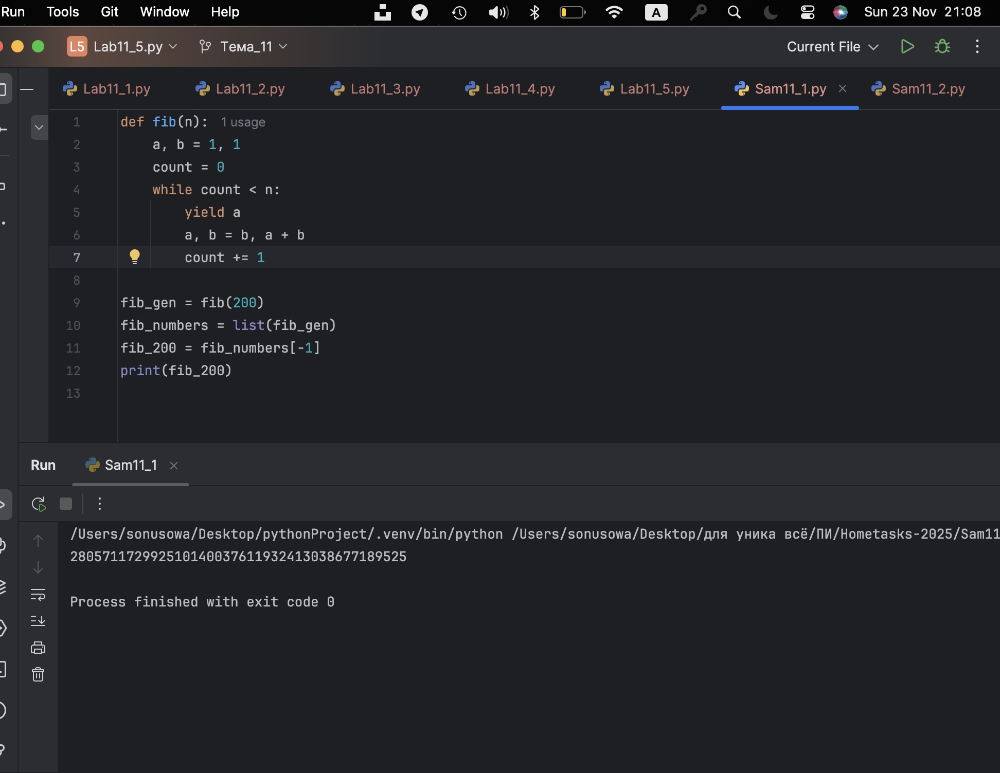
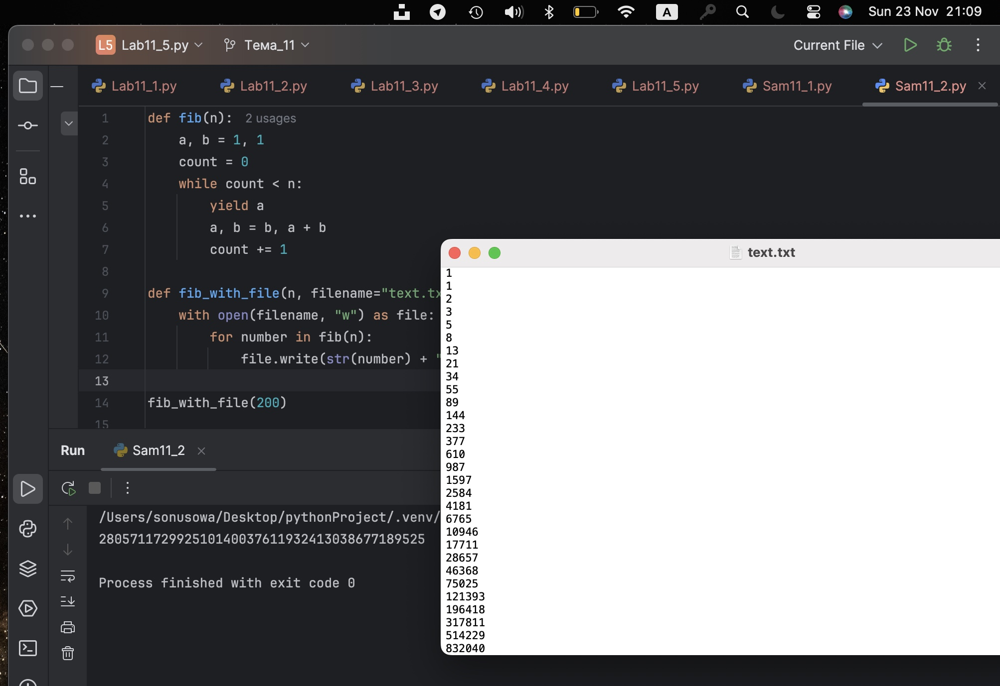

# Тема 11. Итераторы и генераторы
Отчет по Теме #11 выполнил(а):
- Усова Софья Сергеевна
- ИВТ-23-2

| Задание | Лаб_раб | Сам_раб |
| ------ | ------ | ------ |
| Задание 1 | + | + |
| Задание 2 | + | + |
| Задание 3 | + |  |
| Задание 4 | + |  |
| Задание 5 | + |  |

## Лабораторная работа №1
### Простой итератор, но у него нет гибкой настройки, например его нельзя развернуть. Он работает просто как next(), но нет prev()

```python
numbers = [0,1,2,3,4,5]
for item in numbers:
    print(item)
```
### Результат.


## Выводы

Демонстрируется базовый подход к итерации по списку с использованием встроенного механизма Python — цикла for. Здесь нет реализации собственного итератора, и возможности гибкого управления, например, возврата к предыдущему элементу, отсутствуют. Код просто проходит по элементам списка по очереди, используя внутренний итератор, который поддерживает последовательное чтение с помощью метода next() до исчерпания элементов. Такой способ прост и прозрачен, но не расширяем и не настраиваем для нестандартных последовательностей.

## Лабораторная работа №2
### Класс итератор с гибкой настройкой и удобными применением

```python
class CountDown:
    def __init__(self, start):
        self.count = start +1

    def __iter__(self):
        return self

    def __next__(self):
        self.count -=1
        if self.count <0:
            raise StopIteration

        return self.count


if __name__ == '__main__':
    counter = CountDown(5)
    for i in counter:
        print(i)

```
### Результат.

## Выводы

Реализуется собственный класс итератора с методами iter и next. Это позволяет создать настраиваемый объект, который считает назад от заданного числа до нуля, выдавая очередное значение при каждом вызове next(). Важным моментом является генерация исключения StopIteration по окончании последовательности, что сигнализирует циклу for о завершении. Такой итератор более гибкий, чем простой список, и может хранить внутреннее состояние, контролировать порядок и логику итерации, но не умеет двигаться назад.

## Лабораторная работа №3
### Генератор списка

```python
a = [i ** 2 for i in range(1, 5)]

print ('a - ', a)
for i in a:
    print (i)

print ('iter(a) - ', iter(a))
for i in a:
    print (i)

```
### Результат.

## Выводы

Показывается генерацию списка с помощью спискового включения (list comprehension), который создает список квадратов чисел. Итерация здесь идет по уже собранному списку, что требует выделения памяти под все значения сразу. Это удобно и компактно на Python, но в отличие от генераторов не обладает ленивой генерацией, то есть все элементы создаются заранее, что менее эффективно при больших объемах данных.

  
## Лабораторная работа №4
### Выражения генераторы

```python
b = [i ** 2 for i in range(1, 5)]
print (b)
print('first')
for i in b:
    print(i)
print('second')
for i in b:
    print(i)
```
### Результат.

## Выводы

Используется генераторные выражения, которые напоминают списковые включения, но создают генератор — объект, который генерирует значения «на лету» по мере итерации. Это позволяет экономить память и работать с потенциально бесконечными последовательностями. При повторном обходе генератор «исчерпывается», поэтому нужно создать новый для повторного использования.

## Лабораторная работа №5
### Такой же счетчик, как и в первом задании, только это генератор и использует yield

```python
def countdown(count):
    while count>=0:
        yield count
        count -=1

if __name__ == '__main__':
    counter = countdown(5)
    for i in counter:
        print(i)
```
### Результат.

## Выводы

Демонстрируется генератор на основе функции с ключевым словом yield для обратного счета. Такой генератор сочетает компактность кода и низкие затраты памяти, так как значения вычисляются и выдаются по запросу, без хранения всей последовательности сразу. Генераторы при этом поддерживают итерацию через обычный цикл for и автоматически бросают StopIteration при завершении.

## Самостоятельная работа №1
### Вас никак не могут оставить числа Фибоначчи, очень уж они вас заинтересовали. Изучив новые возможности Python вы решили реализовать программу, которая считает числа Фибоначчи при помощи итераторов. Расчет начинается с чисел 1 и 1. Создайте функцию fib(n), генерирующую n чисел Фибоначчи с минимальными затратами ресурсов. Для реализации этой функции потребуется обратиться к инструкции yield (Она не сохраняет в оперативной памяти огромную последовательность, а дает возможность “доставать” промежуточные результаты по одному). Результатом решения задачи будет листинг кода и вывод в консоль с числом Фибоначчи от 200.

```python
def fib(n):
    a, b = 1, 1
    count = 0
    while count < n:
        yield a
        a, b = b, a + b
        count += 1

fib_gen = fib(200)
fib_numbers = list(fib_gen)
fib_200 = fib_numbers[-1]
print(fib_200)

```
### Результат.

## Выводы

Генерация чисел Фибоначчи с помощью итераторов, базируется на методе создания генератора с использованием ключевого слова yield. Такой подход позволяет не сохранять всю последовательность чисел сразу в оперативной памяти, что существенно экономит ресурсы при работе с большими объемами данных. Итератор формирует числа последовательно, отдавая каждое по одному при запросе, благодаря чему можно получить любое количество членов последовательности без необходимости предварительного хранения всех чисел. Это подходит для генерации, например, 200-го числа Фибоначчи. Такой способ эффективен, прост в реализации и оптимален по потреблению памяти.
  
## Самостоятельная работа №2
### К коду предыдущей задачи добавьте запоминание каждого числа Фибоначчи в файл “fib.txt”, при этом каждое число должно находиться на отдельной строчке. Результатом выполнения задачи будет листинг кода и скриншот получившегося файла

```python
def fib(n):
    a, b = 1, 1
    count = 0
    while count < n:
        yield a
        a, b = b, a + b
        count += 1

def fib_with_file(n, filename="text.txt"):
    with open(filename, "w") as file:
        for number in fib(n):
            file.write(str(number) + "\n")

fib_with_file(200)


fib_gen = fib(200)
fib_numbers = list(fib_gen)
print(fib_numbers[-1])  

```
### Результат.

## Выводы

Добавлена возможность записи каждого сгенерированного числа в текстовый файл, где каждое число находится на отдельной строке. При генерации чисел Фибоначчи здесь также применяется итератор с yield, а каждое число по мере генерации записывается в файл поочередно. Это позволяет не только получить последовательность чисел "на лету", но и сохранить их в файл без необходимости держать всю последовательность в памяти одновременно. Такой прием хранения данных удобен для дальнейшей работы или анализа вне программы. Задача демонстрирует прикладное использование генераторов с файловыми операциями для эффективной обработки больших серий числовых данных.

## Общие выводы по теме

Знания и навыки, сформированные в ходе самостоятельных и лабораторных работ, дают глубокое понимание итерационного протокола Python и мощных инструментов генераторов, что позволяет создавать эффективные, масштабируемые и простые для сопровождения решения для обхода и обработки больших данных, потоков, последовательностей и алгоритмически определяемых множеств данных с минимальными затратами памяти и кода. Генераторы считаются современной и предпочтительной практикой в большинстве сценариев, благодаря их лаконичности и эффективности. Итераторы же остаются фундаментальной концепцией, без которой невозможно понять работу генераторов и итераций в Python в целом


