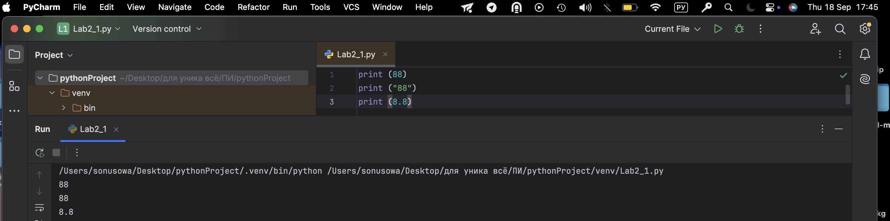
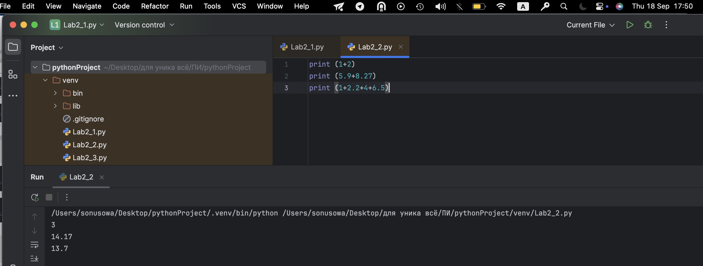
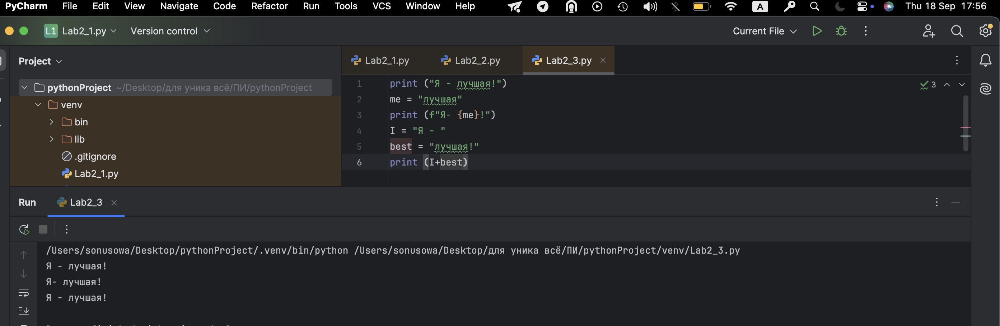
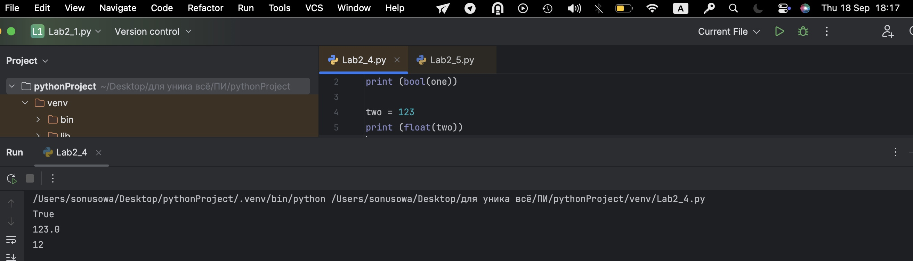
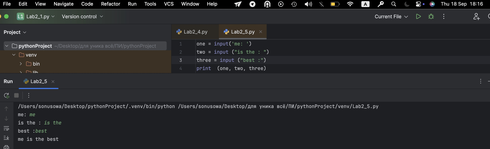
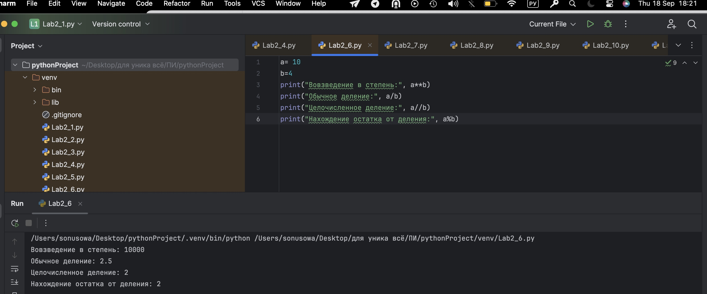
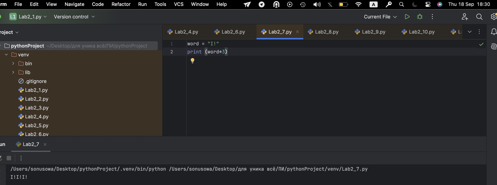
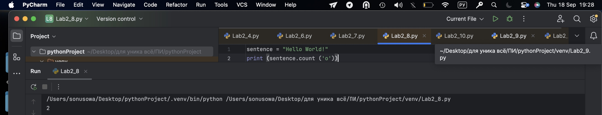
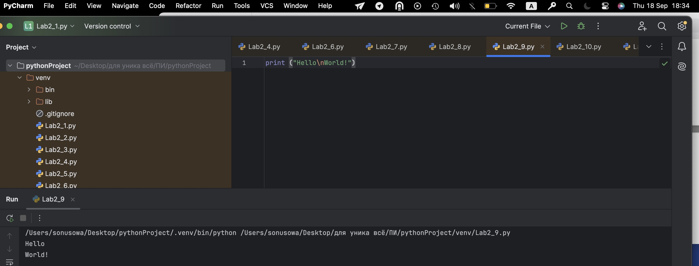
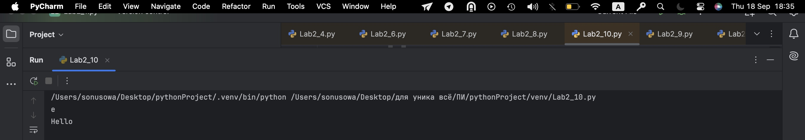

# Тема 2. Базовые операции языка Python
Отчет по Теме #2 выполнил(а):
- Усова Софья Сергеевна
- ИВТ-23-3

| Задание | Лаб_раб | Сам_раб |
| ------ | ------ | ------ |
| Задание 1 | + | + |
| Задание 2 | + | + |
| Задание 3 | + | + |
| Задание 4 | + | + |
| Задание 5 | + | + |
| Задание 6 | + | + |
| Задание 7 | + | + |
| Задание 8 | + | - |
| Задание 9 | + | + |
| Задание 10 | + | + |

знак "+" - задание выполнено; знак "-" - задание не выполнено;

Работу проверили:
- к.э.н., доцент Панов М.А.

## Лабораторная работа №1
### Выведите в консоль три строки. Первая – любое число. Вторая – любое число в виде строки. Третья – любое число с плавающей точкой.

```python
print (88)
print ("88")
print (8.8)
```
### Результат.


## Выводы

В данном коде выводятся три строки с использованием функции `print()`. Каждая строка содержит разные значения:

1. `print(123)`: Выводится целое число 123. Это число не взаимодействует со строковыми операциями и выводится как есть.

2. `print('123')`: Выводится строка '123', так как она заключена в одинарные кавычки. В этом случае это текстовая строка, а не число.

3. `print(1.23)`: Выводится число с плавающей точкой 1.23. Так же, как и в первом случае, оно выводится как числовое значение.

## Лабораторная работа №2
### Выведите в консоль три строки. Первая – результат сложения или вычитания минимум двух переменных типа int. Вторая – результат сложения или вычитания минимум двух переменных типа float. Третья – результат сложения или вычитания минимум двух переменных типа int и float.
```python
print (1+2)
print (5.9+8.27)
print (1+2.2+4+6.5)
```
### Результат.

## Выводы

В данном коде выводятся три строки с использованием функции `print()`. Каждая строка содержит разные значения:

1. `print(123)`: Выводится целое число 123. Это число не взаимодействует со строковыми операциями и выводится как есть.

2. `print('123')`: Выводится строка '123', так как она заключена в одинарные кавычки. В этом случае это текстовая строка, а не число.

3. `print(1.23)`: Выводится число с плавающей точкой 1.23. Так же, как и в первом случае, оно выводится как числовое значение

## Лабораторная работа №3
### Выведите в консоль три строки. Первая – обычная строка. Вторая – F строка с использованием заранее объявленной переменной. Третья – сложите две или более строк в одну.
```python
print ("Я - лучшая!")
me = "лучшая"
print (f"Я- {me}!")
I = "Я - "
best = "лучшая!"
print (I+best)
```
### Результат.

## Выводы

В данном коде выводятся три строки с использованием функции `print()`. Каждая строка содержит разные значения:

1. `print(123)`: Выводится целое число 123. Это число не взаимодействует со строковыми операциями и выводится как есть.

2. `print('123')`: Выводится строка '123', так как она заключена в одинарные кавычки. В этом случае это текстовая строка, а не число.

3. `print(1.23)`: Выводится число с плавающей точкой 1.23. Так же, как и в первом случае, оно выводится как числовое значение
  
## Лабораторная работа №4
### Выведите в консоль три строки. Первая – трансформация любого типа переменной в bool. Вторая – трансформация любого типа переменной в float или int. Третья – трансформация любого типа переменной в str.
```python
one = "me"
print (bool(one))
two = 123
print (float(two))
three = 12
print (str(three))
```
### Результат.

## Выводы

В данном коде выводятся три строки с использованием функции `print()`. Каждая строка содержит разные значения:

1. `print(123)`: Выводится целое число 123. Это число не взаимодействует со строковыми операциями и выводится как есть.

2. `print('123')`: Выводится строка '123', так как она заключена в одинарные кавычки. В этом случае это текстовая строка, а не число.

3. `print(1.23)`: Выводится число с плавающей точкой 1.23. Так же, как и в первом случае, оно выводится как числовое значение

## Лабораторная работа №5
### Присвойте трем переменным различные значения, воспользовавшись функцией input().

```python
one = input('me: ')
two = input ("is the : ")
three = input ("best :")
print  (one, two, three)
```
### Результат.

## Выводы

В данном коде выводятся три строки с использованием функции `print()`. Каждая строка содержит разные значения:

1. `print(123)`: Выводится целое число 123. Это число не взаимодействует со строковыми операциями и выводится как есть.

2. `print('123')`: Выводится строка '123', так как она заключена в одинарные кавычки. В этом случае это текстовая строка, а не число.

3. `print(1.23)`: Выводится число с плавающей точкой 1.23. Так же, как и в первом случае, оно выводится как числовое значение

## Лабораторная работа №6
### Создайте две любые числовые переменные и выполните над ними несколько математических операций: возведение в степень, обычное деление, целочисленное деление, нахождение остатка от деления. При желании вы можете проверить как работают эти вычисления с разными типами данных, например, сначала создать две переменные int, затем создать две переменные float и наконец создать переменные типа int и float и провести над ними операции, прописанные выше.
```python
a= 10
b=4
print("Вовзведение в степень:", a**b)
print("Обычное деление:", a/b)
print("Целочисленное деление:", a//b)
print("Нахождение остатка от деления:", a%b)
```
### Результат.

## Выводы

В данном коде выводятся три строки с использованием функции `print()`. Каждая строка содержит разные значения:

1. `print(123)`: Выводится целое число 123. Это число не взаимодействует со строковыми операциями и выводится как есть.

2. `print('123')`: Выводится строка '123', так как она заключена в одинарные кавычки. В этом случае это текстовая строка, а не число.

3. `print(1.23)`: Выводится число с плавающей точкой 1.23. Так же, как и в первом случае, оно выводится как числовое значение


## Лабораторная работа №7
### Создайте любую строковую переменную и произведите над ней математическое действие умножение на любое число.
```python
word = "I!"
print (word*3)
```
### Результат.

## Выводы

В данном коде выводятся три строки с использованием функции `print()`. Каждая строка содержит разные значения:

1. `print(123)`: Выводится целое число 123. Это число не взаимодействует со строковыми операциями и выводится как есть.

2. `print('123')`: Выводится строка '123', так как она заключена в одинарные кавычки. В этом случае это текстовая строка, а не число.

3. `print(1.23)`: Выводится число с плавающей точкой 1.23. Так же, как и в первом случае, оно выводится как числовое значение

## Лабораторная работа №8
### Посчитайте сколько раз символ ‘o’ встречается в строке ‘Hello World’.
```python
sentence = "Hello World!"
print (sentence.count ('o'))
```
### Результат.

## Выводы

В данном коде выводятся три строки с использованием функции `print()`. Каждая строка содержит разные значения:

1. `print(123)`: Выводится целое число 123. Это число не взаимодействует со строковыми операциями и выводится как есть.

2. `print('123')`: Выводится строка '123', так как она заключена в одинарные кавычки. В этом случае это текстовая строка, а не число.

3. `print(1.23)`: Выводится число с плавающей точкой 1.23. Так же, как и в первом случае, оно выводится как числовое значение

## Лабораторная работа №9
### Напишите предложение ‘Hello World’ в две строки. Написанная программа должна занимать одну строку в редакторе кода.
```python
print ("Hello\nWorld!")
```
### Результат.

## Выводы

В данном коде выводятся три строки с использованием функции `print()`. Каждая строка содержит разные значения:

1. `print(123)`: Выводится целое число 123. Это число не взаимодействует со строковыми операциями и выводится как есть.

2. `print('123')`: Выводится строка '123', так как она заключена в одинарные кавычки. В этом случае это текстовая строка, а не число.

3. `print(1.23)`: Выводится число с плавающей точкой 1.23. Так же, как и в первом случае, оно выводится как числовое значение


## Лабораторная работа №10
### Из предложения ‘Hello World’ выведите в консоль только 2 символ, а затем выведите слово ‘Hello’
```python
sentence = "Hello World!"
print  (sentence[1])
print  (sentence[:5])
```
### Результат.

## Выводы

В данном коде выводятся три строки с использованием функции `print()`. Каждая строка содержит разные значения:

1. `print(123)`: Выводится целое число 123. Это число не взаимодействует со строковыми операциями и выводится как есть.

2. `print('123')`: Выводится строка '123', так как она заключена в одинарные кавычки. В этом случае это текстовая строка, а не число.

3. `print(1.23)`: Выводится число с плавающей точкой 1.23. Так же, как и в первом случае, оно выводится как числовое значение

## Самостоятельная работа №1
### Выведите в консоль булевую переменную False, не используя слово False в строке или изначально присвоенную булевую переменную. Программа должна занимать не более двух строк редактора кода.
```python
sentence = "Hello World!"
print  (sentence[1])
print  (sentence[:5])
```
### Результат.

## Выводы

В данном коде выводятся три строки с использованием функции `print()`. Каждая строка содержит разные значения:

1. `print(123)`: Выводится целое число 123. Это число не взаимодействует со строковыми операциями и выводится как есть.

2. `print('123')`: Выводится строка '123', так как она заключена в одинарные кавычки. В этом случае это текстовая строка, а не число.

3. `print(1.23)`: Выводится число с плавающей точкой 1.23. Так же, как и в первом случае, оно выводится как числовое значение
  
## Самостоятельная работа №2
### Присвоить значения трем переменным и вывести их в консоль, используя только две строки редактора кода
```python
sentence = "Hello World!"
print  (sentence[1])
print  (sentence[:5])
```
### Результат.

## Выводы

В данном коде выводятся три строки с использованием функции `print()`. Каждая строка содержит разные значения:

1. `print(123)`: Выводится целое число 123. Это число не взаимодействует со строковыми операциями и выводится как есть.

2. `print('123')`: Выводится строка '123', так как она заключена в одинарные кавычки. В этом случае это текстовая строка, а не число.

3. `print(1.23)`: Выводится число с плавающей точкой 1.23. Так же, как и в первом случае, оно выводится как числовое значение
  
## Самостоятельная работа №3
### Реализуйте ввод данных в программу, через консоль, в виде только целых чисел (тип данных int). То есть при вводе буквенных символов в консоль, программа не должна работать. Программа должна занимать не более двух строк редактора кода.
sentence = "Hello World!"
print  (sentence[1])
print  (sentence[:5])
```
### Результат.

## Выводы

В данном коде выводятся три строки с использованием функции `print()`. Каждая строка содержит разные значения:

1. `print(123)`: Выводится целое число 123. Это число не взаимодействует со строковыми операциями и выводится как есть.

2. `print('123')`: Выводится строка '123', так как она заключена в одинарные кавычки. В этом случае это текстовая строка, а не число.

3. `print(1.23)`: Выводится число с плавающей точкой 1.23. Так же, как и в первом случае, оно выводится как числовое значение
- Текст задания
- Оформленный код
- Скрины консоли
- Развернутый вывод
  
## Самостоятельная работа №4
### Создайте только одну строковую переменную. Длина строки должна не превышать 5 символов. На выходе мы должны получить строку длиной не менее 16 символов. Программа должна занимать не более двух строк редактора кода.
sentence = "Hello World!"
print  (sentence[1])
print  (sentence[:5])
```
### Результат.

## Выводы

В данном коде выводятся три строки с использованием функции `print()`. Каждая строка содержит разные значения:

1. `print(123)`: Выводится целое число 123. Это число не взаимодействует со строковыми операциями и выводится как есть.

2. `print('123')`: Выводится строка '123', так как она заключена в одинарные кавычки. В этом случае это текстовая строка, а не число.

3. `print(1.23)`: Выводится число с плавающей точкой 1.23. Так же, как и в первом случае, оно выводится как числовое значение
- Текст задания
- Оформленный код
- Скрины консоли
- Развернутый вывод
  
## Самостоятельная работа №5
- Текст задания
- Оформленный код
- Скрины консоли
- Развернутый вывод
  
## Самостоятельная работа №6
- Текст задания
- Оформленный код
- Скрины консоли
- Развернутый вывод
  
## Самостоятельная работа №7
- Текст задания
- Оформленный код
- Скрины консоли
- Развернутый вывод
  
## Самостоятельная работа №8
- Текст задания
- Оформленный код
- Скрины консоли
- Развернутый вывод
  
## Самостоятельная работа №9
- Текст задания
- Оформленный код
- Скрины консоли
- Развернутый вывод
  
## Самостоятельная работа №10
- Текст задания
- Оформленный код
- Скрины консоли
- Развернутый вывод

## Общие выводы по теме
- Развернутый вывод
