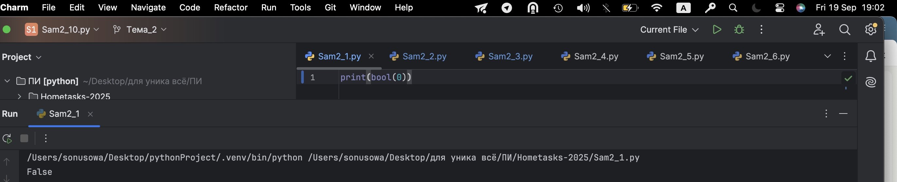
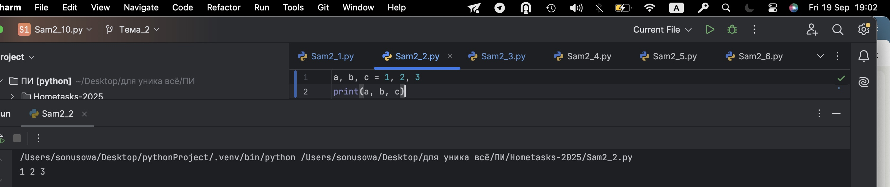
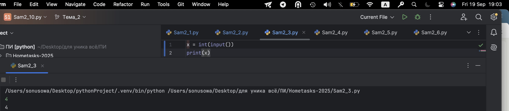
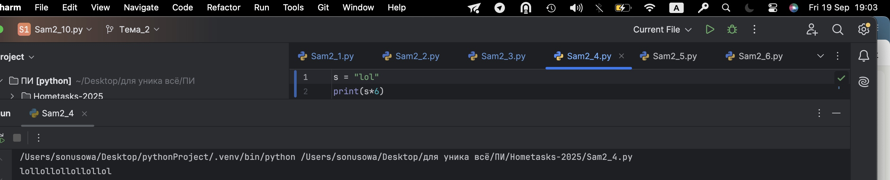
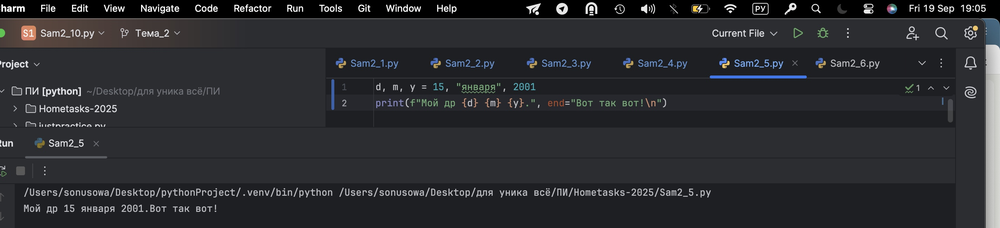
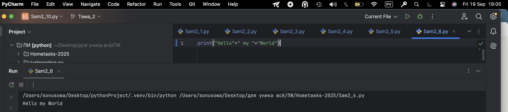
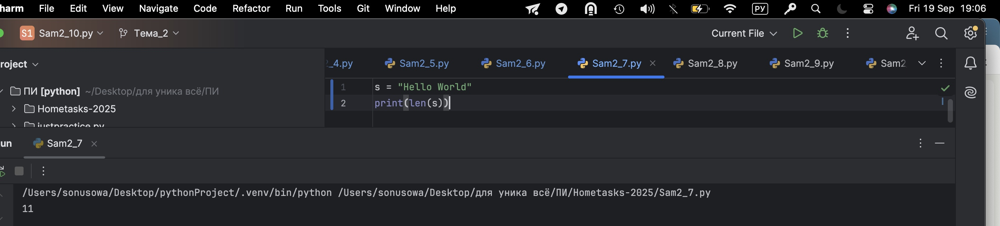
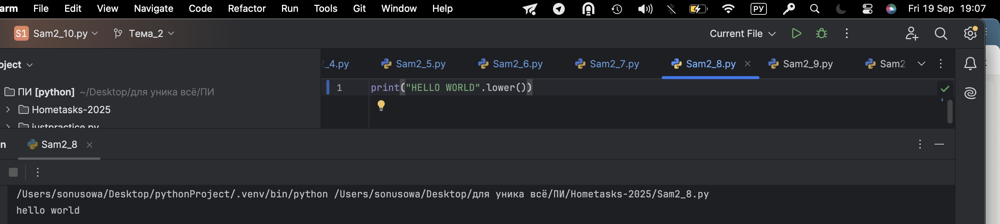
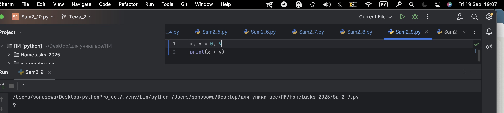
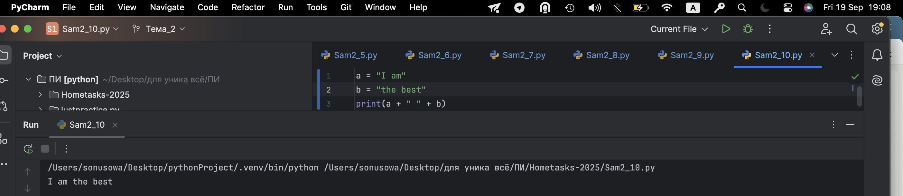

# Тема 2. Базовые операции языка Python
Отчет по Теме #2 выполнил(а):
- Усова Софья Сергеевна
- ИВТ-23-3

| Задание | Лаб_раб | Сам_раб |
| ------ | ------ | ------ |
| Задание 1 | + | + |
| Задание 2 | + | + |
| Задание 3 | + | + |
| Задание 4 | + | + |
| Задание 5 | + | + |
| Задание 6 | + | + |
| Задание 7 | + | + |
| Задание 8 | + | + |
| Задание 9 | + | + |
| Задание 10 | + | + |

## Лабораторная работа №1
### Выведите в консоль три строки. Первая – любое число. Вторая – любое число в виде строки. Третья – любое число с плавающей точкой.

```python
print (88)
print ("88")
print (8.8)
```
### Результат.


## Выводы

В данном коде выводятся три строки с использованием функции `print()`. Каждая строка содержит разные значения:

1. `print(88)`: Выводится целое число 88. Это число не взаимодействует со строковыми операциями и выводится как есть.

2. `print("88")`: Выводится строка "88", так как она заключена в одинарные кавычки. В этом случае это текстовая строка, а не число.

3. `print(8.8)`: Выводится число с плавающей точкой 8.8. Так же, как и в первом случае, оно выводится как числовое значение.

## Лабораторная работа №2
### Выведите в консоль три строки. Первая – результат сложения или вычитания минимум двух переменных типа int. Вторая – результат сложения или вычитания минимум двух переменных типа float. Третья – результат сложения или вычитания минимум двух переменных типа int и float.
```python
print (1+2)
print (5.9+8.27)
print (1+2.2+4+6.5)
```
### Результат.

## Выводы

В этом коде выводятся результаты арифметических операций с переменными типов int и float:

1. 'print(1+2)' : Выводится сумма двух целых чисел 1 и 2, результат — 3.

2. 'print(5.9+8.27)' : Выводится разность двух чисел с плавающей точкой, результат — 14.17.

3. 'print(1+2.2+4+6.5)' : Выводится сумма нескольких чисел, результат — 13.7.

## Лабораторная работа №3
### Выведите в консоль три строки. Первая – обычная строка. Вторая – F строка с использованием заранее объявленной переменной. Третья – сложите две или более строк в одну.
```python
print ("Я - лучшая!")
me = "лучшая"
print (f"Я- {me}!")
I = "Я - "
best = "лучшая!"
print (I+best)
```
### Результат.

## Выводы

В этом коде выводятся строки и их объединение:

1. 'print("Я - лучшая!")' : Выводится простая строка.

2. 'print(f"Я- {me}!")' : Используется f-строка, в результате выводится та же фраза с вставленной переменной
me.

3. 'print(I+best)' : Конкатенация строк, результат — Я - лучшая!.
  
## Лабораторная работа №4
### Выведите в консоль три строки. Первая – трансформация любого типа переменной в bool. Вторая – трансформация любого типа переменной в float или int. Третья – трансформация любого типа переменной в str.
```python
one = "me"
print (bool(one))
two = 123
print (float(two))
three = 12
print (str(three))
```
### Результат.

## Выводы

В этом коде происходит преобразование типов переменных:

1. 'print(bool(me))' : Преобразование строки 'Why' в булевое значение — True.

2. 'print(float(two))' : Преобразование числа 123 в число с плавающей точкой — 123.0.

3. 'print(str(three))' : Преобразование 12 в строку — '12'.

## Лабораторная работа №5
### Присвойте трем переменным различные значения, воспользовавшись функцией input().

```python
one = input('me: ')
two = input ("is the : ")
three = input ("best :")
print  (one, two, three)
```
### Результат.

## Выводы

1. В этом коде пользователь вводит значения, и они выводятся в одной строке через пробел.

## Лабораторная работа №6
### Создайте две любые числовые переменные и выполните над ними несколько математических операций: возведение в степень, обычное деление, целочисленное деление, нахождение остатка от деления. При желании вы можете проверить как работают эти вычисления с разными типами данных, например, сначала создать две переменные int, затем создать две переменные float и наконец создать переменные типа int и float и провести над ними операции, прописанные выше.
```python
a= 10
b=4
print("Вовзведение в степень:", a**b)
print("Обычное деление:", a/b)
print("Целочисленное деление:", a//b)
print("Нахождение остатка от деления:", a%b)
```
### Результат.

## Выводы

В этом коде выполняются математические операции над переменными x и y :

1. Возведение a в степень y: результат — 10000.

2. Обычное деление: результат — 2.5.

3. Целочисленное деление: результат — 2.

4. Остаток от деления: результат — 2.

## Лабораторная работа №7
### Создайте любую строковую переменную и произведите над ней математическое действие умножение на любое число.
```python
word = "I!"
print (word*3)
```
### Результат.

## Выводы

В этом коде выводится строка, повторенная четыре раза:

1. 'word = 'I!: ' ' : Присваивание значение строковой переменной.
2. 'print(word*3)' ' : Строка выводится 3 раза подряд.

## Лабораторная работа №8
### Посчитайте сколько раз символ ‘o’ встречается в строке ‘Hello World’.
```python
sentence = "Hello World!"
print (sentence.count ('o'))
```
### Результат.

## Выводы

В этом коде подсчитывается количество вхождений символа 'o' в строку:

1. 'sentence = 'Hello World' ' : Объявление строковой переменной
2. 'print(sentence.count('o'))' : Подсчёт количество элементов 'о' в строке. Результат - 2.

## Лабораторная работа №9
### Напишите предложение ‘Hello World’ в две строки. Написанная программа должна занимать одну строку в редакторе кода.
```python
print ("Hello\nWorld!")
```
### Результат.

## Выводы

1. Выводится строка с символом перевода строки \n, который разбивает вывод на две строки. В результате печатаются две строки:
Hello
World

## Лабораторная работа №10
### Из предложения ‘Hello World’ выведите в консоль только 2 символ, а затем выведите слово ‘Hello’
```python
sentence = "Hello World!"
print  (sentence[1])
print  (sentence[:5])
```
### Результат.

## Выводы

В данном коде В данном коде выводятся две строки с использованием функции print(). Каждая строка содержит разные значения:
1. 'print(sentence[1])' : При sentence = 'Hello World' выражение sentence[1] обращается ко второму символу строки (индексация с 0). В результате выводится символ e.
2. 'print(sentence[:5])' : Срез sentence[:5] берёт символы от начала до индекса 5 (не включая 5), то есть первые 5 символов. В результате выводится строка Hello

## Самостоятельная работа №1
### Выведите в консоль булевую переменную False, не используя слово False в строке или изначально присвоенную булевую переменную. Программа должна занимать не более двух строк редактора кода.
```python
print(bool(0))
```
### Результат.

## Выводы

В данном коде выводится преобразованное числа в булевую :

1. 'print(bool(0))' : Преобразование числовой переменной в булевую. Результат: False.
  
## Самостоятельная работа №2
### Присвоить значения трем переменным и вывести их в консоль, используя только две строки редактора кода
```python
a, b, c = 1, 2, 3
print(a, b, c)
```
### Результат.

## Выводы

В данном коде присваиваются значения переменных при помощи одного знака присваивания (=) :

1. 'a, b, c = 1, 2, 3' : Объявление трёх переменных и их одновременное присвоение значений.
2. 'print(a, b, c)' : Вывод значений переменных a, b, c. Результат: 1 2 3.
  
## Самостоятельная работа №3
### Реализуйте ввод данных в программу, через консоль, в виде только целых чисел (тип данных int). То есть при вводе буквенных символов в консоль, программа не должна работать. Программа должна занимать не более двух строк редактора кода.
```python
x = int(input())
print(x)
```
### Результат.

## Выводы

В данном коде осуществляется ввод числа через консоль :

1. 'x = int(input())' : Запрос ввода числа у пользователя, преобразование введённого значения из строки в целое число и присвоение переменной x.
2. 'print(x)' : Вывод значения переменной x. Пользователь ввёл 4, Результат: 4.
  
## Самостоятельная работа №4
### Создайте только одну строковую переменную. Длина строки должна не превышать 5 символов. На выходе мы должны получить строку длиной не менее 16 символов. Программа должна занимать не более двух строк редактора кода.
```python
s = "lol"
print(s*6)
```
### Результат.

## Выводы

В данном коде выводится 6 раз строчная переменная :

1. 's = "lol"' : Объявление строковой переменной s со значением 'lol'.
2. 'print(s*6)' : Повтор строки s 6 раз и вывод результата. Результат: 'lollollollollollol'.
  
## Самостоятельная работа №5
### Создайте три переменные: день (тип данных - числовой), месяц (тип данных - строка), год (тип данных - числовой) и выведите в консоль текущую дату в формате: “Сегодня день месяц год. Всего хорошего!” используя F строку и оператор end внутри print(), в котором вы должны написать фразу “Всего хорошего!”. Программа должна занимать не более двух строк редактора кода.
```python
d, m, y = 21, "сентября", 2025
print(f"Сегодня {d} {m} {y}.", end="Всего хорошего!\n")
```
### Результат.

## Выводы

В данном коде выводится текущая дата при помощи f-строку и оператор end= :

1. 'd, m, y = 15, "января", 2001' : Объявление трёх переменных и их одновременное присвоение значений.
2. 'f"Сегодня {d} {m} {y}.", end="Всего хорошего!\n"" : Форматированный вывод с использованием f-строки, выводит строку: Сегодня 16 сентября 2025., после чего продолжает выводить "Всего хорошего дня!" без переноса строки благодаря end=. Результат: Сегодня 16 сентября 2025.Всего хорошего дня!
  
## Самостоятельная работа №6
### В предложении ‘Hello World’ вставьте ‘my’ между двумя словами. Выведите полученное предложение в консоль в одну строку. Программа должна занимать не более двух строк редактора кода.
```python
print("Hello"+" my "+"World")
```
### Результат.

## Выводы

1. 'print("Hello"+" my "+"World")' : Выводит строку с объединением нескольких элементов через запятую, результат: Hello my World.
  
## Самостоятельная работа №7
### Узнайте длину предложения ‘Hello World’, результат выведите в консоль. Программа должна занимать не более двух строк редактора кода
```python
s = "Hello World"
print(len(s))
```
### Результат.

## Выводы

В данном коде выводится длина строковой переменной :

1. 's = "Hello World"' : Объявление строковой переменной s со значением 'Hello World'.
2. 'print(len(s))' : Вывод длины строки s. В данном случае длина 11, результат: 11.
  
## Самостоятельная работа №8
### Переведите предложение ‘HELLO WORLD’ в нижний регистр. Программа должна занимать не более двух строк редактора кода.
```python
print("HELLO WORLD".lower())
```
### Результат.

## Выводы

В данном коде строка, написанная заглавными буквами переводится в строчные :

1. ''HELLO WORLD'.lower()' : Преобразование строки в строчные буквы.
2. 'print(...)' : Вывод преобразованной строки. Результат: hello world.
  
## Самостоятельная работа №9
### Самостоятельно придумайте задачу по проходимой теме и решите ее. Задача должна быть связанна со взаимодействием с числовыми значениями.
```python
x, y = 0, 9
print(x + y)
```
### Результат.

## Выводы

В данном коде выводится результат деления двух целочисленных переменных :

1. 'x, y = 0, 9' : Объявление двух переменных x и y с значениями 0 и 9.
2. 'print(x + y)' : Вывод суммы x и y. Результат примерно 1.8.
  
## Самостоятельная работа №10
### Самостоятельно придумайте задачу по проходимой теме и решите ее. Задача должна быть связанна со взаимодействием со строковыми значениями.
```python
a = "I am"
b = "the best"
print(a + " " + b)
```
### Результат.

## Выводы

В данном коде 5 раз выводится строковая переменная, а затем выводится количество букв "m" в полученной строке :

1. 'a = "I am"' : Объявление строковой переменной a.
2. 'b = "the best"' : Объявление строковой переменной b.
3. 'print(a + " " + b)' : Выводит передложение 'I am the best', добавляю в середину пробел.

## Общие выводы по теме
В этом разделе я изучила базовые операции в языке Python: арифметические вычисления (сложение, вычитание, умножение, деление), объединение строк, преобразование типов данных и отображение информации на экране с помощью функции print(). Эти действия являются основополагающими и часто используются при создании более сложных программ. Также я выделила для себя применение f-строк и настройку параметров sep, end и file в print(), что позволяет делать вывод более удобным и гибким.
