# Тема 3. Операторы, условия, циклы
Отчет по Теме #3 выполнил(а):
- Усова Софья Сергеевна
- ИВТ-23-2

| Задание | Лаб_раб | Сам_раб |
| ------ | ------ | ------ |
| Задание 1 | + | + |
| Задание 2 | + | + |
| Задание 3 | + | + |
| Задание 4 | + | + |
| Задание 5 | + | + |
| Задание 6 | + |  |
| Задание 7 | + |  |
| Задание 8 | + |  |
| Задание 9 | + |  |
| Задание 10 | + |  |

## Лабораторная работа №1
### Создайте две переменные, значение которых будете вводить через консоль. Также составьте условие, в котором созданные ранее переменные будут сравниваться, если условие выполняется, то выведете в консоль «Выполняется», если нет, то «Не выполняется».

```python
one = int (input("Введите значение первой переменной: "))
two = int (input("Введите значение второй переменной: "))
if one >= two:
    print ("Выполняется")
else:
    print("Не выполняется")
```
### Результат.
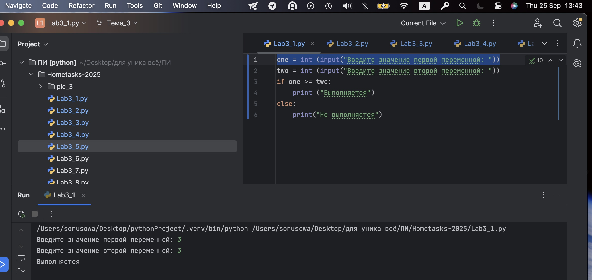

## Выводы

Две переменные вводятся с консоли и сравниваются. Если первая переменная больше или равна второй, выводится «Выполняется», иначе — «Не выполняется».
Используется ввод данных через input(), преобразование строкового значения в целое число с 
помощью int(), а также оператор сравнения >= и условные конструкции if/else для проверки условия.

## Лабораторная работа №2
### Напишите программу, которая будет определять значения переменной меньше 0, больше 0 и меньше 10 или больше 10. Это нужно реализовать при помощи одной переменной, значение которой будет вводится через консоль, а также при помощи конструкций if, elif, else.
```python
print (1+2)
one = int (input("Введите значение первой переменной: "))
if  one < 0:
    print ("Перемнная меньше 0")
elif  0<one < 10:
    print ("Перемнная больше 0 и меньше 10")
else:
    print("Перемнная больше 10")
```
### Результат.
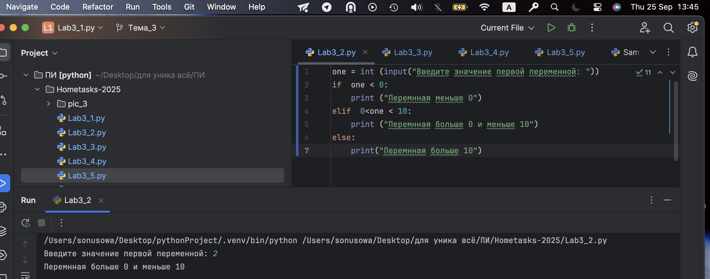
## Выводы

Вводится одна переменная, после чего с помощью if, elif, else определяется, меньше ли она 0, между 0 и 10, или больше 10, и выводится соответствующее сообщение.
Применяется ввод числа через input(), преобразование в тип int(), последовательные проверки диапазонов значений с помощью if, elif, else, а также логические операторы < и составное условие 0 < one < 10.

## Лабораторная работа №3
### Напишите программу, в которой будет проверяться есть ли переменная в указанном массиве используя логический оператор in. Самостоятельно посмотрите, как работает программа со значениями которых нет в массиве numbers.
```python
numbers = [1, 3,4 ,6,8,9]
value = int (input("Введите значение  переменной: "))
if value in numbers:
    print ("Переменная есть в данном массиве")
else:
    print("Переменной нет в этом массиве")
```
### Результат.
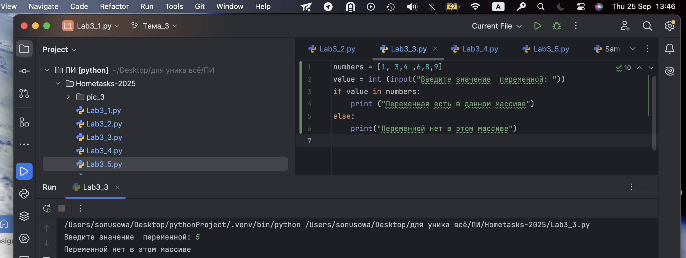
## Выводы

Используется список для хранения значений. Проверка наличия элемента выполняется с помощью оператора in.
Для проверки чётности применяется оператор % (остаток от деления на 2). Условные конструкции if/else определяют, 
какое сообщение выводить.
  
## Лабораторная работа №4
### Напишите программу, которая будет определять находится ли переменная в указанном массиве и если да, то проверьте четная она или нет. Самостоятельно протестируйте данную программу с разными значениями переменной value.
```python
numbers = [1, 499, 3,4 ,6,8,9, 1342]
value = int (input("Введите значение  переменной: "))
if value in numbers:
    if value %2==0:
        print("Переменная четная и есть в массиве numbers")
    else:
        print("Переменная нечетная и есть в массиве numbers")
else:
    print(f"Переменной не в массиве numbers и она равна {value}")
```
### Результат.
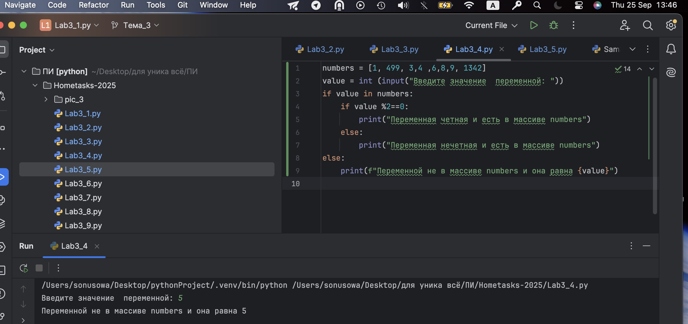
## Выводы

Проверяется, есть ли введённая переменная в массиве. Если переменная присутствует, программа проверяет, чётная она или нечётная, и выводит результат. Если переменной нет в массиве, выводится соответствующее сообщение.
Используется список (массив) для хранения значений, оператор принадлежности in для проверки нахождения числа в массиве, условный оператор if/else, а также оператор остатка от деления % для проверки чётности числа.

## Лабораторная работа №5
### Напишите программу, в которой циклом for значения переменной i будут меняться от 0 до 10 и посмотрите, как разные виды сравнений и операций работают в цикле..

```python
for i in range (10):
    print (" i=", i)
    if i==0:
        i+=2
    if i == 1:
        continue
    if i == 2 or i==3:
        print ("Переменная равна 2 или 3")
    elif i in [4,5,6]:
        print("Переменная равна 4,5 или 6")
    else:
        break
```
### Результат.
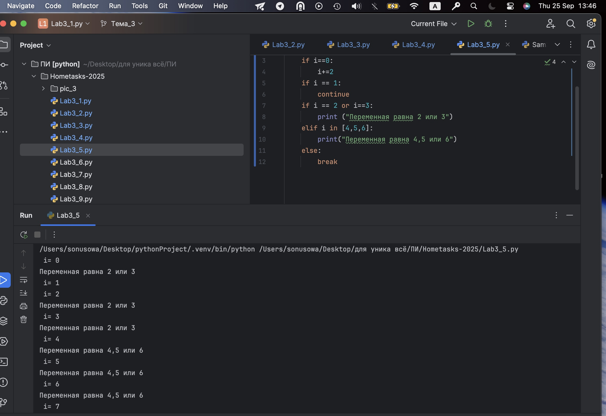
## Выводы

Цикл for перебирает значения i от 0 до 9. При разных значениях i программа выводит сообщения, использует continue для пропуска итерации и break для выхода из цикла.
Задействован цикл for с функцией range(), оператор присваивания с увеличением i+=2, условные проверки if/elif, оператор continue для перехода к следующей итерации и break для выхода из цикла, а также проверка принадлежности числа к списку через оператор in

## Лабораторная работа №6
### Напишите программу, в которой при помощи цикла for определяется есть ли переменная value в строке string и посмотрите, как работает оператор else для циклов. Самостоятельно посмотрите, что выведет программа, если значение переменной value оказалось в строке string.
```python
string  = "Привет все изучающим Python!"
value = input ()
for i in string:
    if i ==value:
        index = string.find(value)
        print (f"Буква '{value}' есть в строке под {index} индексом")
        break
else:
    print(f"Буква '{value}' нет в указанной строке")
```
### Результат.
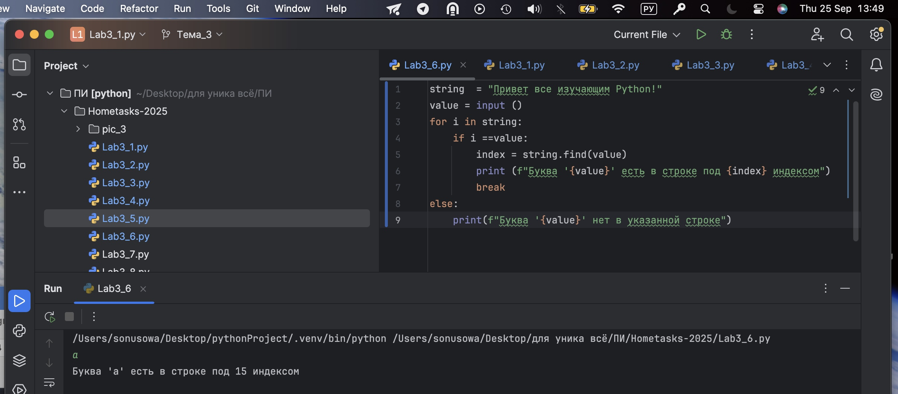
## Выводы

Для итерации используется цикл for по строке. Сравнение каждого символа строки с введённым значением через оператор ==.
Метод .find() определяет индекс первой найденной буквы.
Оператор break прерывает цикл при нахождении совпадения.
Конструкция for...else используется для обработки случая, когда цикл завершился без break.

## Лабораторная работа №7
### Напишите программу, в которой вы наглядно посмотрите, как работает цикл for проходя в обратном порядке, то есть, к примеру не от 0 до 10, а от 10 до 0. В уже готовой программе показано вычитание из 100, а вам во время реализации программы будет необходимо придумать свой вариант применения обратного цикла.
```python
value = 100
for i in range (10, -1, -1):
    value -=i;
    print (i, value)
```
### Результат.
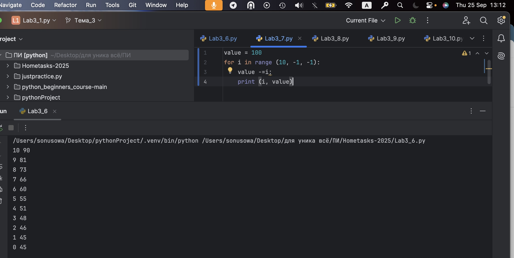
## Выводы

Для перебора чисел в обратном порядке используется range(10, -1, -1).
В теле цикла над переменной выполняются арифметические действия (вычитание).
Программа демонстрирует работу цикла for с отрицательным шагом (итерация назад).

## Лабораторная работа №8
### Напишите программу используя цикл while, внутри которого есть какие-либо проверки, но быть осторожным, поскольку циклы while при неправильно написанных условиях могут становится бесконечными, как указано в примере далее.
```python
value = 0
while value <100:
    if value ==0:
        value +=10
    elif value // 5 >1:
        value *=5
    else:
        value -=5
    print (value)
```
### Результат.
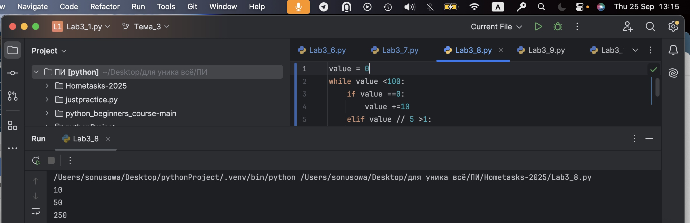
## Выводы

В основе — цикл while с условием value < 100.
Используются условные проверки if/elif/else для изменения значения внутри цикла.
Происходит изменение переменной с помощью +=, -=, *=.
Подчёркивается возможность создания бесконечного цикла, если условие написано неверно.

## Лабораторная работа №9
### Напишите программу с использованием вложенных циклов и одной проверкой внутри них. Самое главное, не забудьте, что нельзя использовать одинаковые имена итерируемых переменных, когда вы используете вложенные циклы.
```python
value = 0
for i in range (10):
    for j in range(10):
        if i!=j:
            value +=j
        else:
            pass
print (value)
```
### Результат.
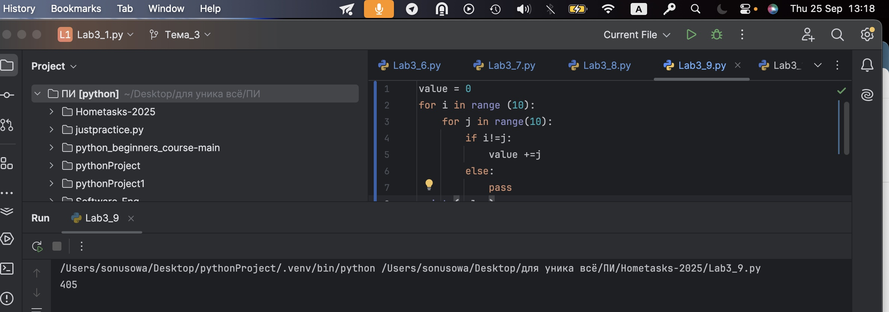
## Выводы

Применяются вложенные циклы for с разными переменными (i, j). Внутри выполняется проверка сравнения i != j.
При выполнении условия происходит суммирование (value += j).
Использован оператор pass, показывающий бездействие при равенстве индексов.

## Лабораторная работа №10
### Напишите программу с использованием flag, которое будет определять есть ли нечетное число в массиве. В данной задаче flag выступает в роли индикатора встречи нечетного числа в исходном массиве, четных чисел.
```python
even_array = [2,4,5,8,9]
flag = False
for value in even_array:
    if value % 2 ==1:
        flag=True
if flag is True:
    print ('В массиве есть нечетное число')
else:
    print('В массиве все числа четные')
```
### Результат.
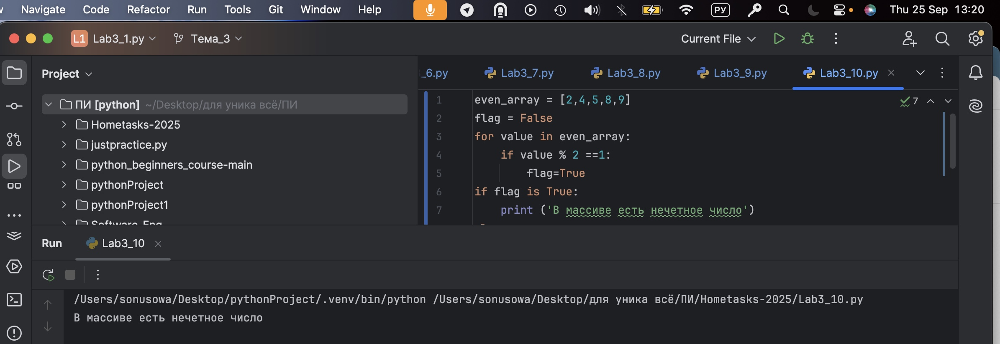
## Выводы

Создан массив чисел и переменная-флаг (flag = False).
При переборе значений массива в цикле проверяется нечётность через оператор % 2 == 1.
Если условие выполняется, флаг меняется на True. После цикла оператор if flag is True определяет, есть ли нечётные числа.
Программа показывает принцип использования флага-индикатора для проверки условия.

## Самостоятельная работа №1
### Напишите программу, которая преобразует 1 в 31. Для выполнения поставленной задачи необходимо обязательно и только один раз использовать: •	Цикл for •	*= 5 •	+= 1 Никаких других действий или циклов использовать нельзя.
```python
x = 1
for _ in range(2):
    x *= 5
    x += 1
print(x)
```
### Результат.
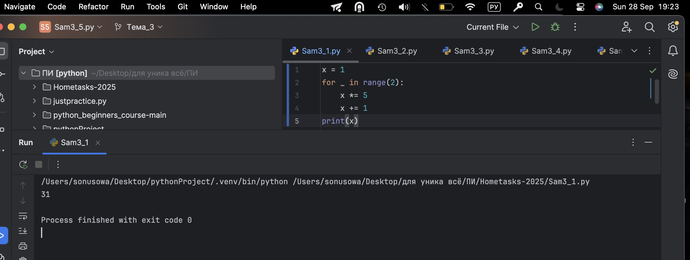
## Выводы

Используется цикл for для повторных операций.
Применяется операция умножения с присваиванием *=.
Затем применяется операция сложения с присваиванием +=.
Последовательность этих действий позволяет получить нужное чиcло
  
## Самостоятельная работа №2
### Напишите программу, которая фразу «Hello World» выводит в обратном порядке, и каждая буква находится в одной строке консоли. Пример вывода в консоль:
```python
s = "Hello World"
for c in s[::-1]: print(c)
```
### Результат.
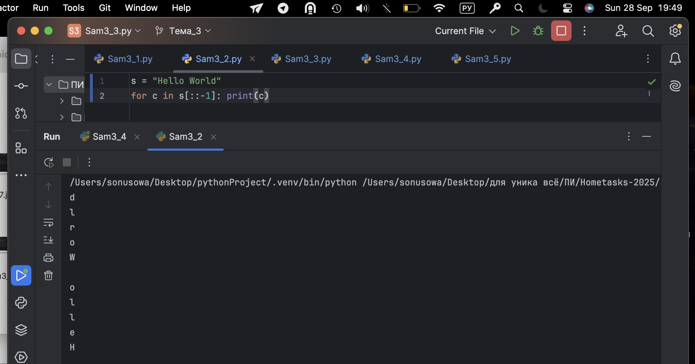
## Выводы

Используется срез строки [::-1] для реверса. Цикл for итерируется по символам реверсированной строки. Вывод каждого символа организован функцией print() в новой строке.
  
## Самостоятельная работа №3
### Напишите программу, на вход которой поступает значение из консоли, оно должно быть числовым и в диапазоне от 0 до 10 включительно (это необходимо учесть в программе). Если вводимое число не подходит по требованиям, то необходимо вывести оповещение об этом в консоль и остановить программу. Код должен вычислять в каком диапазоне находится полученное число. Нужно учитывать три диапазона:•	от 0 до 3 включительно•	от 3 до 6•	от 6 до 10 включительно Результатом работы программы будет выведенный в консоль диапазон. Программа должна занимать не более 10 строчек в редакторе кода.
```python
num = input()
num = float(num) if num.replace('.', '', 1).isdigit() else None
if num is None or not (0 <= num <= 10):
    print("Некорректный ввод")
else:
    if 0 <= num <= 3:
        print("от 0 до 3 включительно")
    elif 3 < num < 6:
        print("от 3 до 6")
    else:
        print("от 6 до 10 включительно")
```
### Результат.
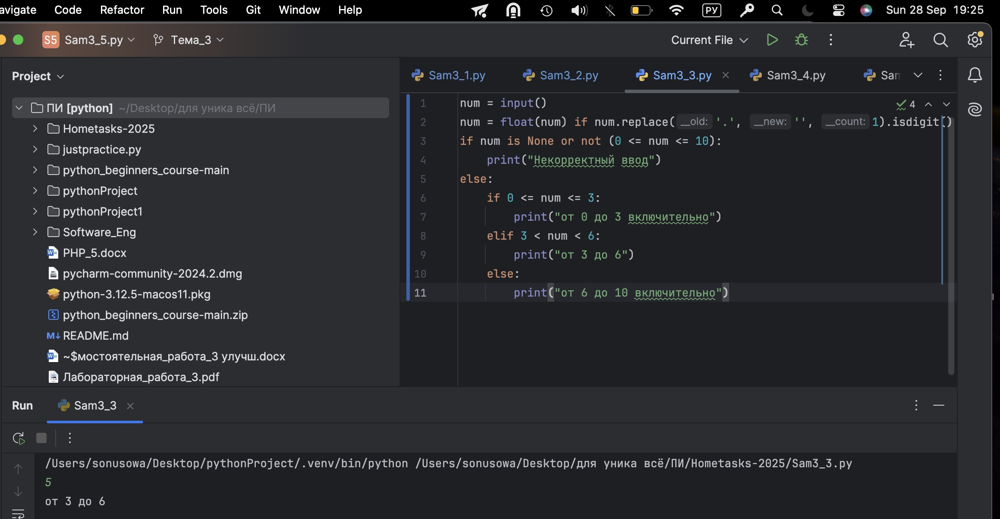
## Выводы

Ввод через input(), проверка на корректность числа с помощью .replace(...).isdigit().
Преобразование строки в число с помощью float(). Условные операторы if/elif/else для проверки диапазонов. Составные условия с логическими операторами (and, <=, <).
Вывод текста как сообщение о диапазоне или о некорректном вводе.
  
## Самостоятельная работа №4
### 	Манипулирование строками. Напишите программу на Python, которая принимает предложение (на английском) в качестве входных данных от пользователя. Выполните следующие операции и отобразите результаты:•	Выведите длину предложения. •	Переведите предложение в нижний регистр. •	Подсчитайте количество гласных (a, e, i, o, u) в предложении. •	Замените все слова "ugly" на "beauty". •	Проверьте, начинается ли предложение с "The" и заканчивается ли на "end". Проверьте работу программы минимум на 3 предложениях, чтобы охватить проверку всех поставленных условий.
```python
sentence = input("Enter a sentence: ")
print(len(sentence))
print(sentence.lower())
print(sum(1 for c in sentence.lower() if c in "aeiou"))
print(sentence.replace("ugly", "beauty"))
print(sentence.startswith("The") and sentence.endswith("end"))
```
### Результат.
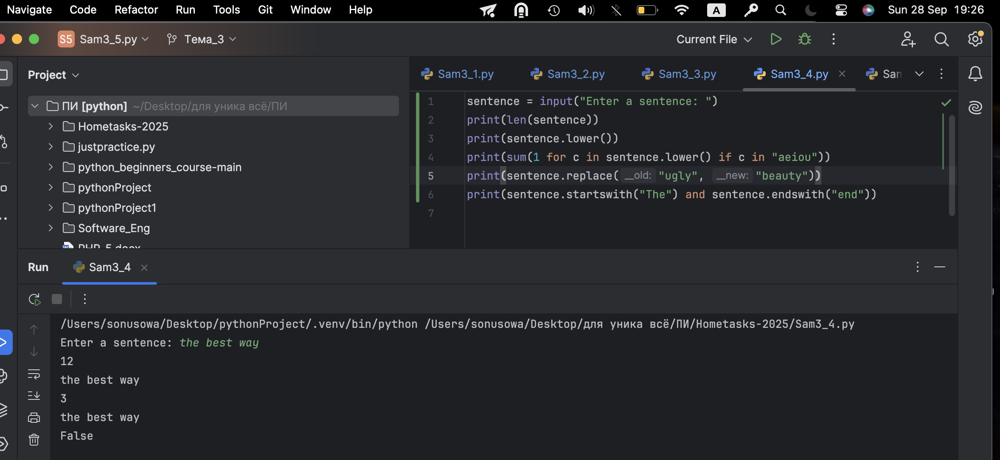
## Выводы

Используется len() для подсчёта длины строки. Метод .lower() для перевода в нижний регистр.
Подсчёт гласных идёт через генераторное выражение и sum().
Метод .replace("ugly", "beauty") выполняет замену слов.
Методы .startswith("The") и .endswith("end") проверяют начало и конец строки.
  
## Самостоятельная работа №5
### Составьте программу, результатом которой будет данный вывод в консоль. Программу нужно составить из данных фрагментов кода.
```python
memory = 'world'
string = 'hello'
counter = 0

while counter != 10:
    memory = string
    if counter < 10:
        if counter % 2 == 0:
            print(memory + " " + memory)
        else:
            print(memory)
        counter += 1

print(memory + " " + memory)
```
### Результат.
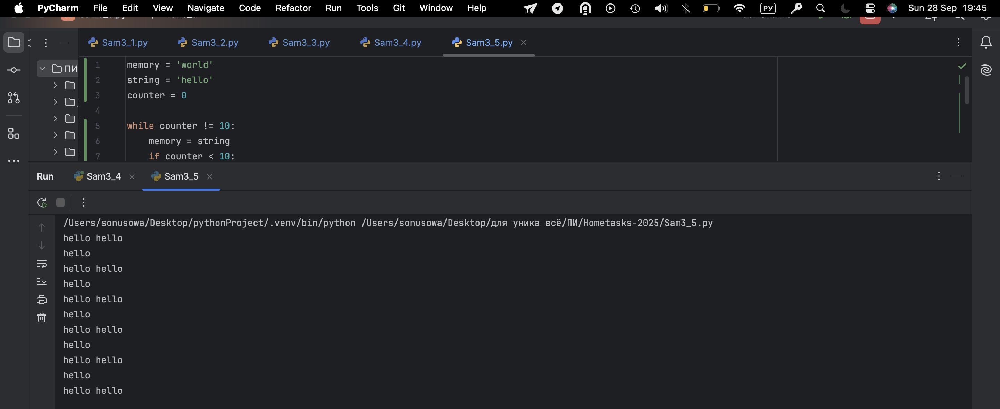
## Выводы

Определены переменные и инициализация (memory, string, counter).
Используется цикл while с условием выхода (counter != 10).
Условные конструкции if для выбора вывода (удвоенная строка или один раз).
Оператор % (остаток от деления) применяется для проверки чётности счётчика.
Итерация реализуется через counter += 1. В финале ещё один print после завершения цикла.

## Общие выводы по теме
В этом разделе я изучила основные операторы, условные конструкции и циклы в языке Python. В ходе решения задач применялись операторы сравнения и логические выражения для проверки условий, что позволяет управлять потоками выполнения программ. Были изучены конструкции if, elif, else для разветвления кода в зависимости от значений переменных. Также я освоила работу с циклами for и while для многократного повторения действий, включая использование управляющих операторов break и continue. Важным моментом стало применение вложенных циклов и индикаторов-флагов для сложной логики проверки данных. В результате я научилась эффективно обрабатывать ввод пользователя, проверять данные по условию и выводить нужные результаты, что является базой для построения более сложных алгоритмов и программ.


