# Тема 4. Функции и стандартные модули/библиотеки
Отчет по Теме #4 выполнил(а):
- Усова Софья Сергеевна
- ИВТ-23-2

| Задание | Лаб_раб | Сам_раб |
| ------ | ------ | ------ |
| Задание 1 | + | + |
| Задание 2 | + | + |
| Задание 3 | + | + |
| Задание 4 | + | + |
| Задание 5 | + | + |
| Задание 6 | + |  |
| Задание 7 | + |  |
| Задание 8 | + |  |
| Задание 9 | + |  |
| Задание 10 | + |  |

## Лабораторная работа №1
### Напишите функцию, которая выполняет любые арифметические действия и выводит результат в консоль. Вызовите функцию используя “точку входа”.

```python
one = int (input("Введите значение первой переменной: "))
two = int (input("Введите значение второй переменной: "))
if one >= two:
    print ("Выполняется")
else:
    print("Не выполняется")
```
### Результат.
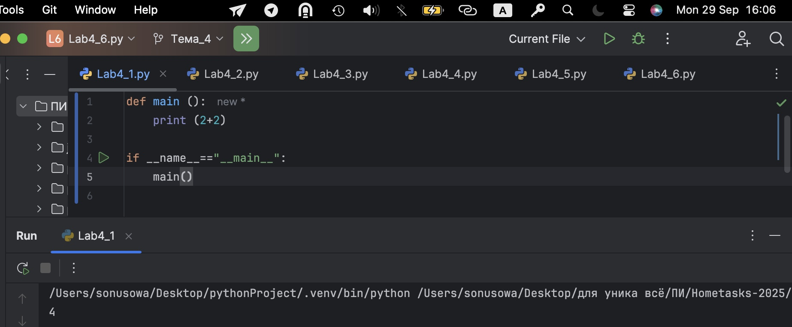

## Выводы

Две переменные вводятся с консоли и сравниваются. Если первая переменная больше или равна второй, выводится «Выполняется», иначе — «Не выполняется».
Используется ввод данных через input(), преобразование строкового значения в целое число с 
помощью int(), а также оператор сравнения >= и условные конструкции if/else для проверки условия.

## Лабораторная работа №2
### Напишите функцию, которая выполняет любые арифметические действия, возвращает при помощи return значение в место, откуда вызывали функцию. Выведите результат в консоль. Вызовите функцию используя “точку входа”.
```python
print (1+2)
one = int (input("Введите значение первой переменной: "))
if  one < 0:
    print ("Перемнная меньше 0")
elif  0<one < 10:
    print ("Перемнная больше 0 и меньше 10")
else:
    print("Перемнная больше 10")
```
### Результат.
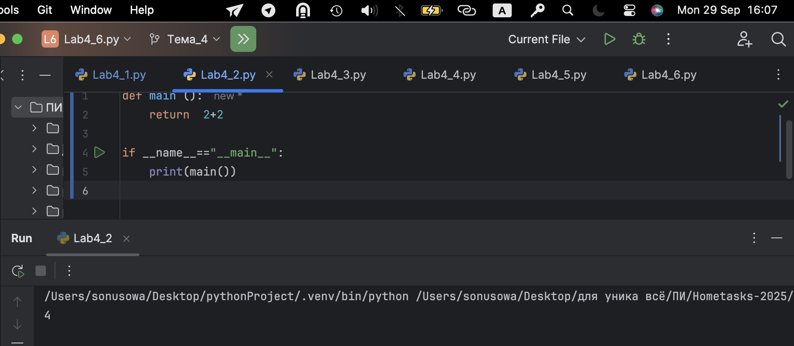
## Выводы

Вводится одна переменная, после чего с помощью if, elif, else определяется, меньше ли она 0, между 0 и 10, или больше 10, и выводится соответствующее сообщение.
Применяется ввод числа через input(), преобразование в тип int(), последовательные проверки диапазонов значений с помощью if, elif, else, а также логические операторы < и составное условие 0 < one < 10.

## Лабораторная работа №3
### Напишите функцию, в которую передаются два аргумента, над ними производится арифметическое действие, результат возвращается туда, откуда эту функцию вызывали. Выведите результат в консоль. Вызовите функцию в любом небольшом цикле.


```python
numbers = [1, 3,4 ,6,8,9]
value = int (input("Введите значение  переменной: "))
if value in numbers:
    print ("Переменная есть в данном массиве")
else:
    print("Переменной нет в этом массиве")
```
### Результат.
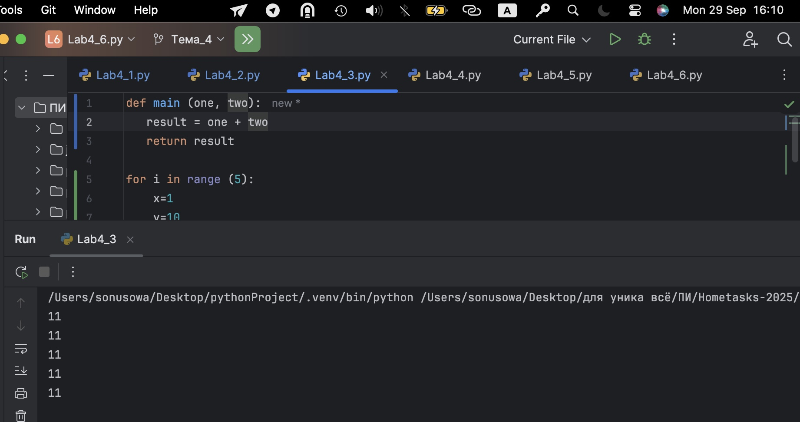
## Выводы

Используется список для хранения значений. Проверка наличия элемента выполняется с помощью оператора in.
Для проверки чётности применяется оператор % (остаток от деления на 2). Условные конструкции if/else определяют, 
какое сообщение выводить.
  
## Лабораторная работа №4
### Напишите функцию, на вход которой подается какое-то изначальное неизвестное количество аргументов, над которыми будет производится арифметические действия. Для выполнения задания необходимо использовать кортеж “*args”. 
```python
numbers = [1, 499, 3,4 ,6,8,9, 1342]
value = int (input("Введите значение  переменной: "))
if value in numbers:
    if value %2==0:
        print("Переменная четная и есть в массиве numbers")
    else:
        print("Переменная нечетная и есть в массиве numbers")
else:
    print(f"Переменной не в массиве numbers и она равна {value}")
```
### Результат.
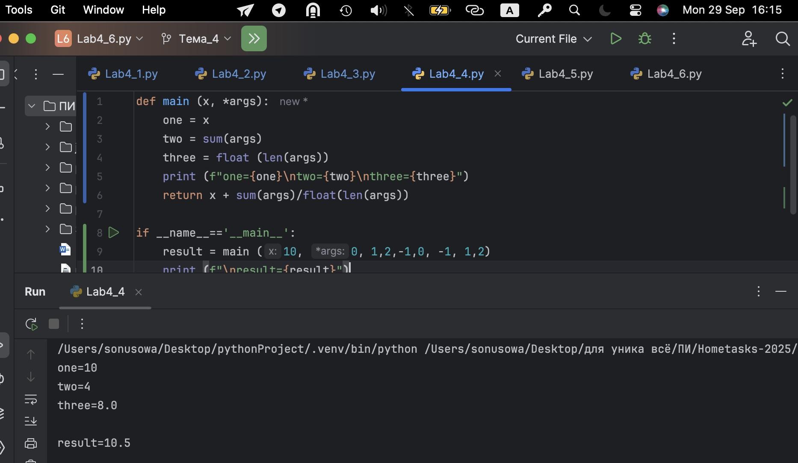
## Выводы

Проверяется, есть ли введённая переменная в массиве. Если переменная присутствует, программа проверяет, чётная она или нечётная, и выводит результат. Если переменной нет в массиве, выводится соответствующее сообщение.
Используется список (массив) для хранения значений, оператор принадлежности in для проверки нахождения числа в массиве, условный оператор if/else, а также оператор остатка от деления % для проверки чётности числа.

## Лабораторная работа №5
### Напишите функцию, которая на вход получает кортеж “**kwargs” и при помощи цикла выводит значения, поступившие в функцию. На скриншоте ниже указаны два варианта вызова функции с “**kwargs” и два варианта работы с данными, поступившими в эту функцию. 
```python
for i in range (10):
    print (" i=", i)
    if i==0:
        i+=2
    if i == 1:
        continue
    if i == 2 or i==3:
        print ("Переменная равна 2 или 3")
    elif i in [4,5,6]:
        print("Переменная равна 4,5 или 6")
    else:
        break
```
### Результат.
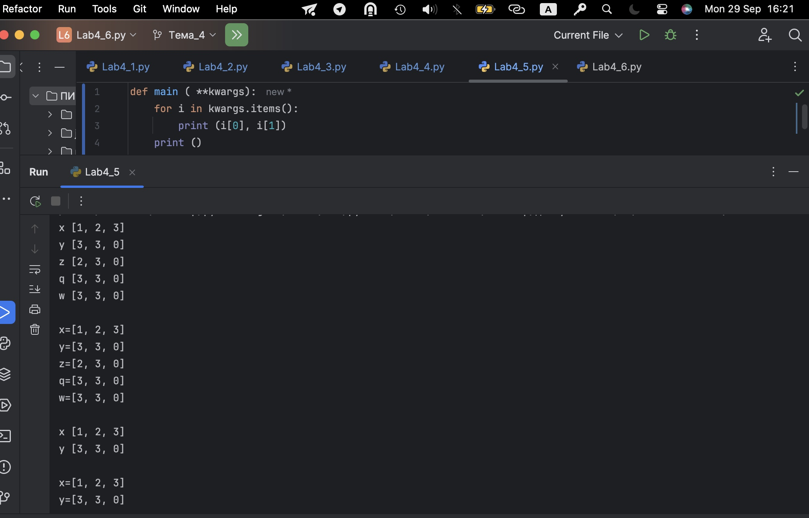
## Выводы

Цикл for перебирает значения i от 0 до 9. При разных значениях i программа выводит сообщения, использует continue для пропуска итерации и break для выхода из цикла.
Задействован цикл for с функцией range(), оператор присваивания с увеличением i+=2, условные проверки if/elif, оператор continue для перехода к следующей итерации и break для выхода из цикла, а также проверка принадлежности числа к списку через оператор in

## Лабораторная работа №6
### Напишите две функции. Первая – получает в виде параметра “**kwargs”. Вторая считает среднее арифметическое из значений первой функции. Вызовите первую функцию используя “точку входа” и минимум 4 аргумента.
```python
string  = "Привет все изучающим Python!"
value = input ()
for i in string:
    if i ==value:
        index = string.find(value)
        print (f"Буква '{value}' есть в строке под {index} индексом")
        break
else:
    print(f"Буква '{value}' нет в указанной строке")
```
### Результат.
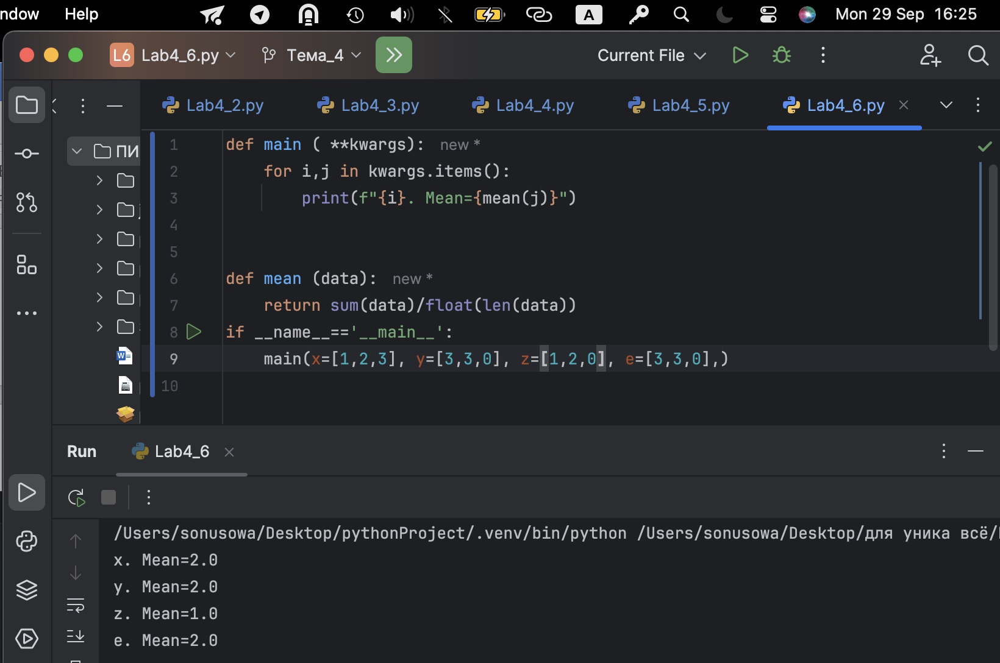
## Выводы

Цикл for перебирает значения i от 0 до 9. При разных значениях i программа выводит сообщения, использует continue для пропуска итерации и break для выхода из цикла.
Задействован цикл for с функцией range(), оператор присваивания с увеличением i+=2, условные проверки if/elif, оператор continue для перехода к следующей итерации и break для выхода из цикла, а также проверка принадлежности числа к списку через оператор in

## Лабораторная работа №7
### Создайте дополнительный файл .py. Напишите в нем любую функцию, которая будет что угодно выводить в консоль, но не вызывайте ее в нем. Откройте файл main.py, импортируйте в него функцию из нового файла и при помощи “точки входа” вызовите эту функцию.
```python
value = 100
for i in range (10, -1, -1):
    value -=i;
    print (i, value)
```
### Результат.
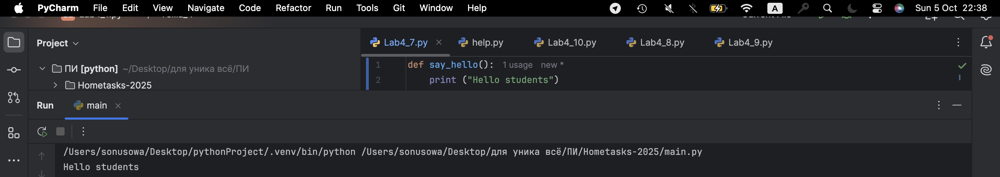
## Выводы

Для перебора чисел в обратном порядке используется range(10, -1, -1).
В теле цикла над переменной выполняются арифметические действия (вычитание).
Программа демонстрирует работу цикла for с отрицательным шагом (итерация назад).

## Лабораторная работа №8
### Напишите программу, которая будет выводить корень, синус, косинус полученного от пользователя числа.
```python
value = 0
while value <100:
    if value ==0:
        value +=10
    elif value // 5 >1:
        value *=5
    else:
        value -=5
    print (value)
```
### Результат.
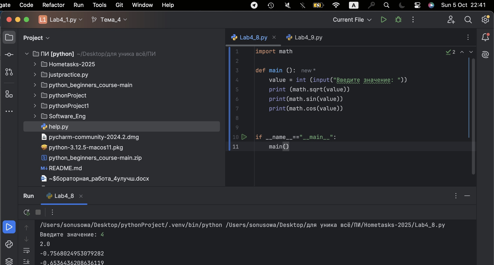
## Выводы

В основе — цикл while с условием value < 100.
Используются условные проверки if/elif/else для изменения значения внутри цикла.
Происходит изменение переменной с помощью +=, -=, *=.
Подчёркивается возможность создания бесконечного цикла, если условие написано неверно.

## Лабораторная работа №9
### Напишите программу, которая будет рассчитывать какой день недели будет через n-нное количество дней, которые укажет пользователь.
```python
value = 0
for i in range (10):
    for j in range(10):
        if i!=j:
            value +=j
        else:
            pass
print (value)
```
### Результат.
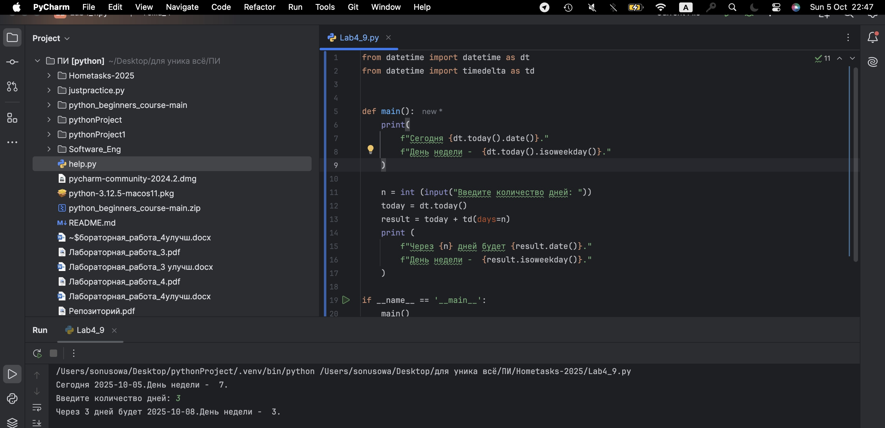
## Выводы

Применяются вложенные циклы for с разными переменными (i, j). Внутри выполняется проверка сравнения i != j.
При выполнении условия происходит суммирование (value += j).
Использован оператор pass, показывающий бездействие при равенстве индексов.

## Лабораторная работа №10
### Напишите программу с использованием глобальных переменных, которая будет считать площадь треугольника или прямоугольника в зависимости от того, что выберет пользователь. Получение всей необходимой информации реализовать через input(), а подсчет площадей выполнить при помощи функций. Результатом программы будет число, равное площади, необходимой фигуры.
even_array = [2,4,5,8,9]
flag = False
for value in even_array:
    if value % 2 ==1:
        flag=True
if flag is True:
    print ('В массиве есть нечетное число')
else:
    print('В массиве все числа четные')
```
### Результат.
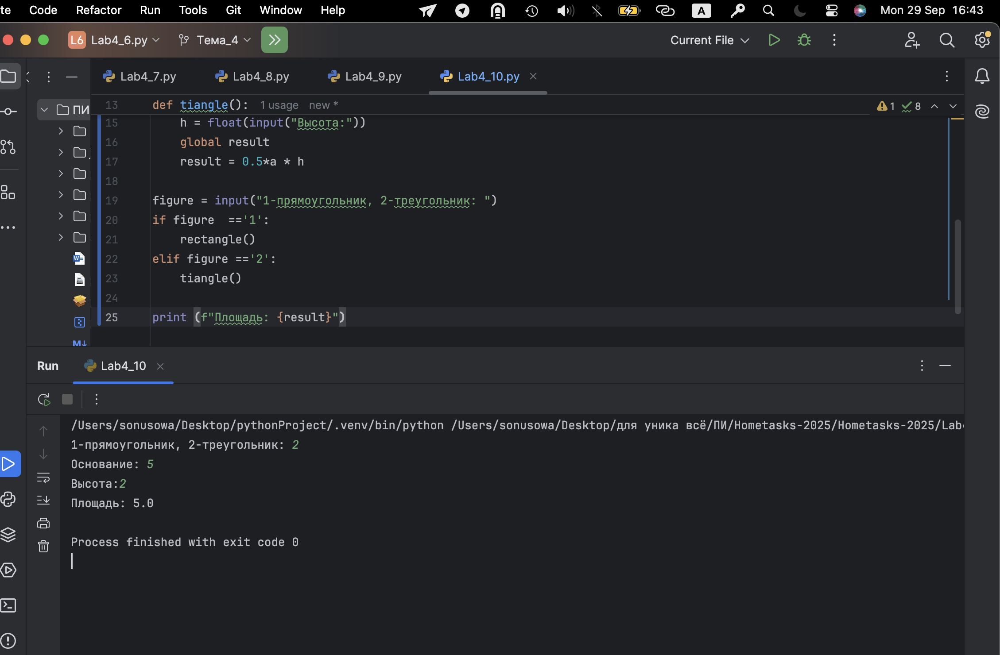
## Выводы

Создан массив чисел и переменная-флаг (flag = False).
При переборе значений массива в цикле проверяется нечётность через оператор % 2 == 1.
Если условие выполняется, флаг меняется на True. После цикла оператор if flag is True определяет, есть ли нечётные числа.
Программа показывает принцип использования флага-индикатора для проверки условия.

## Самостоятельная работа №1
### Дайте подробный комментарий для кода, написанного ниже. Комментарий нужен для каждой строчки кода, нужно описать что она делает. Не забудьте, что функции комментируются по-особенному.
```python
from datetime import datetime  # Импорт модуля datetime и класса datetime для работы с датой и временем
from math import sqrt          # Импорт функции sqrt из модуля math для вычисления квадратного корня

def main(**kwargs):
    """
    Основная функция, которая принимает произвольное количество именованных аргументов.
    Каждый аргумент должен быть списком или кортежем из двух чисел (координаты).
    Для каждого аргумента вычисляется длина вектора (гипотенуза), используя теорему Пифагора.
    Результаты выводятся в консоль.
    """
    for key in kwargs.items():  # Перебираем пару (ключ, значение) в словаре аргументов kwargs
        # key[1] — значение (список из двух чисел), key[1][0] и key[1][1] — сами числа
        result = sqrt(key[1][0] ** 2 + key[1][1] ** 2)  # Вычисляем длину вектора: sqrt(x² + y²)
        print(result)  # Выводим результат для каждого аргумента

if __name__ == '__main__':  # Точка входа: код внутри блока выполнится, если файл запущен напрямую
    start_time = datetime.now()  # Запоминаем время начала выполнения программы
    main(
        one=[10, 3],     # Передаем аргументы в функцию main, где ключ — название вектора, значение — координаты
        two=[5, 4],
        three=[15, 13],
        four=[93, 53],
        five=[133, 15]
    )
    time_costs = datetime.now() - start_time  # Вычисляем разницу во времени — сколько длилась программа
    print(f"Время выполнения программы - {time_costs}")  # Выводим время выполнения программы
```
### Результат.
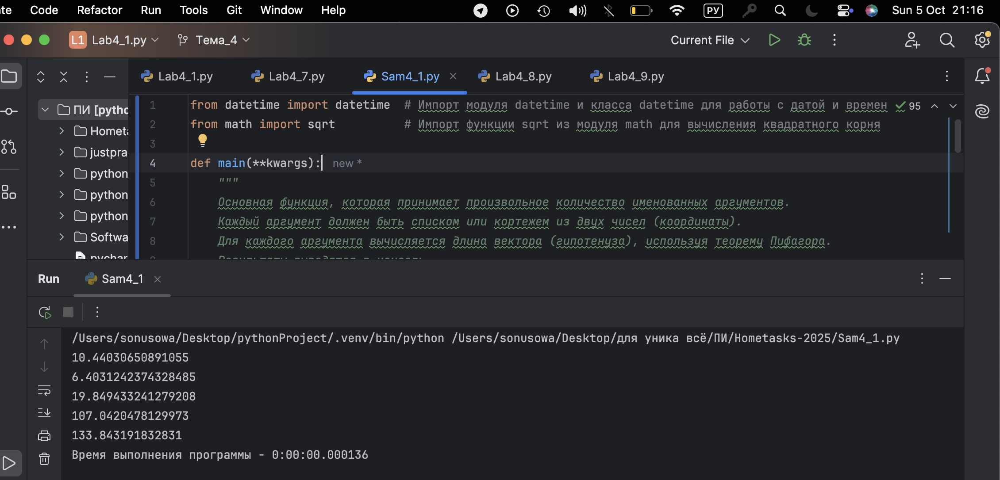
## Выводы

Используется цикл for для повторных операций.
Применяется операция умножения с присваиванием *=.
Затем применяется операция сложения с присваиванием +=.
Последовательность этих действий позволяет получить нужное чиcло
  
## Самостоятельная работа №2
### Напишите программу, которая будет заменять игральную кость с 6 гранями. Если значение равно 5 или 6, то в консоль выводится «Вы победили», если значения 3 или 4, то вы рекурсивно должны вызвать эту же функцию, если значение 1 или 2, то в консоль выводится «Вы проиграли». При этом каждый вызов функции необходимо выводить в консоль значение “кубика”. Для выполнения задания необходимо использовать стандартную библиотеку random. Программу нужно написать, используя одну функцию и “точку входа”

```python
s = "Hello World"
for c in s[::-1]: print(c)
```
### Результат.
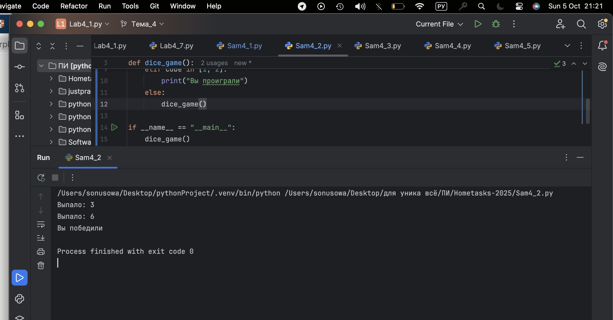
## Выводы

Используется срез строки [::-1] для реверса. Цикл for итерируется по символам реверсированной строки. Вывод каждого символа организован функцией print() в новой строке.
  
## Самостоятельная работа №3
### Напишите программу, которая будет выводить текущее время, с точностью до секунд на протяжении 5 секунд. Программу нужно написать с использованием цикла. Подсказка: необходимо использовать модуль datetime и time, а также вам необходимо как-то “усыплять” программу на 1 секунду
num = input()
num = float(num) if num.replace('.', '', 1).isdigit() else None
if num is None or not (0 <= num <= 10):
    print("Некорректный ввод")
else:
    if 0 <= num <= 3:
        print("от 0 до 3 включительно")
    elif 3 < num < 6:
        print("от 3 до 6")
    else:
        print("от 6 до 10 включительно")
```
### Результат.
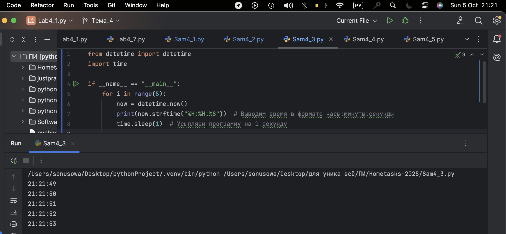
## Выводы

Ввод через input(), проверка на корректность числа с помощью .replace(...).isdigit().
Преобразование строки в число с помощью float(). Условные операторы if/elif/else для проверки диапазонов. Составные условия с логическими операторами (and, <=, <).
Вывод текста как сообщение о диапазоне или о некорректном вводе.
  
## Самостоятельная работа №4
### Напишите программу, которая считает среднее арифметическое от аргументов вызываемое функции, с условием того, что изначальное количество этих аргументов неизвестно. Программу необходимо реализовать используя одну функцию и “точку входа”.
```python
sentence = input("Enter a sentence: ")
print(len(sentence))
print(sentence.lower())
print(sum(1 for c in sentence.lower() if c in "aeiou"))
print(sentence.replace("ugly", "beauty"))
print(sentence.startswith("The") and sentence.endswith("end"))
```
### Результат.
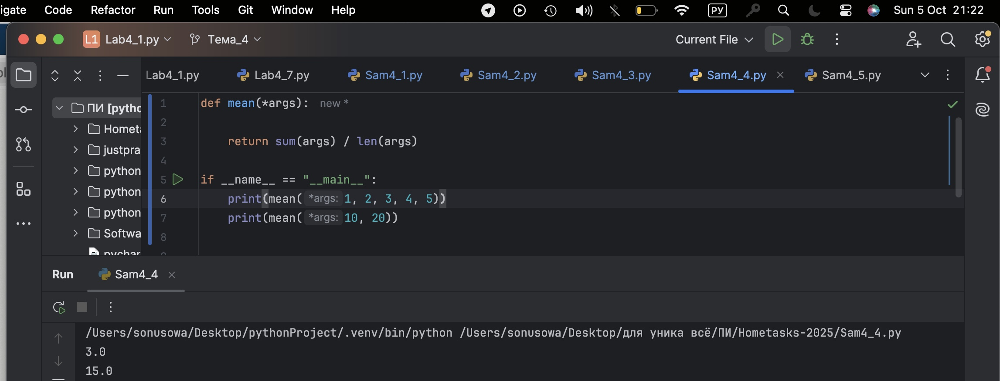
## Выводы

Используется len() для подсчёта длины строки. Метод .lower() для перевода в нижний регистр.
Подсчёт гласных идёт через генераторное выражение и sum().
Метод .replace("ugly", "beauty") выполняет замену слов.
Методы .startswith("The") и .endswith("end") проверяют начало и конец строки.
  
## Самостоятельная работа №5
### Создайте два Python файла, в одном будет выполняться вычисление площади треугольника при помощи формулы Герона (необходимо реализовать через функцию), а во втором будет происходить взаимодействие с пользователем (получение всей необходимой информации и вывод результатов). Напишите эту программу и выведите в консоль полученную площадь.
```python
memory = 'world'
string = 'hello'
counter = 0

while counter != 10:
    memory = string
    if counter < 10:
        if counter % 2 == 0:
            print(memory + " " + memory)
        else:
            print(memory)
        counter += 1

print(memory + " " + memory)
```
### Результат.
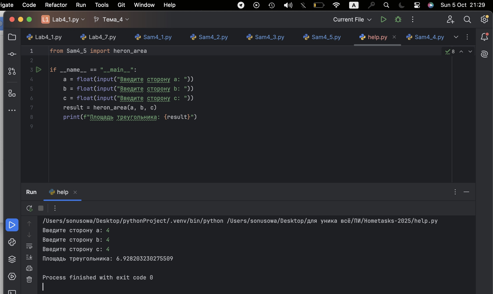
## Выводы

Определены переменные и инициализация (memory, string, counter).
Используется цикл while с условием выхода (counter != 10).
Условные конструкции if для выбора вывода (удвоенная строка или один раз).
Оператор % (остаток от деления) применяется для проверки чётности счётчика.
Итерация реализуется через counter += 1. В финале ещё один print после завершения цикла.

## Общие выводы по теме
В этом разделе я изучила основные операторы, условные конструкции и циклы в языке Python. В ходе решения задач применялись операторы сравнения и логические выражения для проверки условий, что позволяет управлять потоками выполнения программ. Были изучены конструкции if, elif, else для разветвления кода в зависимости от значений переменных. Также я освоила работу с циклами for и while для многократного повторения действий, включая использование управляющих операторов break и continue. Важным моментом стало применение вложенных циклов и индикаторов-флагов для сложной логики проверки данных. В результате я научилась эффективно обрабатывать ввод пользователя, проверять данные по условию и выводить нужные результаты, что является базой для построения более сложных алгоритмов и программ.


