# Тема 5. Базовые коллекции: строки и списки
Отчет по Теме #5 выполнил(а):
- Усова Софья Сергеевна
- ИВТ-23-2

| Задание | Лаб_раб | Сам_раб |
| ------ | ------ | ------ |
| Задание 1 | + | + |
| Задание 2 | + | + |
| Задание 3 | + | + |
| Задание 4 | + | + |
| Задание 5 | + | + |
| Задание 6 | + |  |
| Задание 7 | + |  |
| Задание 8 | + |  |
| Задание 9 | + |  |
| Задание 10 | + |  |

## Лабораторная работа №1
### Друзья предложили вам поиграть в игру “найди отличия и убери повторения (версия для программистов)”. Суть игры состоит в том, что на вход программы поступает два множества, а ваша задача вывести все элементы первого, которых нет во втором. А вы как раз недавно прошли множества и знаете их возможности, поэтому это не составит для вас труда.

```python
set_1 = {"white", "black", "red", "pink"}
set_2 = {"red", "green", "blue", "red"}

print (set_1-set_2)
```
### Результат.
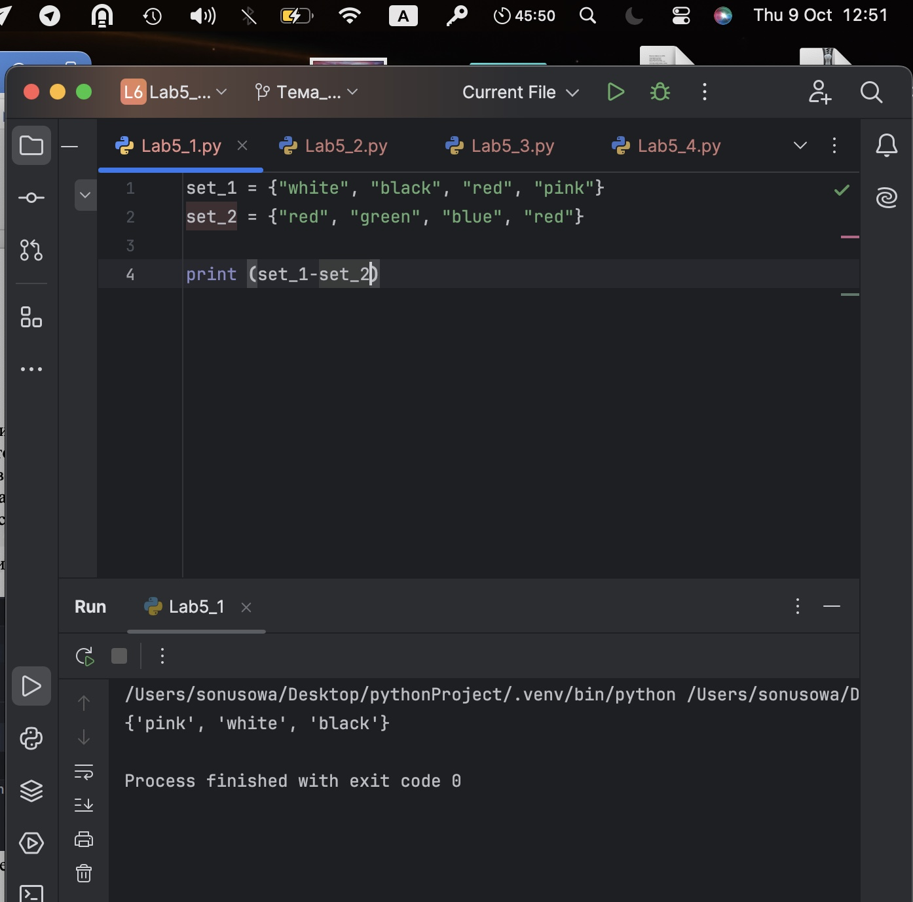

## Выводы

Используется операция вычитания множеств set_1 - set_2, что позволяет быстро получить элементы первого множества, отсутствующие во втором. 

## Лабораторная работа №2
### Напишите две одинаковые программы, только одна будет использовать set(), а вторая frozenset() и попробуйте к исходному множеству добавить несколько элементов, например, через цикл.
```python
a = set('abcdefg')
print(a)
for i in range (1, 5):
    a.add (i)
print (a)
```
### Результат.
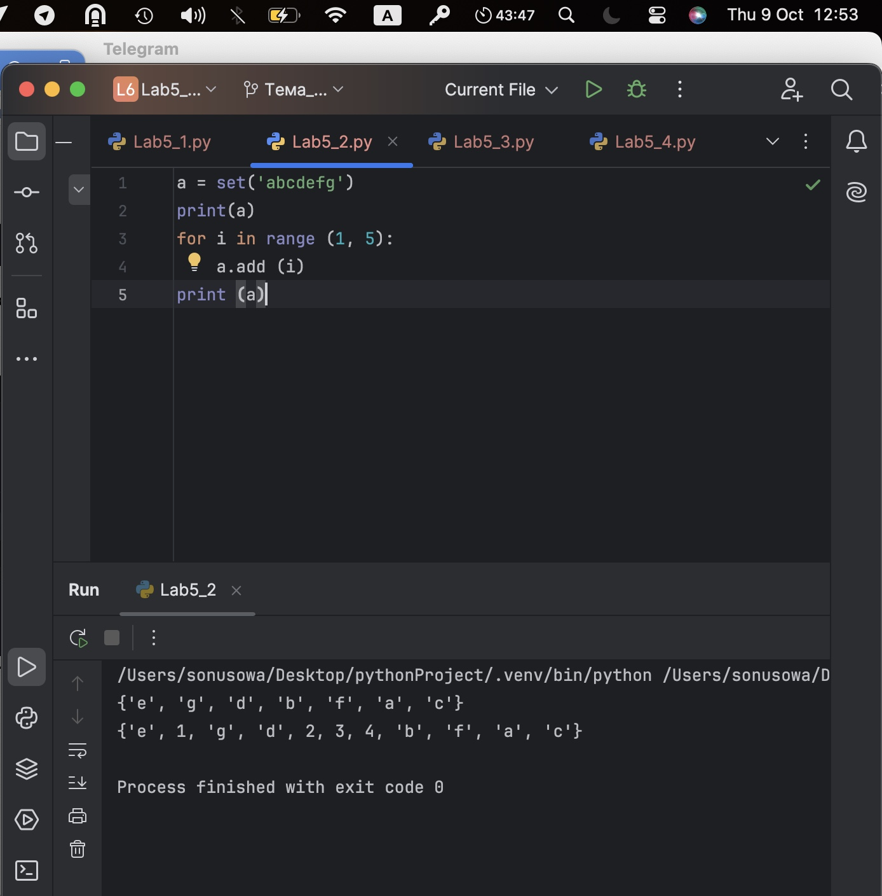
## Выводы

Создаётся изменяемое множество set() и неизменяемое frozenset(). К set() 
можно добавлять элементы с помощью метода .add(), в то время как у frozenset() 
нет таких методов — он неизменяемый. Показывает концепцию мутабельности и иммутабельности коллекций.

## Лабораторная работа №3
### На вход в программу поступает список (минимальной длиной 2 символа). Напишите программу, которая будет менять первый и последний элемент списка.

```python
def replace (input_list):
    memory = input_list[0]
    input_list[0]= input_list[-1]
    input_list[-1] = memory

    return input_list
print (replace([1,2,3,4,5]))
```
### Результат.
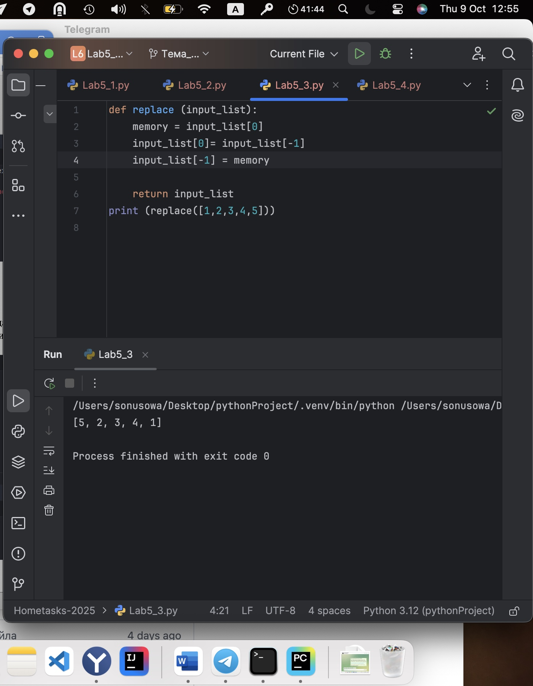
## Выводы

В функции используется классический приём обмена значений с помощью 
временной переменной. Применяется индексирование по отрицательному индексу -1 
для доступа к последнему элементу, что удобно и характерно для Python.
  
## Лабораторная работа №4
### На вход в программу поступает список (минимальной длиной 10 символов). Напишите программу, которая выводит элементы с индексами от 2 до 6. В программе необходимо использовать “срез”.
```python
a  = [12, 54, 32 , 57, 843, 2346, 765, 25, 234]
print(a[2:6])
```
### Результат.
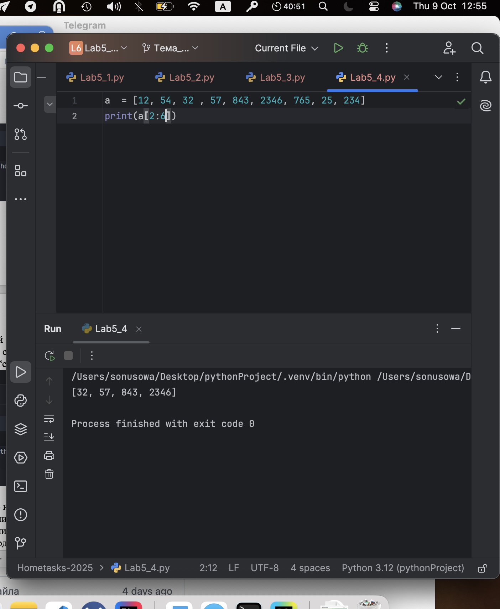
## Выводы

Для получения подсписка применяется срез [2:6] — базовый и очень удобный с
пособ работы с частями списков без лишних циклов.

## Лабораторная работа №5
### Иван задумался о поиске «бесполезного» числа, полученного из списка. Суть поиска в следующем: он берет произвольный список чисел, находит самое большое из них, а затем делит его на длину списка. Студент пока не придумал, где может пригодиться подобное значение, но ищет у вас помощи в реализации такой функции useless().
```python
def useless ( lst):
    return max(lst)/ len (lst)

print (useless([3,5,7,3,33]))

print (useless([-12.5, 53, 77.3, 0, -36]))
print (useless([-22.8, 86, 12.5, 0,  -7]))
```
### Результат.
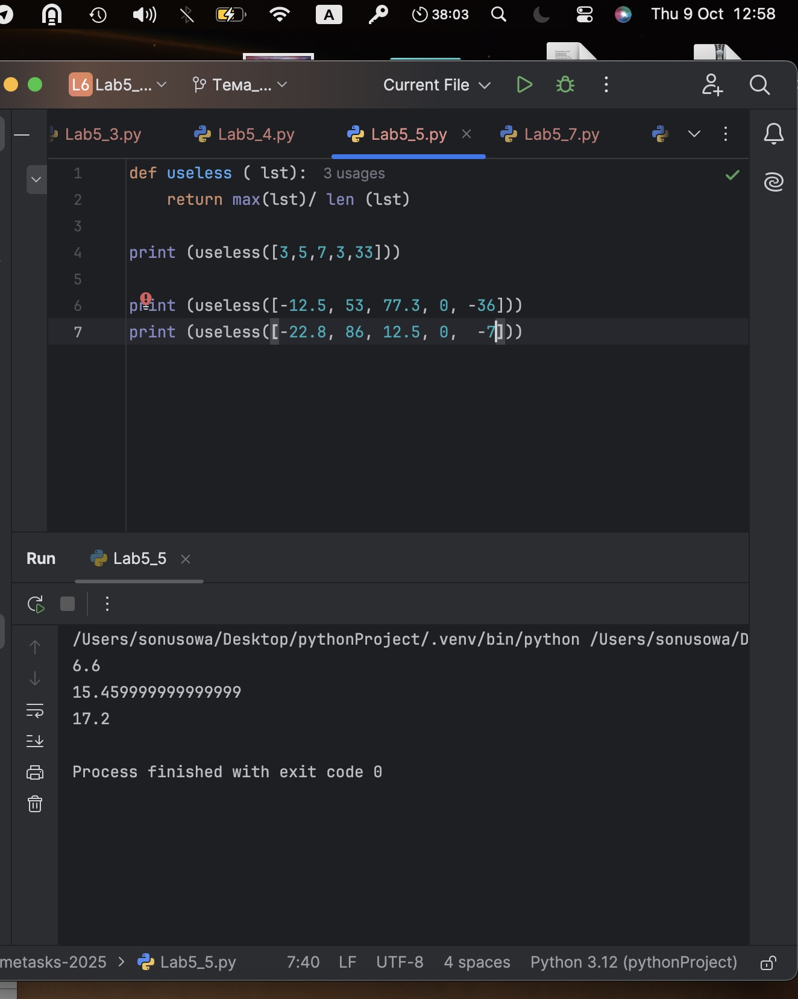
## Выводы

Используются встроенные функции max() для нахождения максимума и len() для 
длины списка. Их арифметическое сочетание позволяет получить элемент, интересующий 
студента — простой пример вычисления с использованием базового функционала Python.

## Лабораторная работа №6
### Ребята не могут определится каким супергероем они хотят стать. У них есть случайно составленный список супергероев, и вы должны определить кто из ребят будет каким супергероем. Необходимо использовать разделение списков.
```python
superheroes = ['superman', 'spiderman', 'batman']
nika, sonya, katya = superheroes

print('Ника-', nika)
print('Соня-', sonya)
print('Катя-', katya)
```
### Результат.
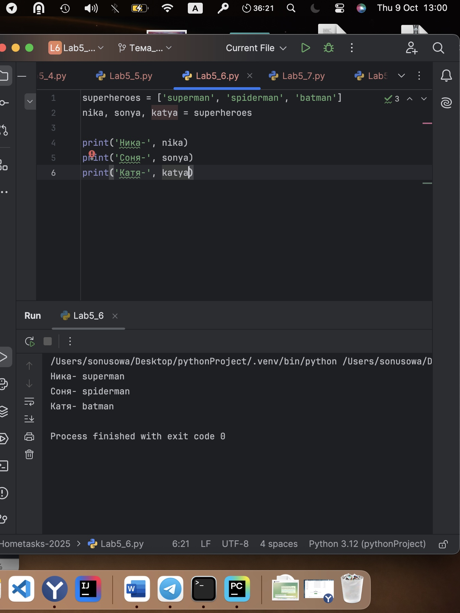
## Выводы

Кортежная распаковка (unpacking) позволяет присвоить элементы 
списка отдельным переменным за одну строку. Это улучшает читаемость и 
удобно для гарантированного фиксированного размера списков.

## Лабораторная работа №7
### Вовочка, насмотревшись передачи “Слабое звено” решил написать программу, которая также будет находить самое слабое звено (минимальный элемент) и удалять его, только делать он это хочет не с людьми, а со списком. Помогите Вовочке с реализацией программы. Подсказка: для этого вам необходимо отсортировать список и удалить значение при помощи pop().
```python
a = [-12.5, 53, 77.3, 0, -36]
a.sort()
print ('Отсортированный список:\n', a)
a.pop(0)
print ('Отсортированный список без наименьшего жлемента:\n', a)
```
### Результат.
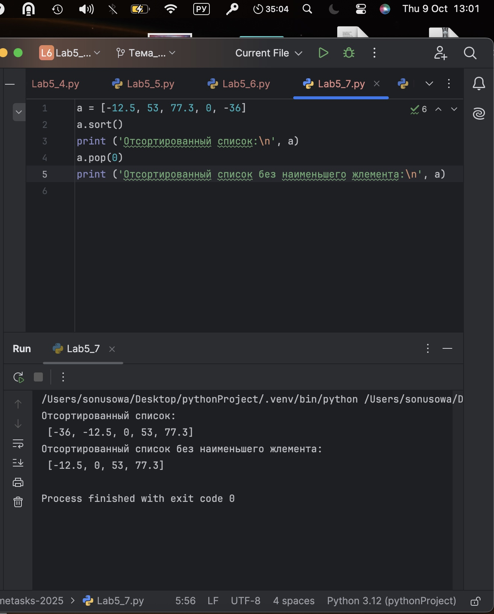
## Выводы

Используется метод .sort() для упорядочивания списка, после чего с помощью 
.pop(0) удаляется первый (минимальный) элемент. Демонстрирует удобство встроенных методов для 
изменения списков.

## Лабораторная работа №8
### Михаил решил создать большой n-мерный список, для этого он случайным образом создал несколько списков, состоящих минимум из 3, а максимум из 10 элементов и поместил их в один большой список. Он также как и Иван не знает зачем ему это сейчас нужно, но надеется на то, что это пригодится ему в будущем.
```python
from random import  randint

def list_maker():
    a = [randint(1, 100)]*randint (3,10)
    return a

if __name__=="__main__":
    result = []
    for i in range(randint (1, 5)):
        result.append(list_maker())

    print (result)
```
### Результат.
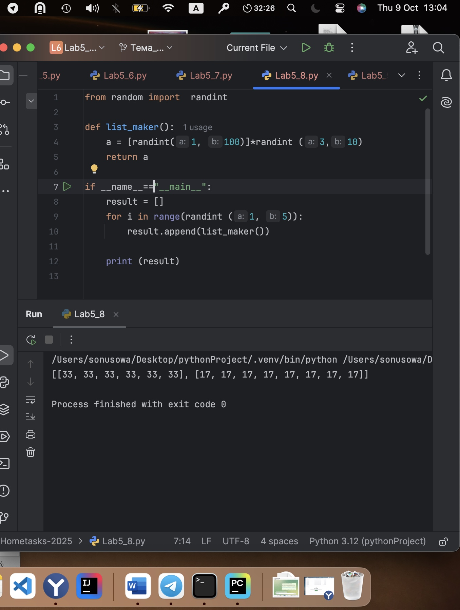
## Выводы

Создаётся список списков, где каждый вложенный список содержит 
несколько одинаковых случайных чисел. Использовано умножение списка [число] * количество для 
генерации повторяющихся элементов, а randint из модуля random — для определения случайных значений и размеров.

## Лабораторная работа №9
### Вы работаете в ресторане и отвечает за статистику покупок, ваша задача сравнить между собой заказы покупателей, которые указаны в разном порядке. Реализуйте функцию superset(), которая принимает 2 множества. Результат работы функции: вывод в консоль одного из сообщений в зависимости от ситуации: - «Супермножество не обнаружено» «Объект {X} является чистым супермножеством» «Множества равны»

```python
def superset (set_1, set_2):
    if set_1>set_2:
        print(f'Объект {set_1} является чистым супермножеством')
    elif set_1==set_2:
        print(f'Множества равны')
    elif set_1<set_2:
        print(f'Объект {set_2} является чистым супермножеством')
    else:
        print(f'Суперножества не обнаружено')

if __name__ == '__main__':
    superset({1,2,3,5}, {3,5})
    superset({1, 2, 3, 5}, {5,3,2,1})
    superset({3,5}, {5,3,2,1})
    superset({90, 100}, {3,5})
```
### Результат.
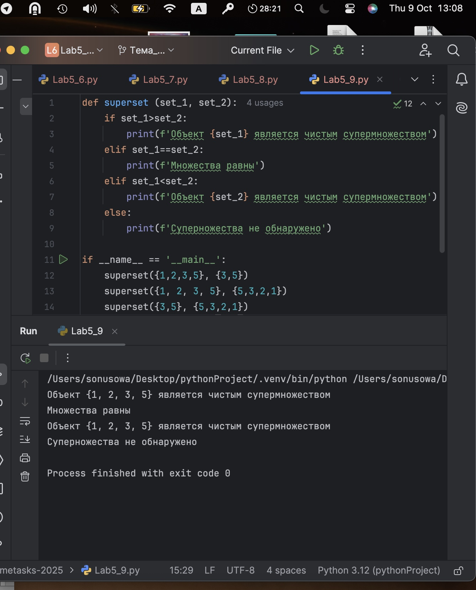
## Выводы

В функции применяется сравнение множеств через операторы >, <, ==. Определяется, 
является ли одно множество чистым супермножеством другого или они равны. В противном 
случае выводится, что супермножества нет. Это демонстрирует возможности Python по работе с отношениями между множествами.
## Лабораторная работа №10
### Предположим, что вам нужно разобрать стопку бумаг, но нужно начать работу с нижней, “переверните стопку”. Вам дан произвольный список. Представьте его в обратном порядке. Программа должна занимать не более двух строк в редакторе кода.
```python
my_list = [2, 5, 8, 3]
print (my_list[::-1])
```
### Результат.
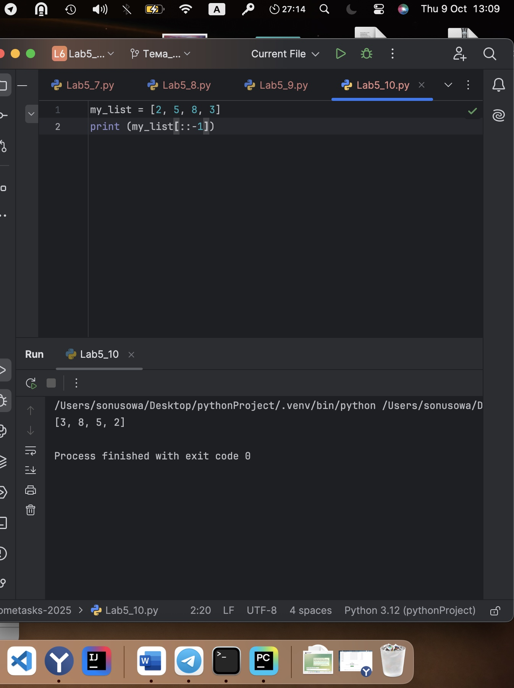
## Выводы

Использован срез с шагом -1 ([::-1]), чтобы получить новый список в обратном 
порядке — простой и лаконичный способ инверсии последовательности.

## Самостоятельная работа №1
### Ресторан на предприятии ведет учет посещений за неделю при помощи кода работника. У них есть список со всеми посещениями за неделю. Ваша задача почитать:Сколько было выдано чеков; Сколько разных людей посетило ресторан; Какой работник посетил ресторан больше всех раз 

```python
cheques = [8734, 2345, 8201, 6621, 9999, 1234, 5678, 8201, 8888, 4321, 3365,
           1478, 9865, 5555, 7777, 9998, 1111, 2222, 3333, 4444, 5556, 6666,
           5410, 7778, 8889, 4445, 1439, 9604, 8201, 3365, 7502, 3016, 4928,
           5837, 8201, 2643, 5017, 9682, 8530, 3250, 7193, 9051, 4506, 1987,
           3365, 5410, 7168, 7777, 9865, 5678, 8201, 4445, 3016, 4506, 4506]

total_cheques = len(cheques)
unique_visitors = len(set(cheques))
from collections import Counter
most_visits = Counter(cheques).most_common(1)[0]

print(f"Выдано чеков: {total_cheques}")
print(f"Разных посетителей: {unique_visitors}")
print(f"Чаще всех приходил работник с кодом {most_visits[0]} ({most_visits[1]} раз)")
print()

results = [10.2, 14.8, 19.3, 22.7, 12.5, 33.1, 38.9, 21.6, 26.4, 17.1, 30.2, 35.7, 16.9,
           27.8, 24.5, 16.3, 18.7, 31.9, 12.9, 37.4]

sorted_results = sorted(results)
best_three = sorted_results[:3]
worst_three = sorted_results[-3:]
from_10_onwards = [r for r in results if r >= 10]

```
### Результат.
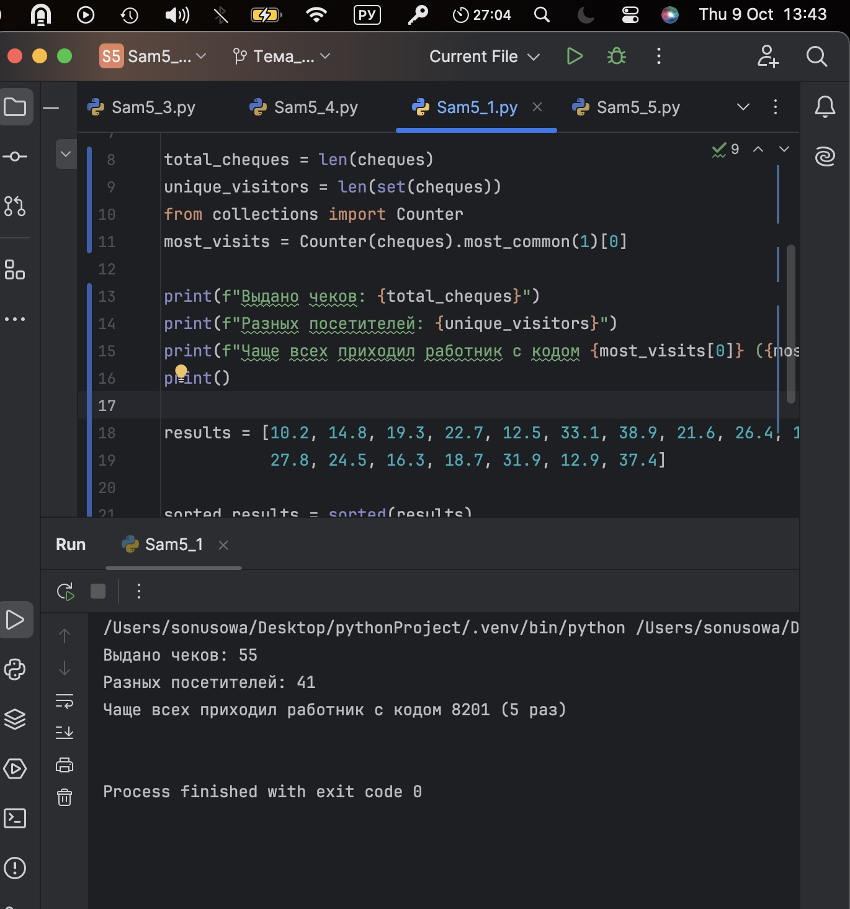
## Выводы

Использовали функции len() для подсчёта общего числа чеков и уникальных посетителей через преобразование списка в set(). Для определения частоты появления кода применили collections.Counter и метод .most_common(1), что позволило быстро получить самый частый элемент и его количество.
  
## Самостоятельная работа №2
### На физкультуре студенты сдавали бег, у преподавателя физкультуры есть список всех результатов, ему нужно узнать: Три лучшие результата; Три худшие результата; Все результаты начиная с 10

```python
sorted_results = sorted(results)
best_three = sorted_results[:3]
worst_three = sorted_results[-3:]
from_10_onwards = [r for r in results if r >= 10]


print(f"Три лучших результата: {best_three}")
print(f"Три худших результата: {worst_three}")
print(f"Все результаты начиная с 10: {from_10_onwards}")
print()

```
### Результат.
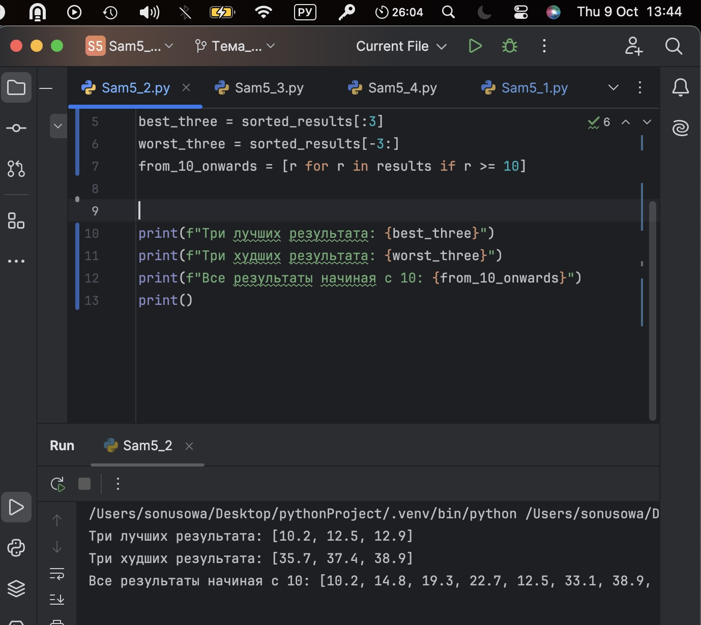
## Выводы

Сначала сортировка списка через функцию sorted(), чтобы получить упорядоченные результаты для отбора лучших и худших значений (применение срезов Python). Для фильтрации результатов с условием (начиная с 10) применён генератор списков, что оптимально и читаемо.
  
## Самостоятельная работа №3
### Преподаватель по математике придумал странную задачку. У вас есть три списка с элементами, каждый элемент которых – длина стороны треугольника, ваша задача найти площади двух треугольников, составленные из максимальных и минимальных элементов полученных списков. Результатом выполнения задачи будет: листинг кода, и вывод в консоль, в котором будут указаны два этих значения.
```python
import math
one = [12, 25, 3, 48, 71]
two = [5, 18, 40, 62, 98]
three = [4, 21, 37, 56, 84]

max_sides = (max(one), max(two), max(three))
min_sides = (min(one), min(two), min(three))

def triangle_area(a, b, c):
    p = (a + b + c) / 2
    return math.sqrt(p * (p - a) * (p - b) * (p - c))

area_max = triangle_area(*max_sides)
area_min = triangle_area(*min_sides)


print(f"Площадь треугольника с максимальными сторонами {max_sides}: {area_max:.2f}")
print(f"Площадь треугольника с минимальными сторонами {min_sides}: {area_min:.2f}")
print()
```
### Результат.
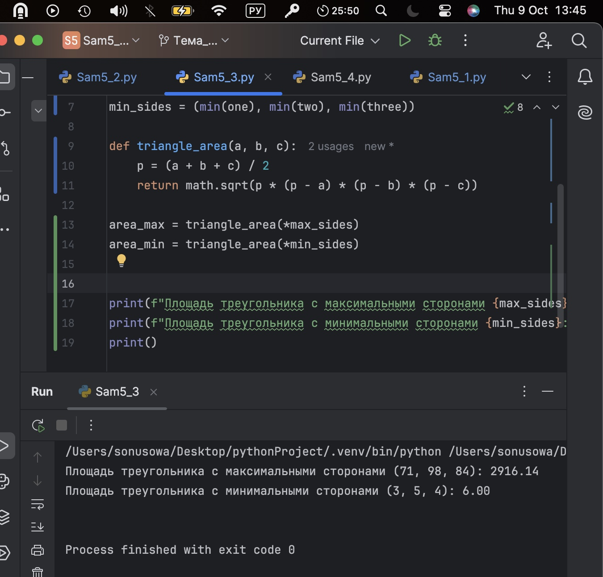
## Выводы

Определение максимальных и минимальных сторон через встроенные функции max() и min(). Функция triangle_area реализует подсчёт площади по формуле Герона с использованием метода распаковки аргументов * для передачи трёх значений из кортежа, что упрощает вызов.

## Самостоятельная работа №4
### Никто не любит получать плохие оценки, поэтому Борис решил это исправить. Допустим, что все оценки студента за семестр хранятся в одном списке. Ваша задача удалить из этого списка все двойки, а все тройки заменить на четверки.
```python
grades_lists = [
    [2, 3, 4, 5, 3, 4, 5, 2, 2, 5, 3, 4, 3, 5, 4],
    [4, 2, 3, 5, 3, 5, 4, 2, 2, 5, 4, 3, 5, 3, 4],
    [5, 4, 3, 3, 4, 3, 3, 5, 5, 3, 3, 3, 3, 4, 4]
]

for grades in grades_lists:
    new_grades = [4 if g == 3 else g for g in grades if g != 2]
    print(new_grades)
print()
```
### Результат.
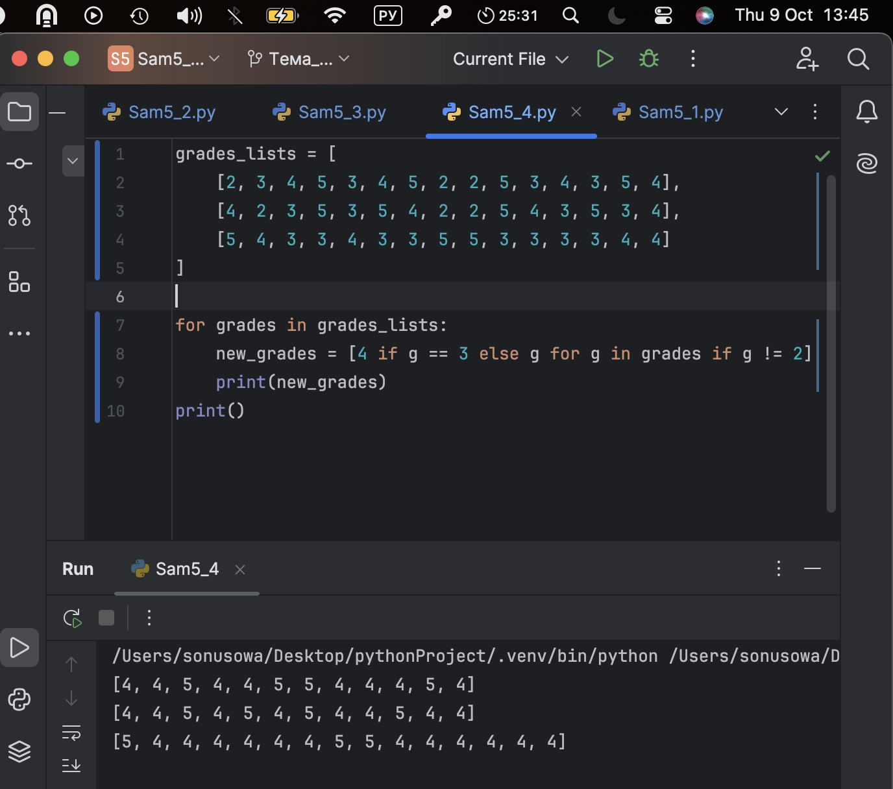
## Выводы

Для коллекций оценок использовалась однострочная обработка через списковое включение (list comprehension): мы удаляем двойки (if g != 2) и заменяем тройки на четвёрки (4 if g == 3 else g). Такой подход позволяет компактно преобразовать список без циклов и дополнительных условий.
  
## Самостоятельная работа №5
### Вам предоставлены списки натуральных чисел, из них необходимо сформировать множества. При этом следует соблюдать это правило: если какое-либо число повторяется, то преобразовать его в строку по следующему образцу: например, если число 4 повторяется 3 раза, то в множестве будет следующая запись: само число 4, строка «44», строка «444».

```python
def create_set(lst):
    from collections import Counter
    counts = Counter(lst)
    result = set()
    for num, count in counts.items():
        result.add(num)
        for i in range(2, count + 1):
            result.add(str(num) * i)
    return result

list_1 = [1, 1, 3, 3, 1]
list_2 = [5, 5, 5, 5, 5, 5, 5]
list_3 = [2, 2, 1, 2, 2, 5, 6, 7, 1, 3, 2, 2]

print(create_set(list_1))
print(create_set(list_2))
print(create_set(list_3))
```
### Результат.
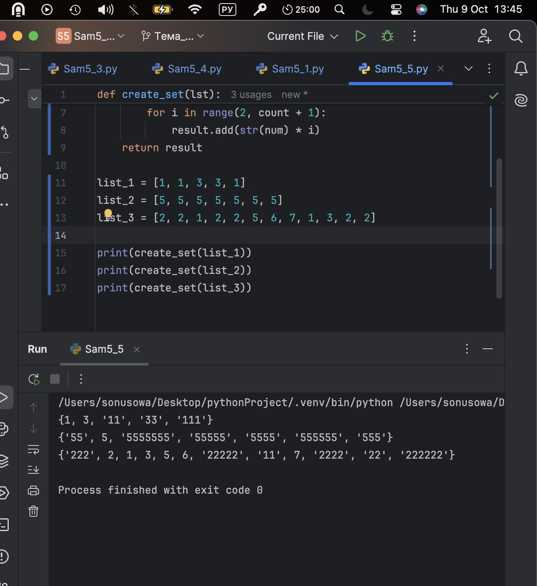
## Выводы

Счётчик повторов collections.Counter применяется для подсчёта количества каждого числа. Далее с помощью цикла формируется множество: добавляется число и при повторных встречах — строки с повторяющимися символами (например, '22', '222'). Использование множества set() обеспечивает уникальность элементов и быструю проверку наличия.

## Общие выводы по теме
Во всех задачах активно применялись встроенные структуры данных Python (списки и множества) и их методы, а также свойства операций над множествами. Использования срезов, распаковки, циклов и методов коллекций показывают базовые, но мощные инструменты языка, которые позволяют писать короткий, понятный и эффективный код для разнообразных задач.


