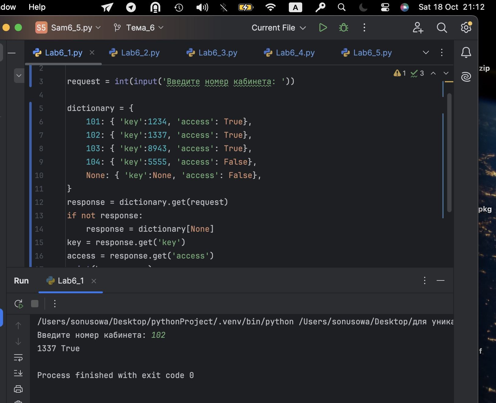
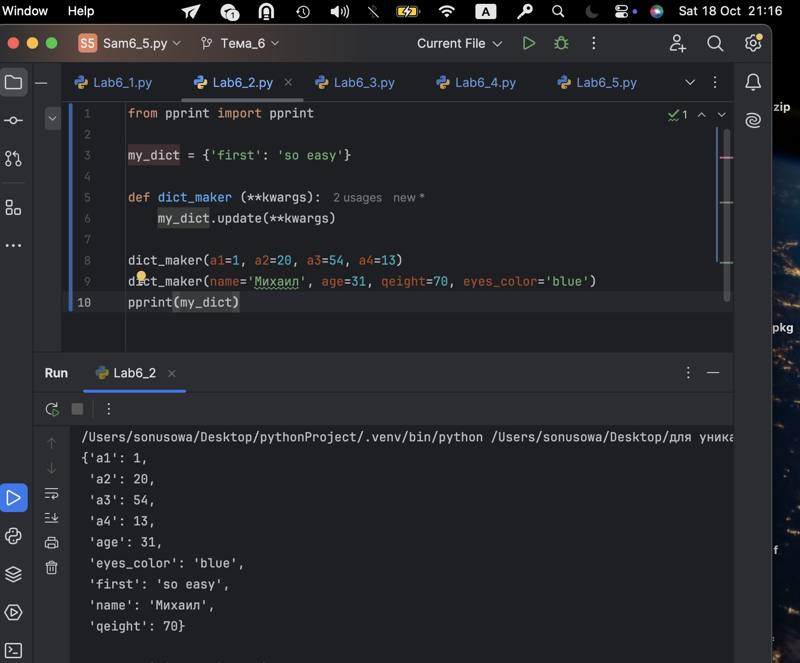
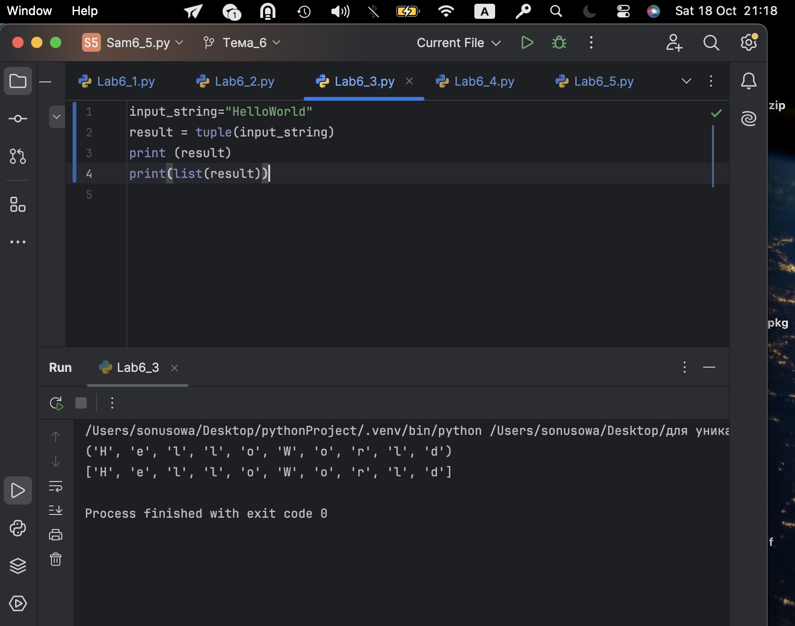
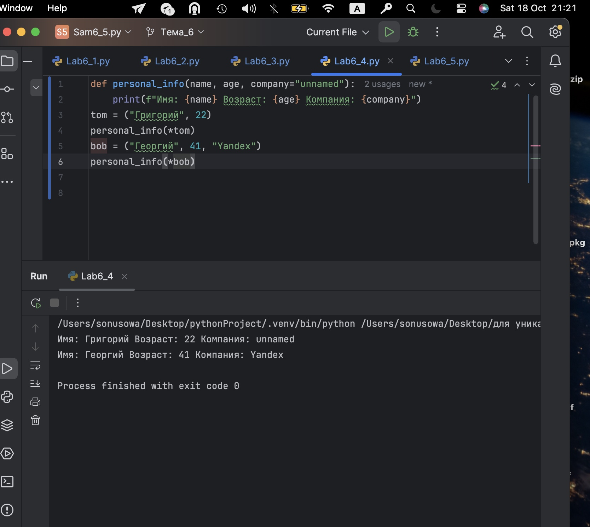
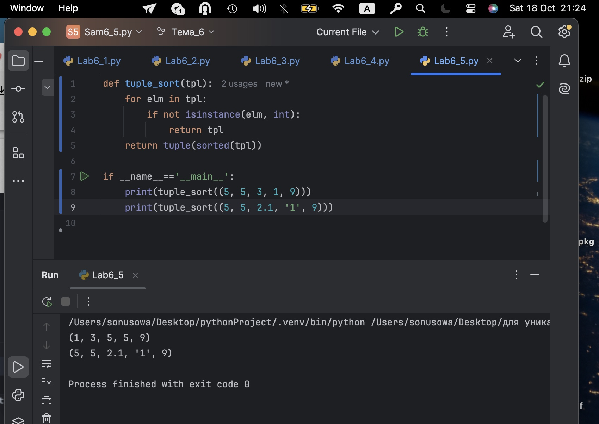

# Тема 6. Базовые коллекции: строки и списки
Отчет по Теме #6 выполнил(а):
- Усова Софья Сергеевна
- ИВТ-23-2

| Задание | Лаб_раб | Сам_раб |
| ------ | ------ | ------ |
| Задание 1 | + | + |
| Задание 2 | + | + |
| Задание 3 | + | + |
| Задание 4 | + | + |
| Задание 5 | + | + |

## Лабораторная работа №1
### В школе, где вы учились, узнали, что вы крутой программист и попросили написать программу для учителей, которая будет при вводе кабинета писать для него ключ доступа и статус, занят кабинет или нет. При написании программы необходимо использовать словарь (dict), который на вход получает номер кабинета, а выводит необходимую информацию. Если кабинета, который вы ввели нет в словаре, то в консоль в виде значения ключа нужно вывести “None” и виде статуса вывести “False”.

```python
from os import access

request = int(input('Введите номер кабинета: '))

dictionary = {
    101: { 'key':1234, 'access': True},
    102: { 'key':1337, 'access': True},
    103: { 'key':8943, 'access': True},
    104: { 'key':5555, 'access': False},
    None: { 'key':None, 'access': False},
}
response = dictionary.get(request)
if not response:
    response = dictionary[None]
key = response.get('key')
access = response.get('access')
print(key, access)
```
### Результат.


## Выводы

Используется операция вычитания множеств set_1 - set_2, что позволяет быстро получить элементы первого множества, отсутствующие во втором. 

## Лабораторная работа №2
### Алексей решил создать самый большой словарь в мире. Для этого он придумал функцию dict_maker (**kwargs), которая принимает неограниченное количество параметров «ключ: значение» и обновляет созданный им словарь my_dict, состоящий всего из одного элемента «first» со значением «so easy». Помогите Алексею создать данную функцию. Ниже на скриншоте мы использовали встроенный модуль pprint, который выводит большие объемы информации более понятно для восприятия человеческим глазом. Иногда очень удобно использовать данную возможность Python.

```python
from pprint import pprint

my_dict = {'first': 'so easy'}

def dict_maker (**kwargs):
    my_dict.update(**kwargs)

dict_maker(a1=1, a2=20, a3=54, a4=13)
dict_maker(name='Михаил', age=31, qeight=70, eyes_color='blue')
pprint(my_dict)
```
### Результат.

## Выводы

Создаётся изменяемое множество set() и неизменяемое frozenset(). К set() 
можно добавлять элементы с помощью метода .add(), в то время как у frozenset() 
нет таких методов — он неизменяемый. Показывает концепцию мутабельности и иммутабельности коллекций.

## Лабораторная работа №3
### Для решения некоторых задач бывает необходимо разложить строку на отдельные символы. Мы знаем что это можно сделать при помощи split(), у которого более гибкая настройка для разделения для этого, но если нам нужно посимвольно разделить строку без всяких условий, то для этого мы можем использовать кортежи (tuple). Для этого напишем любую строку, которую будем делить и “обвернем” ее в tuple и дальше мы можем как нам угодно с ней работать, например, сделать ее списком (тогда получится полный аналог split()) или же работать с ним дальше, как с кортежем.

```python
input_string="HelloWorld"
result = tuple(input_string)
print (result)
print(list(result))
```
### Результат.

## Выводы

В функции используется классический приём обмена значений с помощью 
временной переменной. Применяется индексирование по отрицательному индексу -1 
для доступа к последнему элементу, что удобно и характерно для Python.
  
## Лабораторная работа №4
### Вовочка решил написать крутую функцию, которая будет писать имя, возраст и место работы, но при этом на вход этой функции будет поступать кортеж. Помогите Вовочке написать эту программу.

```python
def personal_info(name, age, company="unnamed"):
    print(f"Имя: {name} Возраст: {age} Компания: {company}")
tom = ("Григорий", 22)
personal_info(*tom)
bob = ("Георгий", 41, "Yandex")
personal_info(*bob)
```
### Результат.

## Выводы

Для получения подсписка применяется срез [2:6] — базовый и очень удобный с
пособ работы с частями списков без лишних циклов.

## Лабораторная работа №5
### Для сопровождения первых лиц государства X нужен кортеж, но никто не может определиться с порядком машин, поэтому вам нужно написать функцию, которая будет сортировать кортеж, состоящий из целых чисел по возрастанию, и возвращает его. Если хотя бы один элемент не является целым числом, то функция возвращает исходный кортеж.

```python
def tuple_sort(tpl):
    for elm in tpl:
        if not isinstance(elm, int):
            return tpl
    return tuple(sorted(tpl))

if __name__=='__main__':
    print(tuple_sort((5, 5, 3, 1, 9)))
    print(tuple_sort((5, 5, 2.1, '1', 9)))
```
### Результат.

## Выводы

Используются встроенные функции max() для нахождения максимума и len() для 
длины списка. Их арифметическое сочетание позволяет получить элемент, интересующий 
студента — простой пример вычисления с использованием базового функционала Python.

## Самостоятельная работа №1
### При создании сайта у вас возникла потребность обрабатывать данные пользователя в странной форме, а потом переводить их в нужные вам форматы. Вы хотите принимать от пользователя последовательность чисел, разделенных пробелом, а после переформатировать эти данные в список и кортеж. Реализуйте вашу задумку. Для получения начальных данных используйте input(). Результатом программы будет выведенный список и кортеж из начальных данных.

```python
user_input = input("Введите числа через пробел: ")
numbers_list = user_input.split()
numbers_tuple = tuple(numbers_list)
print(numbers_list)
print(numbers_tuple)
```
### Результат.

## Выводы

Используется метод строки split(), который разбивает исходную строку по пробелам и возвращает список подстрок. Преобразование списка в кортеж происходит встроенной функцией tuple(). Такая логика удобна для преобразования пользовательского ввода в структуры данных для дальнейшей обработки. Методы строк в Python всегда возвращают новый объект и не изменяют исходную строку.
  
## Самостоятельная работа №2
### Николай знает, что кортежи являются неизменяемыми, но он очень упрямый и всегда хочет доказать, что он прав. Студент решил создать функцию, которая будет удалять первое появление определенного элемента из кортежа по значению и возвращать кортеж без него. Попробуйте повторить шедевр не признающего авторитеты начинающего программиста. Но учтите, что Николай не всегда уверен в наличии элемента в кортеже (в этом случае кортеж вернется функцией в исходном виде).

```python
def remove_first_occurrence(t, el):
    if el not in t:
        return t
    idx = t.index(el)
    return t[:idx] + t[idx+1:]

print(remove_first_occurrence((1, 2, 3), 1))
print(remove_first_occurrence((1, 2, 3, 1, 2, 3, 4, 5, 2, 3, 4, 2, 4, 2), 3))
print(remove_first_occurrence((2, 4, 6, 6, 4, 2), 9))
```
### Результат.

## Выводы

Поскольку кортежи в Python неизменяемы, прямая операция удаления невозможна. Для удаления первого вхождения создаём новый кортеж конкатенацией срезов: до элемента и после. Используется метод index() для поиска позиции первого вхождения. Если элемент отсутствует, возвращаем исходный кортеж без изменений. Такой подход эффективен и соответствует правилам работы с неизменяемыми типами.​
  
## Самостоятельная работа №3
### Ребята поспорили кто из них одним нажатием на numpad наберет больше повторяющихся цифр, но не понимают, как узнать победителя. Вам им нужно в этом помочь. Дана строка в виде случайной последовательности чисел от 0 до 9 (длина строки минимум 15 символов). Требуется создать словарь, который в качестве ключей будет принимать данные числа (т. е. ключи будут типом int), а в качестве значений – количество этих чисел в имеющейся последовательности. Для построения словаря создайте функцию, принимающую строку из цифр. Функция должна возвратить словарь из 3-х самых часто встречаемых чисел, также эти значения нужно вывести в порядке возрастания ключа.

```python
from collections import Counter

def top_three_digits_count(digits_str):
    count = Counter(int(d) for d in digits_str)
    most_common = count.most_common(3)
    result = {k: v for k, v in sorted(most_common)}
    return result

example_str = "2344448920201"
print(top_three_digits_count(example_str))
```
### Результат.

## Выводы

Для подсчёта количества элементов удобно использовать класс Counter из модуля collections, который возвращает словарь с частотами. Метод most_common(3) позволяет быстро получить три наиболее частых элемента. Для правильного вывода словаря по возрастанию ключей применяется сортировка по ключам. Функция принимает строку, преобразует каждый символ в число (int), что важно для корректного ключа словаря. Словарь хранит данные за счёт хэш-таблиц, обеспечивая быстрый доступ.

## Самостоятельная работа №4
### Ваш хороший друг владеет офисом со входом по электронным картам, ему нужно чтобы вы написали программу, которая показывала в каком порядке сотрудники входили и выходили из офиса. Определение сотрудника происходит по id. Напишите функцию, которая на вход принимает кортеж и случайный элемент (id), его можно придумать самостоятельно. Требуется вернуть новый кортеж, начинающийся с первого появления элемента в нем и заканчивающийся вторым его появлением включительно.

```python
def slice_by_element(t, el):
    if el not in t:
        return ()
    first_idx = t.index(el)
    try:
        second_idx = t.index(el, first_idx + 1)
        return t[first_idx:second_idx + 1]
    except ValueError:
        return t[first_idx:]

print(slice_by_element((1, 2, 3), 8))
print(slice_by_element((1, 8, 3, 4, 8, 8, 9, 2), 8))
print(slice_by_element((1, 2, 8, 5, 1, 2, 9), 8))
```
### Результат.

## Выводы

Использована работа с кортежами и методами index() для поиска позиций первого и второго вхождения элемента. Обработка исключения ValueError позволяет учесть случаи, когда элемент появляется лишь один раз. Возврат среза кортежа с помощью операторов среза — стандартная и эффективная практика.
  
## Самостоятельная работа №5
### Самостоятельно придумайте и решите задачу, в которой будут обязательно использоваться кортеж или список. Проведите минимум три теста для проверки работоспособности вашей задачи.

```python
def top_three_unique(numbers):
    uniq = set(numbers)
    top_three = sorted(uniq, reverse=True)[:3]
    return tuple(top_three)


print(top_three_unique([1, 3, 5, 7, 5, 3, 1]))
print(top_three_unique([10, 9, 8, 7, 6]))
print(top_three_unique([1, 1, 1, 1]))
```
### Результат.

## Выводы

Рассматривается работа с множеством (set) для удаления повторов. Сортировка множества и затем срез на первые три значения позволяет получить топ-3 уникальных числа.
Возврат результата в кортеже удобен для передачи неизменяемого набора значений. 

## Общие выводы по теме
Во всех задачах активно применялись встроенные структуры данных Python (списки и множества) и их методы, а также свойства операций над множествами. Использования срезов, распаковки, циклов и методов коллекций показывают базовые, но мощные инструменты языка, которые позволяют писать короткий, понятный и эффективный код для разнообразных задач.


