# Тема 7. Работа с файлами (ввод, вывод)
Отчет по Теме #7 выполнил(а):
- Усова Софья Сергеевна
- ИВТ-23-2

| Задание | Лаб_раб | Сам_раб |
| ------ | ------ | ------ |
| Задание 1 | + | + |
| Задание 2 | + | + |
| Задание 3 | + | + |
| Задание 4 | + | + |
| Задание 5 | + | + |
| Задание 6 | + |  |
| Задание 7 | + |  |
| Задание 8 | + |  |
| Задание 9 | + |  |
| Задание 10 | + |  |

## Лабораторная работа №1
### Составьте текстовый файл и положите его в одну директорию с программой на Python. Текстовый файл должен состоять минимум из двух строк.

```python
with open('input.txt', 'a+') as f:
    f.write('\nНе уходи, постой, фанатка!')
    f.seek(0)
    result = f.readlines()
    print(result)
```
### Результат.
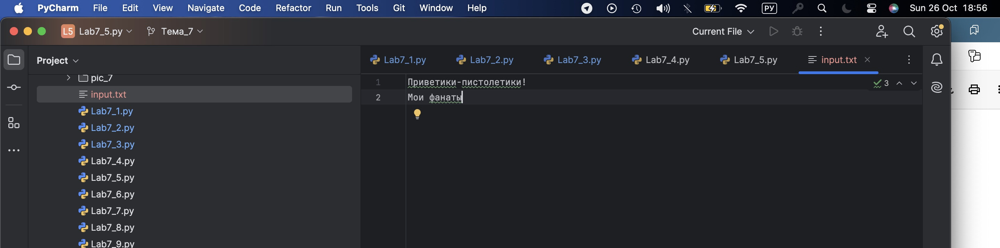

## Выводы

Использован словарь (dict) для сопоставления номера кабинета с информацией о ключе доступа и статусе. Метод dict.get() позволяет безопасно получить значение по ключу, возвращая заданное значение по умолчанию, если ключ отсутствует.
Данные в словаре вложены, то есть значением является другой словарь с полями 'key' и 'access', что демонстрирует вложенность структур. Логика с проверкой отсутствия ключа и подстановкой дефолтных значений "None" и False обеспечивает устойчивость программы.

## Лабораторная работа №2
### Напишите программу, которая выведет только первую строку из вашего файла, при этом используйте конструкцию open()/close().

```python
f = open('input.txt', 'r')
print(f.readline())
f.close()
```
### Результат.
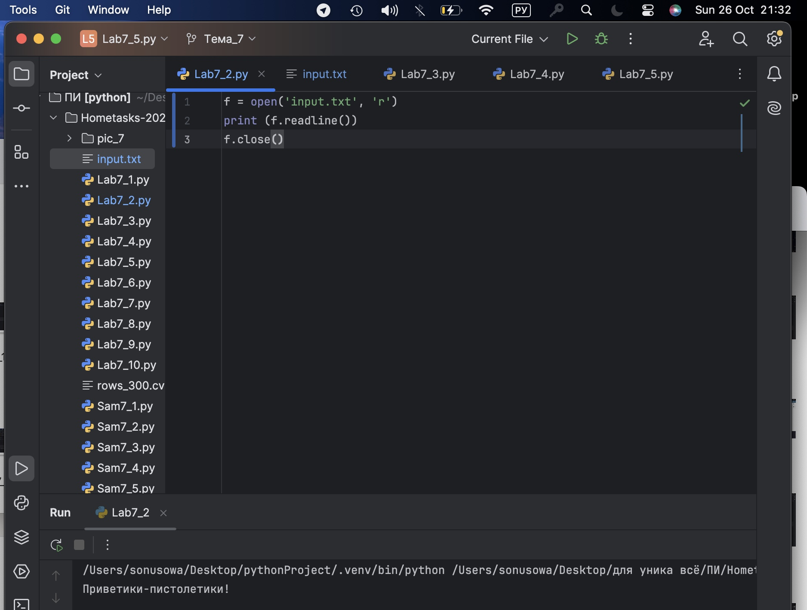
## Выводы

Использование функции с параметром **kwargs позволяет принимать произвольное количество именованных аргументов. Метод dict.update() служит для дозаписи новых пар ключ-значение в существующий словарь, что способствует накоплению данных.

## Лабораторная работа №3
### Напишите программу, которая выведет все строки из вашего файла в массиве, при этом используйте конструкцию open()/close().

```python
f = open('input.txt', 'r')
print(f.readlines())
f.close()
```
### Результат.
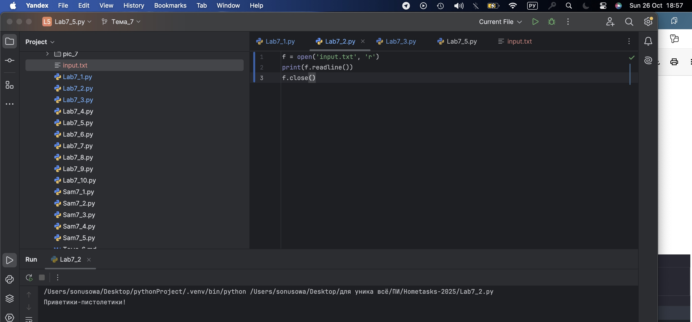
## Выводы

Использование функции tuple() для преобразования строкового объекта в кортеж символов — удобный способ поделить строку на отдельные элементы без разделителей. Последующее преобразование кортежа в список демонстрирует смену структур данных, что может понадобиться при разных операциях. Эта задача иллюстрирует работу с последовательностями и типами данных, а также принципы неизменяемости (tuple) и изменяемости (list).
  
## Лабораторная работа №4
### Напишите программу, которая выведет все строки из вашего файла в массиве, при этом используйте конструкцию with open().

```python
with open('input.txt') as f:
    print(f.readlines())
```
### Результат.
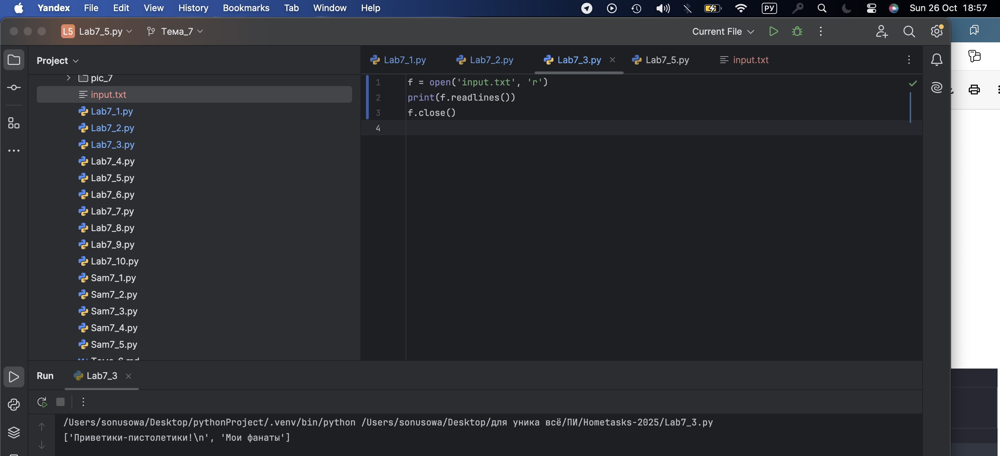
## Выводы

Распаковка кортежа при передаче в функцию с помощью оператора * упрощает передачу аргументов. Параметры функции с умолчательными значениями позволяют гибко задавать обязательные и необязательные параметры. Пример показывает, как кортежи могут служить компактным контейнером для групп данных, а функции — извлекать эти данные для форматированного вывода.

## Лабораторная работа №5
### Напишите программу, которая выведет каждую строку из вашего файла отдельно, при этом используйте конструкцию with open().

```python
with open('input.txt', 'a+') as f:
    f.write('\nНе уходи, постой, фанатка!')
    f.seek(0)
    result = f.readlines()
    print(result)
```
### Результат.
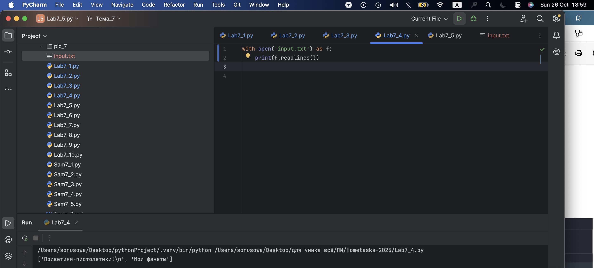
## Выводы

Итерация по кортежу с проверкой каждого элемента функцией isinstance() демонстрирует типобезопасность. Отказ от сортировки в случае наличия недопустимого типа данных предотвращает ошибки и сохраняет исходные данные. Применение функции sorted() и возврат результата как кортежа сохраняют неизменяемость исходной структуры. 

## Лабораторная работа №6
### Напишите программу, которая будет добавлять новую строку в ваш файл, а потом выведет полученный файл в консоль. Вывод можно осуществлять любым способом. Обязательно проверьте сам файл, чтобы изменения в нем тоже отображались

```python
lines = ['лучшая!', 'гениальная', 'красивая']
with open('input.txt', 'w') as f:
    for line in lines:
        f.write('\nЯ-'+line)
    print('Done!')
```
### Результат.
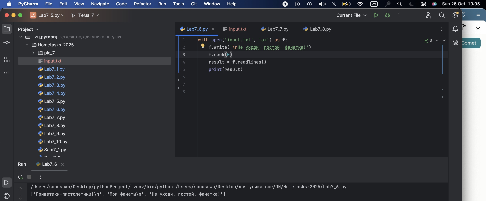

## Выводы

Использован словарь (dict) для сопоставления номера кабинета с информацией о ключе доступа и статусе. Метод dict.get() позволяет безопасно получить значение по ключу, возвращая заданное значение по умолчанию, если ключ отсутствует.
Данные в словаре вложены, то есть значением является другой словарь с полями 'key' и 'access', что демонстрирует вложенность структур. Логика с проверкой отсутствия ключа и подстановкой дефолтных значений "None" и False обеспечивает устойчивость программы.

## Лабораторная работа №7
### Напишите программу, которая перепишет всю информацию, которая была у вас в файле до этого, например напишет любые данные из произвольно вами составленного списка. Также не забудьте проверить что измененная вами информация сохранилась в файле.

```python
lines = ['лучшая!', 'гениальная', 'красивая']
with open('input.txt', 'w') as f:
    for line in lines:
        f.write('\nЯ-'+line)
    print('Done!')
```
### Результат.
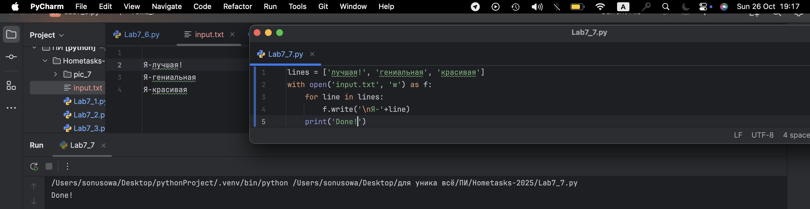

## Выводы

Использован словарь (dict) для сопоставления номера кабинета с информацией о ключе доступа и статусе. Метод dict.get() позволяет безопасно получить значение по ключу, возвращая заданное значение по умолчанию, если ключ отсутствует.
Данные в словаре вложены, то есть значением является другой словарь с полями 'key' и 'access', что демонстрирует вложенность структур. Логика с проверкой отсутствия ключа и подстановкой дефолтных значений "None" и False обеспечивает устойчивость программы.

## Лабораторная работа №8
### Выберите любую папку на своем компьютере, имеющую вложенные директории. Выведите на печать в терминал ее содержимое, как и всех подкаталогов при помощи функции print_docs(directory).

```python
import os

def print_docs(directory):
    for root, dirs, files in os.walk(directory):
        print(f'Папка: {root} содержит:')
        print(f'  Подпапки: {", ".join(dirs)}')
        print(f'  Файлы: {", ".join(files)}')
        print('-' * 40)

print_docs(r'/Users/sonusowa/Desktop/для уника всё')
```
### Результат.
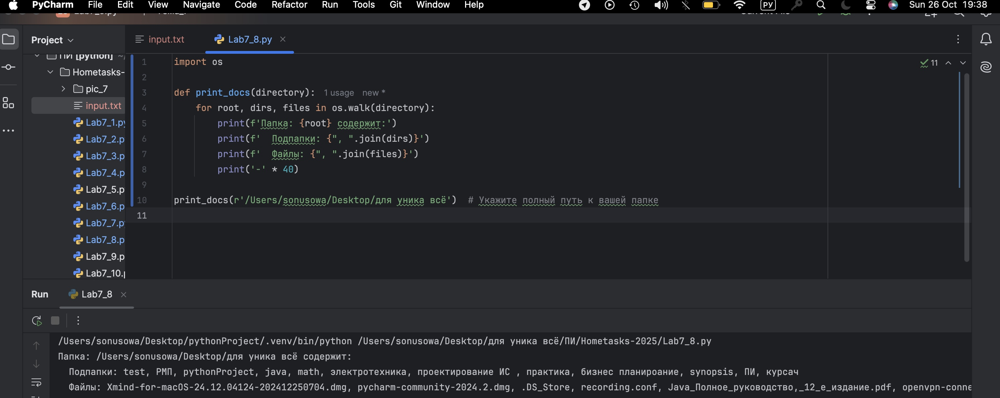

## Выводы

Использован словарь (dict) для сопоставления номера кабинета с информацией о ключе доступа и статусе. Метод dict.get() позволяет безопасно получить значение по ключу, возвращая заданное значение по умолчанию, если ключ отсутствует.
Данные в словаре вложены, то есть значением является другой словарь с полями 'key' и 'access', что демонстрирует вложенность структур. Логика с проверкой отсутствия ключа и подстановкой дефолтных значений "None" и False обеспечивает устойчивость программы.

## Лабораторная работа №9
### Требуется реализовать функцию, которая выводит слово, имеющее максимальную длину (или список слов, если таковых несколько).

```python
def longest_words(file):
    with open(file, encoding='utf-8') as f:
        words = f.read().split()
        max_length = len(max(words, key=len))
        for word in words:
            if len (word) == max_length:
                sought_words = word

        if len(sought_words) ==1:
            return sought_words[0]
        return sought_words
print (longest_words('input.txt'))
```
### Результат.
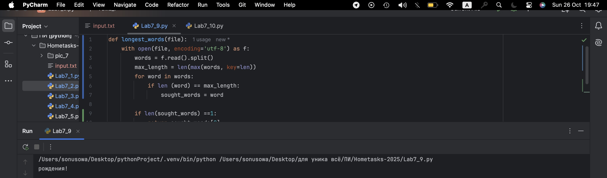

## Выводы

Использован словарь (dict) для сопоставления номера кабинета с информацией о ключе доступа и статусе. Метод dict.get() позволяет безопасно получить значение по ключу, возвращая заданное значение по умолчанию, если ключ отсутствует.
Данные в словаре вложены, то есть значением является другой словарь с полями 'key' и 'access', что демонстрирует вложенность структур. Логика с проверкой отсутствия ключа и подстановкой дефолтных значений "None" и False обеспечивает устойчивость программы.

## Лабораторная работа №10
### Требуется создать csv-файл «rows_300.csv» со следующими столбцами

```python
import csv
import datetime
import time

with open ('rows_300.cvs', 'w', encoding='utf-8', newline='') as f:
    writer = csv.writer(f)
    writer.writerow(['№','Секунда', 'Микросекунда'])
    for line in range (1, 301):
        writer.writerow([line, datetime.datetime.now().second,datetime.datetime.now().microsecond])
        time.sleep(0.01)
```
### Результат.
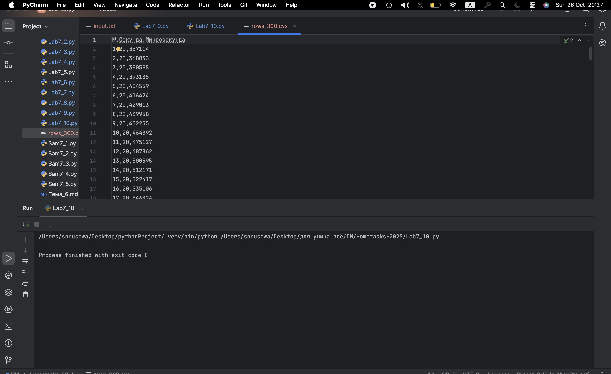

## Выводы

Использован словарь (dict) для сопоставления номера кабинета с информацией о ключе доступа и статусе. Метод dict.get() позволяет безопасно получить значение по ключу, возвращая заданное значение по умолчанию, если ключ отсутствует.
Данные в словаре вложены, то есть значением является другой словарь с полями 'key' и 'access', что демонстрирует вложенность структур. Логика с проверкой отсутствия ключа и подстановкой дефолтных значений "None" и False обеспечивает устойчивость программы.

## Самостоятельная работа №1
### Найдите в интернете любую статью (объем статьи не менее 200 слов), скопируйте ее содержимое в файл и напишите программу, которая считает количество слов в текстовом файле и определит самое часто встречающееся слово. Результатом выполнения задачи будет: скриншот файла со статьей, листинг кода, и вывод в консоль, в котором будет указана вся необходимая информация.

```python
from collections import Counter
import re

with open('input.txt', 'r', encoding='utf-8') as f:
    text = f.read().lower()
    words = re.findall(r'\b\w+\b', text)
    count = len(words)
    most_common = Counter(words).most_common(1)[0]

print(f'Количество слов: {count}')
print(f'Самое частое слово: {most_common[0]}, встречается {most_common[1]} раз(а)')
```
### Результат.
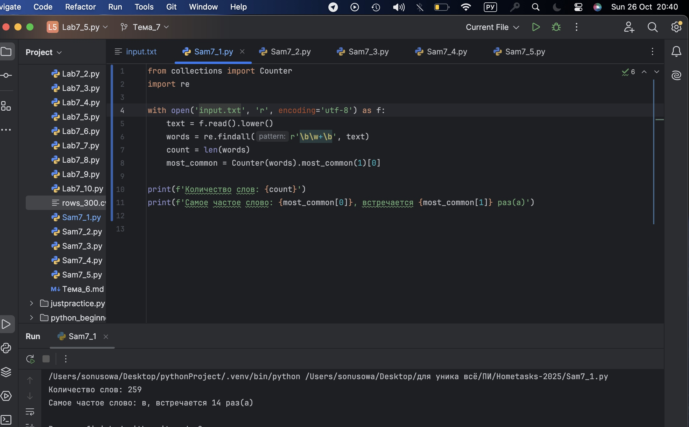
## Выводы

Используется метод строки split(), который разбивает исходную строку по пробелам и возвращает список подстрок. Преобразование списка в кортеж происходит встроенной функцией tuple(). Такая логика удобна для преобразования пользовательского ввода в структуры данных для дальнейшей обработки. Методы строк в Python всегда возвращают новый объект и не изменяют исходную строку.
  
## Самостоятельная работа №2
### У вас появилась потребность в ведении книги расходов, посмотрев все существующие варианты вы пришли к выводу что вас ничего не устраивает и нужно все делать самому. Напишите программу для учета расходов. Программа должна позволять вводить информацию о расходах, сохранять ее в файл и выводить существующие данные в консоль. Ввод информации происходит через консоль. Результатом выполнения задачи будет: скриншот файла с учетом расходов, листинг кода, и вывод в консоль, с демонстрацией работоспособности программы.

```python
def add_expense():
    date = input("Дата (ДД.ММ.ГГГГ): ")
    amount = input("Сумма: ")
    category = input("Категория: ")
    desc = input("Описание: ")
    with open('expenses.txt', 'a', encoding='utf-8') as f:
        f.write(f'{date},{amount},{category},{desc}\n')
    print("Расход добавлен!")

def view_expenses():
    print("Все расходы:")
    with open('expenses.txt', 'r', encoding='utf-8') as f:
        print(f.read())

while True:
    cmd = input("1: Добавить\n2: Показать\n3: Выйти\nВыберите: ")
    if cmd == '1':
        add_expense()
    elif cmd == '2':
        view_expenses()
    else:
        break
```
### Результат.
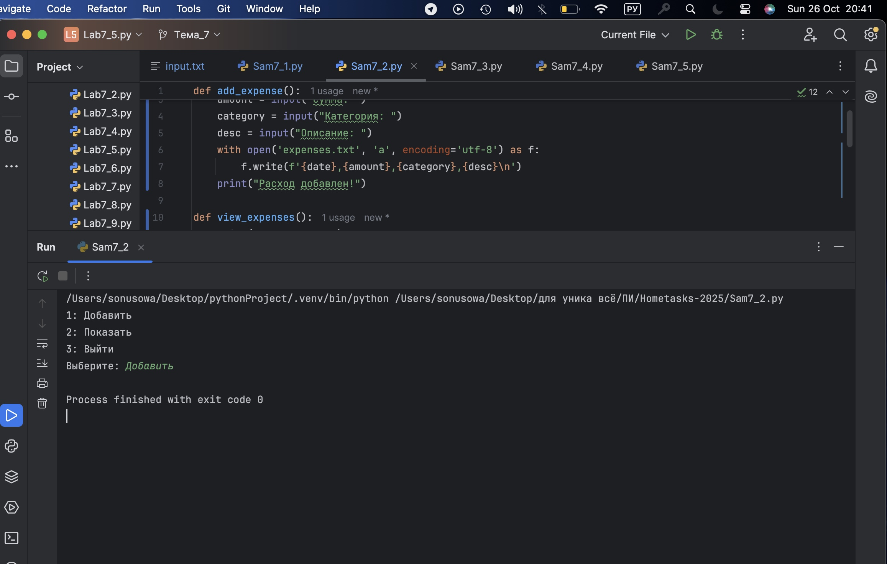
## Выводы

Поскольку кортежи в Python неизменяемы, прямая операция удаления невозможна. Для удаления первого вхождения создаём новый кортеж конкатенацией срезов: до элемента и после. Используется метод index() для поиска позиции первого вхождения. Если элемент отсутствует, возвращаем исходный кортеж без изменений. Такой подход эффективен и соответствует правилам работы с неизменяемыми типами.​
  
## Самостоятельная работа №3
### Имеется файл input.txt с текстом на латинице. Напишите программу, которая выводит следующую статистику по тексту: количество букв латинского алфавита; число слов; число строк.
```python
with open('input.txt', 'r', encoding='utf-8') as f:
    text = f.read()
    letters = [c for c in text if c.isalpha() and c.isascii()]
    words = text.split()
    lines = text.splitlines()
    print(f"{len(letters)} letters")
    print(f"{len(words)} words")
    print(f"{len(lines)} lines")
```
### Результат.
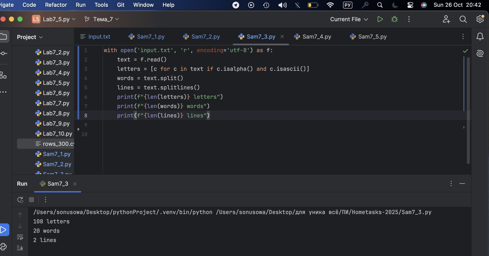
## Выводы

Для подсчёта количества элементов удобно использовать класс Counter из модуля collections, который возвращает словарь с частотами. Метод most_common(3) позволяет быстро получить три наиболее частых элемента. Для правильного вывода словаря по возрастанию ключей применяется сортировка по ключам. Функция принимает строку, преобразует каждый символ в число (int), что важно для корректного ключа словаря. Словарь хранит данные за счёт хэш-таблиц, обеспечивая быстрый доступ.

## Самостоятельная работа №4
### Напишите программу, которая получает на вход предложение, выводит его в терминал, заменяя все запрещенные слова звездочками * (количество звездочек равно количеству букв в слове). Запрещенные слова, разделенные символом пробела, хранятся в текстовом файле input.txt. Все слова в этом файле записаны в нижнем регистре. Программа должна заменить запрещенные слова, где бы они ни встречались, даже в середине другого слова.

```python
import re


with open('input.txt', encoding='utf-8') as f:
    banned = [line.strip() for line in f.read().split() if line.strip()]

sentence = input("Введите предложение: ")

def censor(text, banned):
    def repl(match):
        return '*' * len(match.group())

    pattern = '|'.join(map(re.escape, banned))
    return re.sub(pattern, repl, text, flags=re.IGNORECASE)

print(censor(sentence, banned))
```
### Результат.
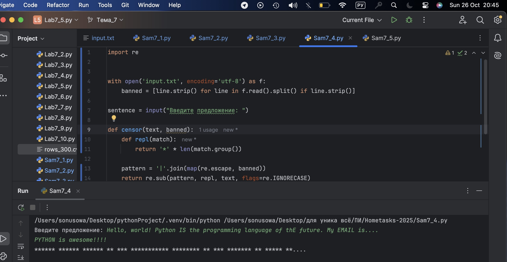
## Выводы

Использована работа с кортежами и методами index() для поиска позиций первого и второго вхождения элемента. Обработка исключения ValueError позволяет учесть случаи, когда элемент появляется лишь один раз. Возврат среза кортежа с помощью операторов среза — стандартная и эффективная практика.
  
## Самостоятельная работа №5
### Самостоятельно придумайте и решите задачу, которая будет взаимодействовать с текстовым файлом

```python
name = input("Имя игрока: ")
score = int(input("Очки: "))

with open('scores.txt', 'a', encoding='utf-8') as f:
    f.write(f"{name},{score}\n")

with open('scores.txt', 'r', encoding='utf-8') as f:
    scores = [line.strip().split(',') for line in f]
    scores = sorted(scores, key=lambda x: int(x[1]), reverse=True)

print("Топ 3 результата:")
for i, row in enumerate(scores[:3], 1):
    print(f"{i}. {row[0]} - {row[1]}")
```
### Результат.
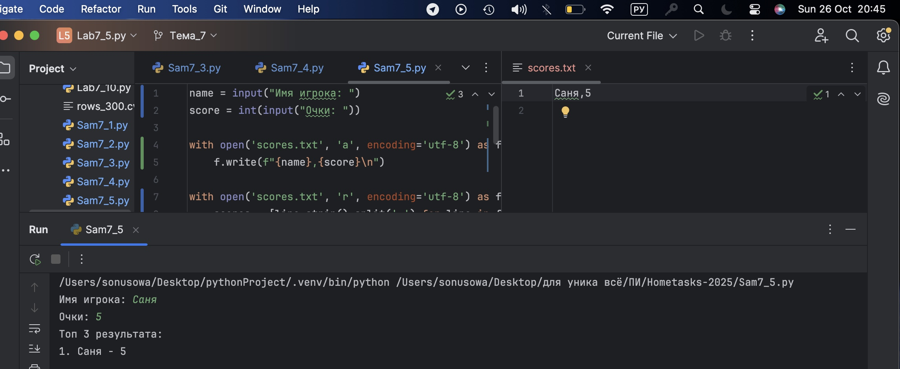
## Выводы

Рассматривается работа с множеством (set) для удаления повторов. Сортировка множества и затем срез на первые три значения позволяет получить топ-3 уникальных числа.
Возврат результата в кортеже удобен для передачи неизменяемого набора значений. 

## Общие выводы по теме
Все задачи демонстрируют практическое использование основ Python: словарей для хранения и поиска данных, функций с динамическим числом параметров, работу с последовательностями (кортежи и списки) и базовые проверки типов. Это фундаментальные навыки, необходимые для качественного программирования и разработки устойчивых приложений.


