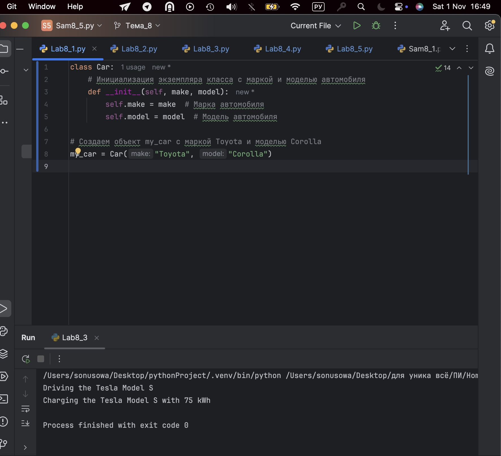
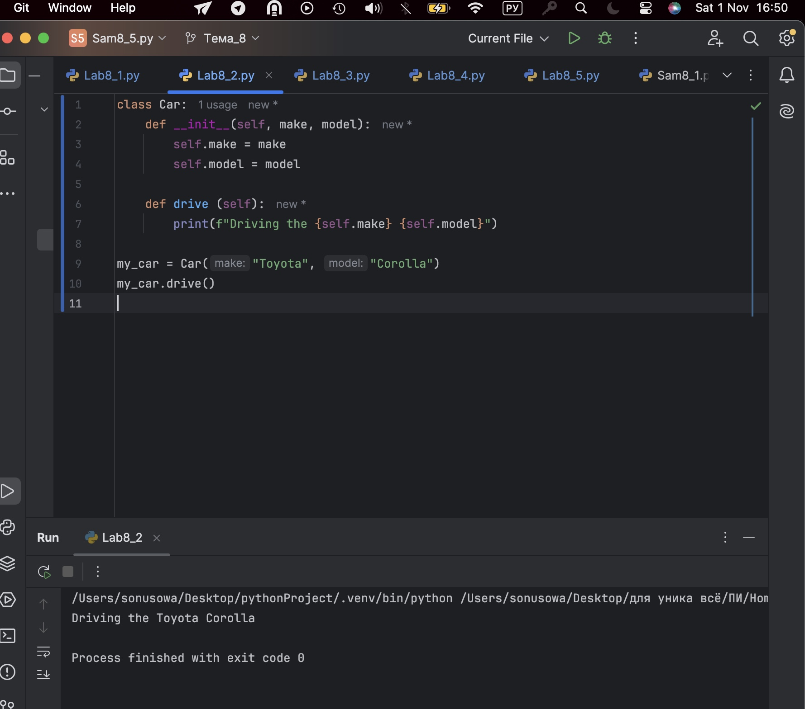
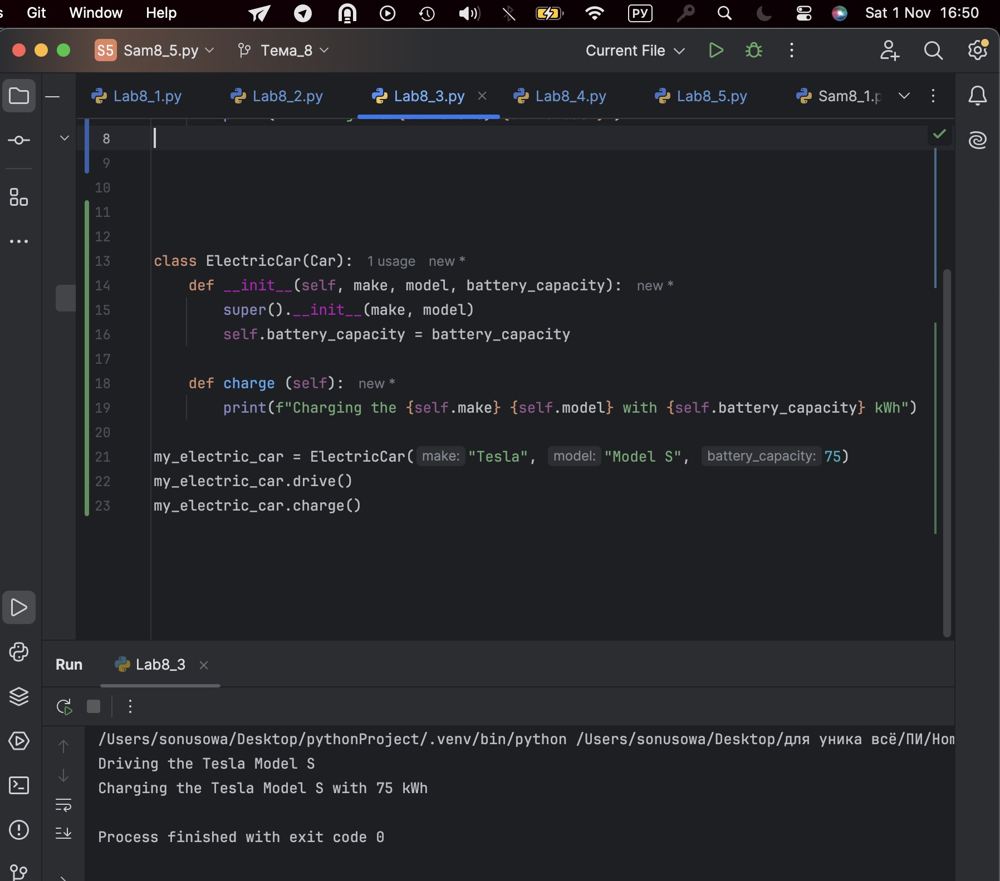
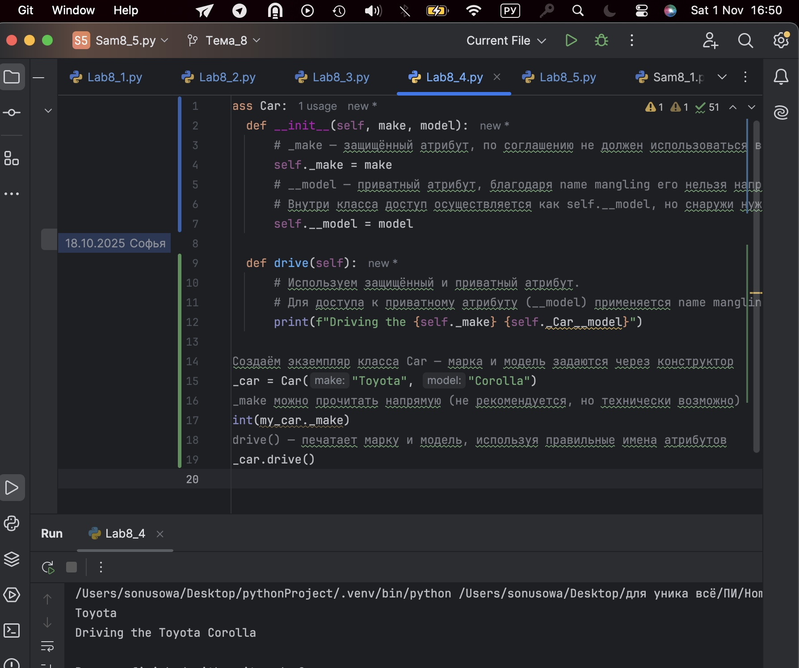
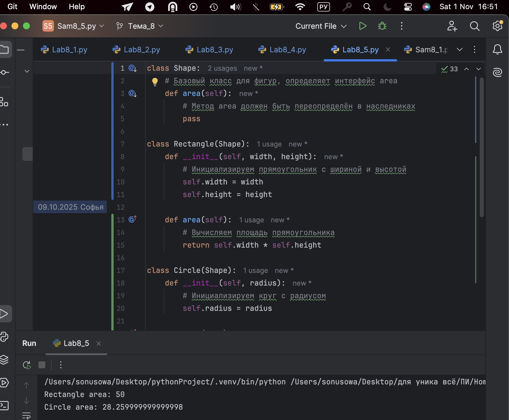
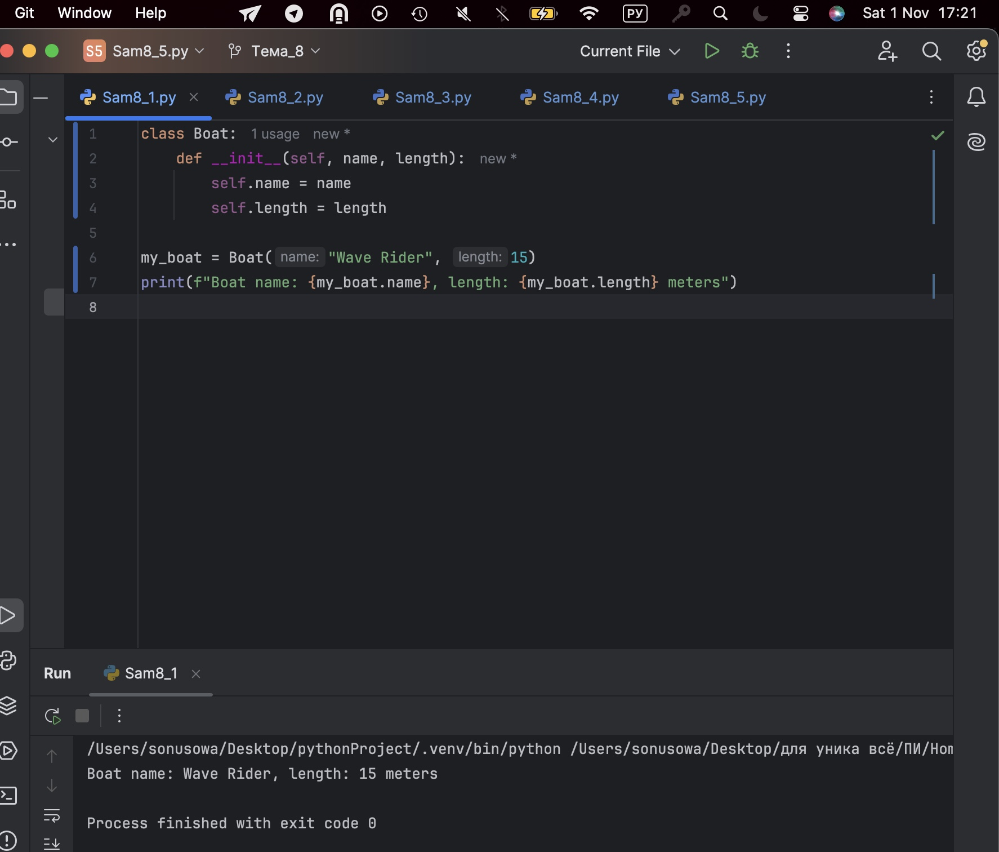
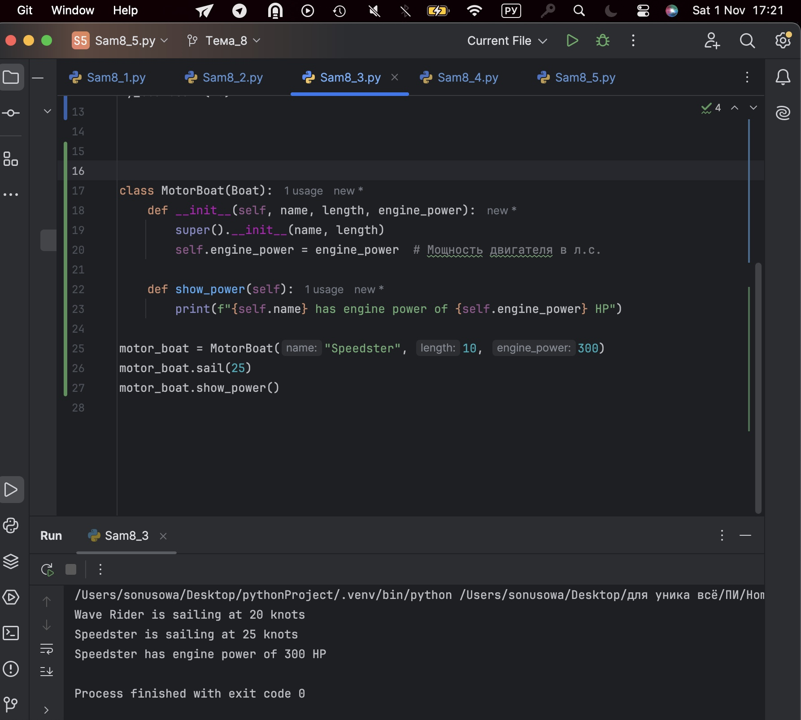
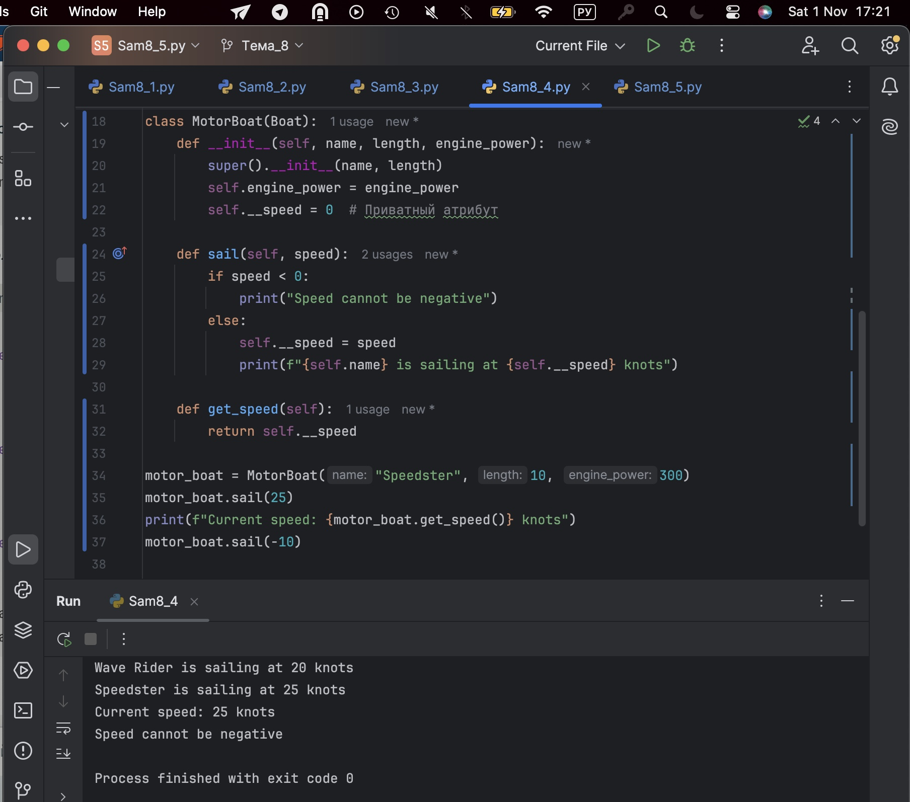
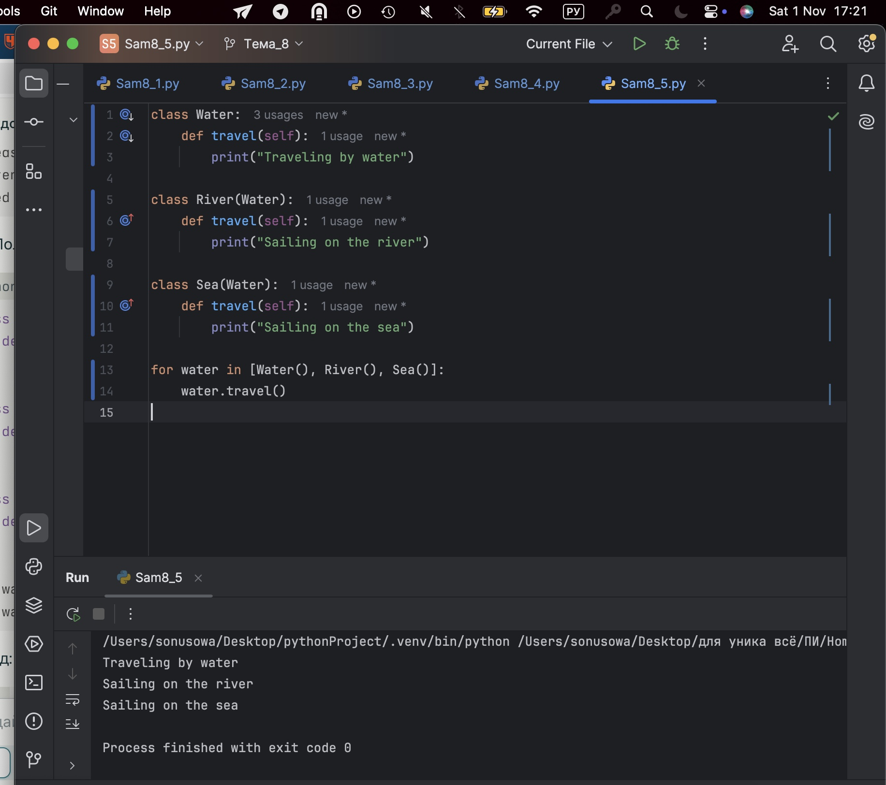

# Тема 8. Введение в ООП
Отчет по Теме #8 выполнил(а):
- Усова Софья Сергеевна
- ИВТ-23-2

| Задание | Лаб_раб | Сам_раб |
| ------ | ------ | ------ |
| Задание 1 | + | + |
| Задание 2 | + | + |
| Задание 3 | + | + |
| Задание 4 | + | + |
| Задание 5 | + | + |

## Лабораторная работа №1
### Создайте класс “Car” с атрибутами производитель и модель. Создайте объект этого класса. Напишите комментарии для кода, объясняющие его работу. Результатом выполнения задания будет листинг кода с комментариями.

```python
class Car:
    # Инициализация экземпляра класса с маркой и моделью автомобиля
    def __init__(self, make, model):
        self.make = make  # Марка автомобиля
        self.model = model  # Модель автомобиля

# Создаем объект my_car с маркой Toyota и моделью Corolla
my_car = Car("Toyota", "Corolla")
```
### Результат.


## Выводы

Реализовано чтение и добавление строк в текстовый файл с помощью методов file.write и file.readlines, что демонстрирует работу с файловыми потоками и позиционирование курсора в файле.

## Лабораторная работа №2
### Дополните код из первого задания, добавив в него атрибуты и методы класса, заставьте машину “поехать”. Напишите комментарии для кода, объясняющие его работу. Результатом выполнения задания будет листинг кода с комментариями и получившийся вывод в консоль.

```python
class Car:
    # Инициализация экземпляра класса с маркой и моделью автомобиля
    def __init__(self, make, model):
        self.make = make  # Марка автомобиля
        self.model = model  # Модель автомобиля

# Создаем объект my_car с маркой Toyota и моделью Corolla
my_car = Car("Toyota", "Corolla")
```
### Результат.

## Выводы

Показано базовое чтение первой строки из файла через open()/close(), что иллюстрирует ручное управление ресурсами и простейшие операции с файлами без контекстного менеджера.

## Лабораторная работа №3
### Создайте новый класс “ElectricCar” с методом “charge” и атрибутом емкость батареи. Реализуйте его наследование от класса, созданного в первом задании. Заставьте машину поехать, а потом заряжаться.

```python
class Car:
    def __init__(self, make, model):
        self.make = make
        self.model = model

    def drive (self):
        print(f"Driving the {self.make} {self.model}")

class ElectricCar(Car):
    def __init__(self, make, model, battery_capacity):
        super().__init__(make, model)
        self.battery_capacity = battery_capacity

    def charge (self):
        print(f"Charging the {self.make} {self.model} with {self.battery_capacity} kWh")

my_electric_car = ElectricCar("Tesla", "Model S", 75)
my_electric_car.drive()
my_electric_car.charge()
```
### Результат.

## Выводы

Использовала метод readlines() для получения всех строк файла в виде списка, что удобно для работы с текстом построчно и демонстрирует управление состоянием файла.
  
## Лабораторная работа №4
### Реализуйте инкапсуляцию для класса, созданного в первом задании. Создайте защищенный атрибут производителя и приватный атрибут модели. Вызовите защищенный атрибут и заставьте машину поехать. Напишите комментарии для кода, объясняющие его работу. Результатом выполнения задания будет листинг кода с комментариями и получившийся вывод в консоль.

```python
class Car:
    def __init__(self, make, model):
        # _make — защищённый атрибут, по соглашению не должен использоваться вне класса и его наследников
        self._make = make
        # __model — приватный атрибут, благодаря name mangling его нельзя напрямую получить или переопределить в наследниках
        # Внутри класса доступ осуществляется как self.__model, но снаружи нужно использовать self._Car__model
        self.__model = model

    def drive(self):
        # Используем защищённый и приватный атрибут.
        # Для доступа к приватному атрибуту (__model) применяется name mangling: self._Car__model
        print(f"Driving the {self._make} {self._Car__model}")

# Создаём экземпляр класса Car — марка и модель задаются через конструктор
my_car = Car("Toyota", "Corolla")
# _make можно прочитать напрямую (не рекомендуется, но технически возможно)
print(my_car._make)
# drive() — печатает марку и модель, используя правильные имена атрибутов
my_car.drive()
```
### Результат.

## Выводы

Продемонстрировано использование контекстного менеджера with open(), который автоматически управляет открытием и закрытием файла, повышая надежность кода и упрощая работу с файлами.

## Лабораторная работа №5
### Реализуйте полиморфизм создав основной (общий) класс “Shape”, а также еще два класса “Rectangle” и “Circle”. Внутри последних двух классов реализуйте методы для подсчета площади фигуры. После этого создайте массив с фигурами, поместите туда круг и прямоугольник, затем при помощи цикла выведите их площади. Напишите комментарии для кода, объясняющие его работу. Результатом выполнения задания будет листинг кода с комментариями и получившийся вывод в консоль.

```python
class Shape:
    # Базовый класс для фигур, определяет интерфейс area
    def area(self):
        # Метод area должен быть переопределён в наследниках
        pass

class Rectangle(Shape):
    def __init__(self, width, height):
        # Инициализируем прямоугольник с шириной и высотой
        self.width = width
        self.height = height

    def area(self):
        # Вычисляем площадь прямоугольника
        return self.width * self.height

class Circle(Shape):
    def __init__(self, radius):
        # Инициализируем круг с радиусом
        self.radius = radius

    def area(self):
        # Вычисляем площадь круга (приблизительно)
        return 3.14 * self.radius * self.radius

# Создание экземпляров прямоугольника и круга с задаными параметрами
rect = Rectangle(5, 10)
circle = Circle(3)

# Вывод площади фигуры
print("Rectangle area:", rect.area())
print("Circle area:", circle.area())
```
### Результат.

## Выводы

Повторяет добавление строк и чтение всего содержимого файла в список с помощью режима 'a+', позволяющего дописывать и читать файл без потери данных, что удобно при интерактивной работе с файлами.


## Самостоятельная работа №1
### Самостоятельно создайте класс и его объект. Они должны отличаться, от тех, что указаны в теоретическом материале (методичке) и лабораторных заданиях. Результатом выполнения задания будет листинг кода и получившийся вывод консоли.

```python
class Boat:
    def __init__(self, name, length):
        self.name = name
        self.length = length

my_boat = Boat("Wave Rider", 15)
print(f"Boat name: {my_boat.name}, length: {my_boat.length} meters")
```
### Результат.

## Выводы

В задаче по подсчету слов и самого частого слова использованы методы чтения файла, регулярные выражения для выделения слов и коллекция Counter для подсчета частоты.
  
## Самостоятельная работа №2
### Самостоятельно создайте атрибуты и методы для ранее созданного класса. Они должны отличаться, от тех, что указаны в теоретическом материале (методичке) и лабораторных заданиях. Результатом выполнения задания будет листинг кода и получившийся вывод консоли.

```python
class Boat:
    def __init__(self, name, length):
        self.name = name
        self.length = length
        self.speed = 0  # Скорость в узлах

    def sail(self, speed):
        self.speed = speed
        print(f"{self.name} is sailing at {self.speed} knots")

my_boat = Boat("Wave Rider", 15)
my_boat.sail(20)

```
### Результат.

## Выводы

Для ведения книги расходов реализован интерактивный ввод через консоль, запись данных в файл в формате CSV и вывод всех записей из файла.
  
## Самостоятельная работа №3
### Самостоятельно реализуйте наследование, продолжая работать с ранее созданным классом. Оно должно отличаться, от того, что указано в теоретическом материале (методичке) и лабораторных заданиях. Результатом выполнения задания будет листинг кода и получившийся вывод консоли.

```python
class MotorBoat(Boat):
    def __init__(self, name, length, engine_power):
        super().__init__(name, length)
        self.engine_power = engine_power  # Мощность двигателя в л.с.

    def show_power(self):
        print(f"{self.name} has engine power of {self.engine_power} HP")

motor_boat = MotorBoat("Speedster", 10, 300)
motor_boat.sail(25)
motor_boat.show_power()
```
### Результат.

## Выводы

В задаче подсчета латинских букв, слов и строк применены методы фильтрации символов, а также разбиение текста на слова и строки стандартными функциями.

## Самостоятельная работа №4
### Самостоятельно реализуйте инкапсуляцию, продолжая работать с ранее созданным классом. Она должна отличаться, от того, что указана в теоретическом материале (методичке) и лабораторных заданиях. Результатом выполнения задания будет листинг кода и получившийся вывод консоли.

```python

class MotorBoat(Boat):
    def __init__(self, name, length, engine_power):
        super().__init__(name, length)
        self.engine_power = engine_power
        self.__speed = 0  # Приватный атрибут

    def sail(self, speed):
        if speed < 0:
            print("Speed cannot be negative")
        else:
            self.__speed = speed
            print(f"{self.name} is sailing at {self.__speed} knots")

    def get_speed(self):
        return self.__speed

motor_boat = MotorBoat("Speedster", 10, 300)
motor_boat.sail(25)
print(f"Current speed: {motor_boat.get_speed()} knots")
motor_boat.sail(-10)
```
### Результат.

## Выводы

При реализации цензуры слов использовано чтение списка запрещенных слов из файла, формирование регулярного выражения и замена в тексте всех вхождений на звездочки.
  
## Самостоятельная работа №5
### Самостоятельно реализуйте полиморфизм. Он должен отличаться, от того, что указан в теоретическом материале (методичке) и лабораторных заданиях. Результатом выполнения задания будет листинг кода и получившийся вывод консоли.


```python
class Water:
    def travel(self):
        print("Traveling by water")

class River(Water):
    def travel(self):
        print("Sailing on the river")

class Sea(Water):
    def travel(self):
        print("Sailing on the sea")

for water in [Water(), River(), Sea()]:
    water.travel()
```
### Результат.

## Выводы

Задача с добавлением и сортировкой результатов игроков решила ввод данных, сохранение в файл, чтение с обработкой и вывод топ-3 по очкам.

## Общие выводы по теме
Задачи включают в себя: работа с файлами в кодировке UTF-8, регулярные выражения, стандартные строковые методы для разбиения и фильтрации, интерактивный ввод-вывод через консоль.
Все задачи направлены на освоение базовых операций с текстовыми файлами, анализ текста и взаимодействие пользователя с программой.


