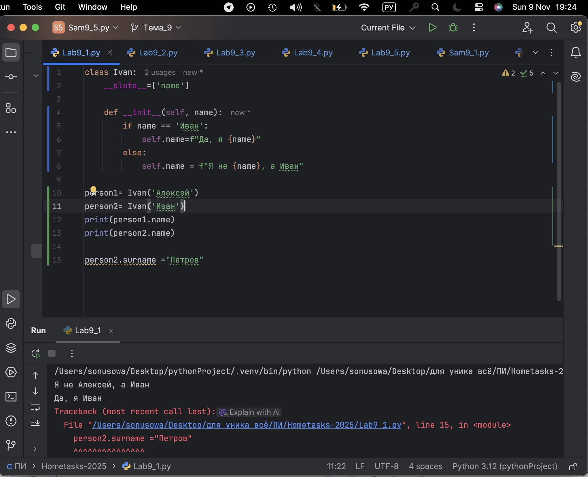
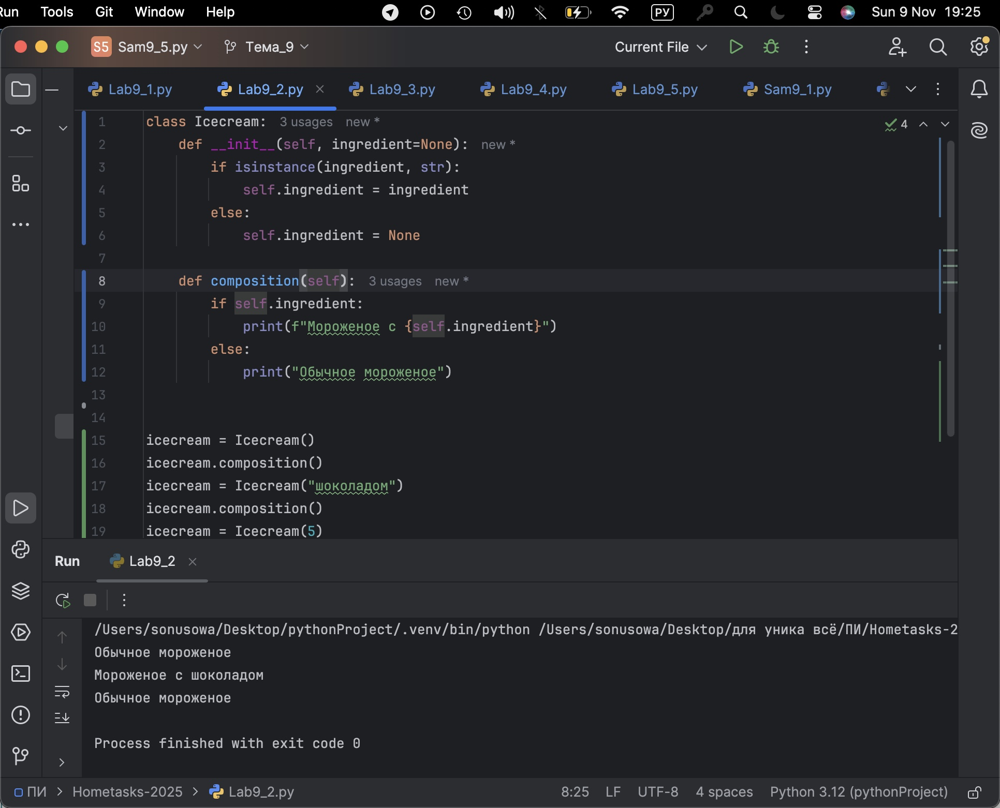
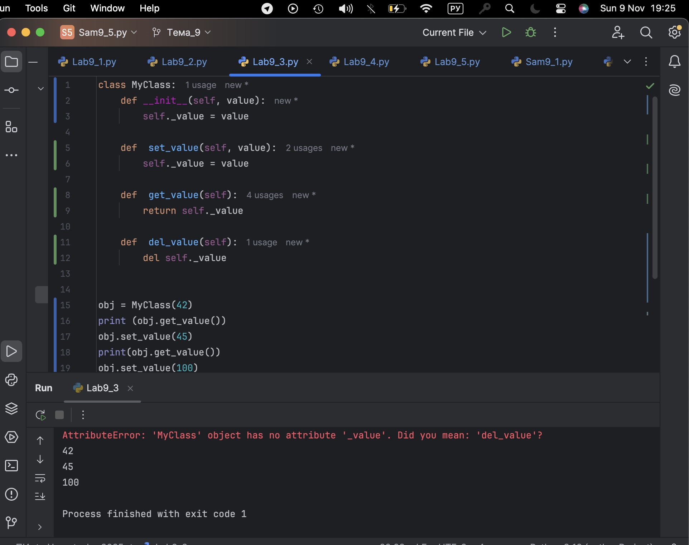
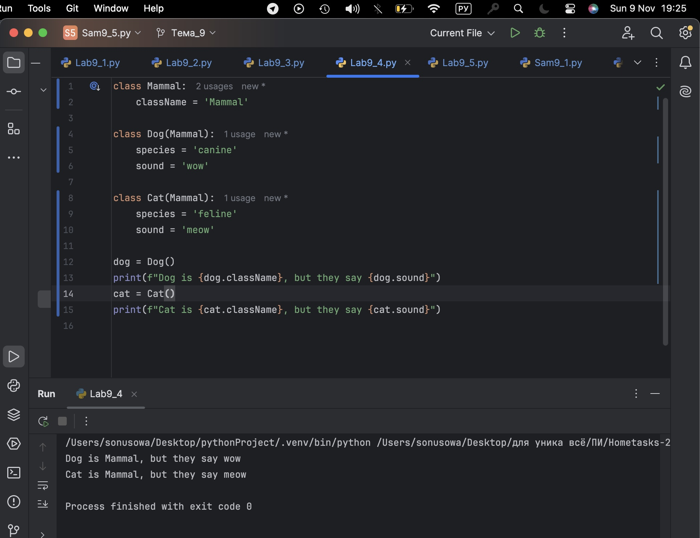
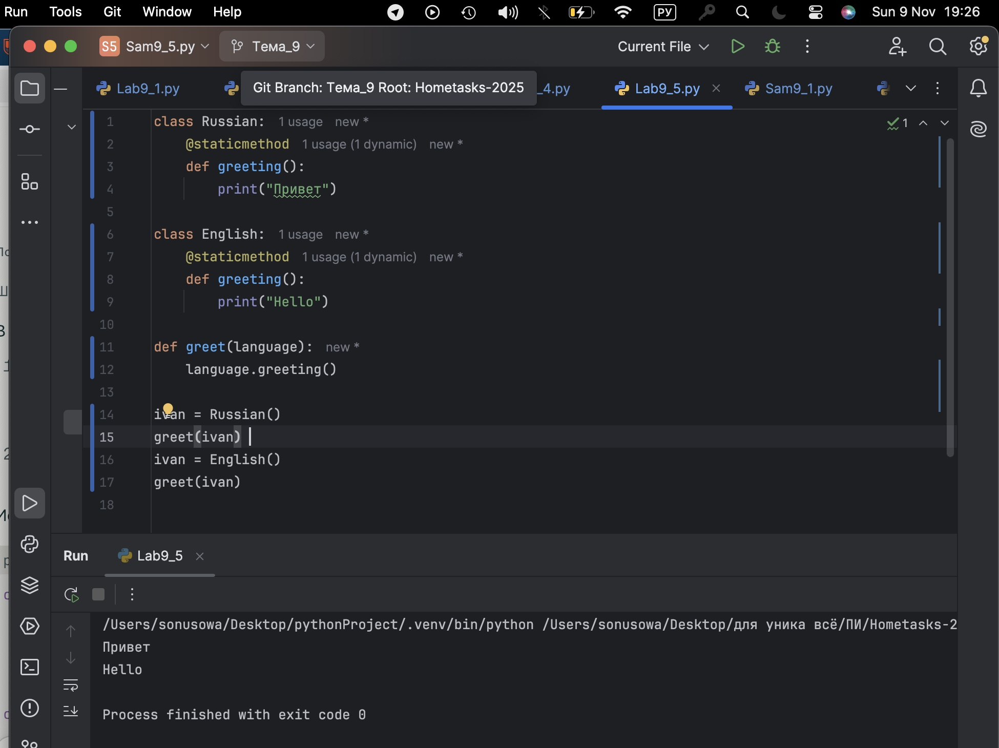
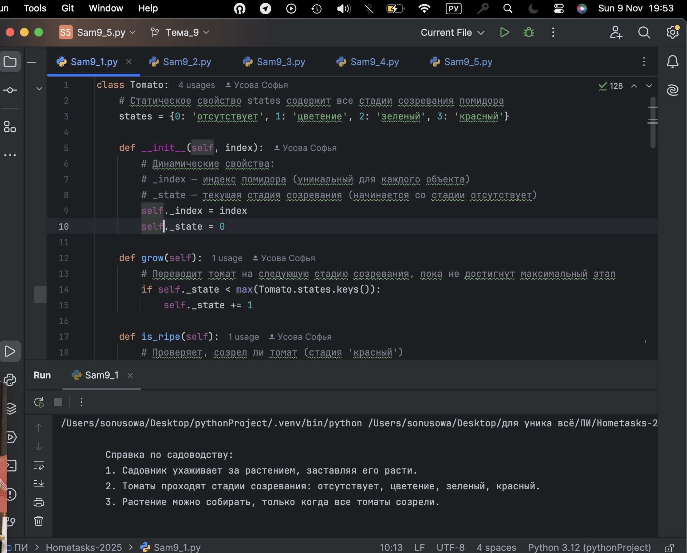
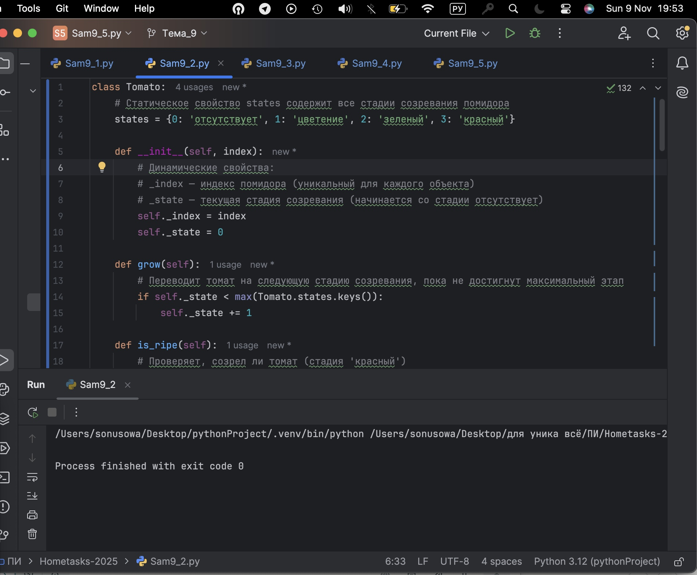
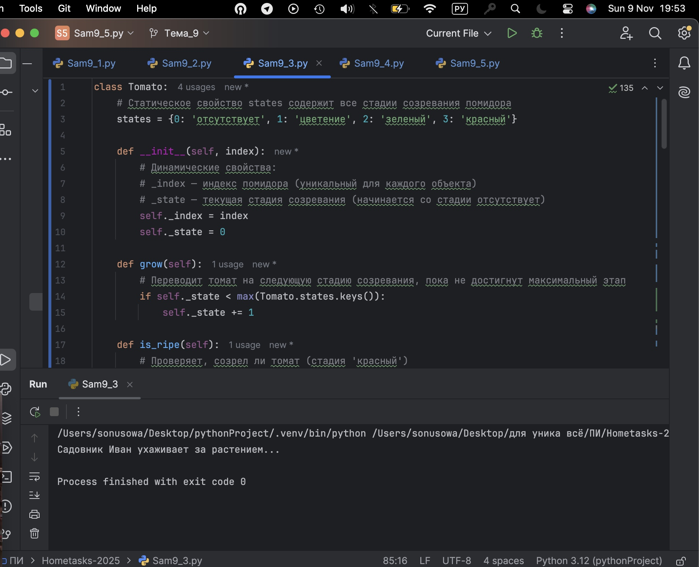
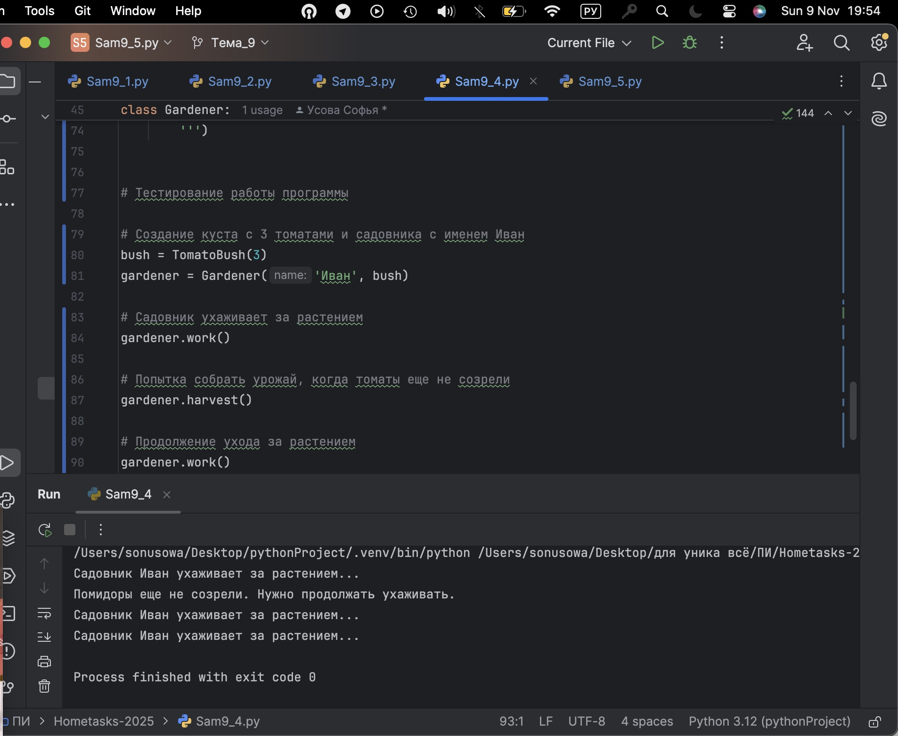
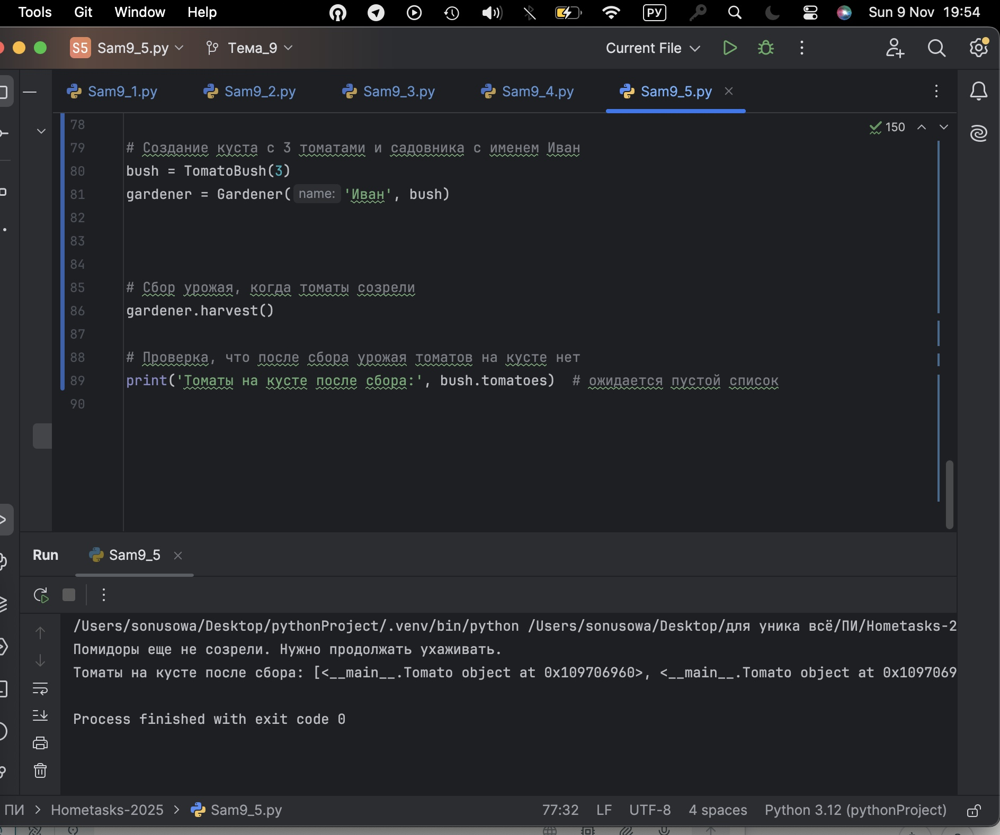

# Тема 9. Концепции и принципы ООП 
Отчет по Теме #9 выполнил(а):
- Усова Софья Сергеевна
- ИВТ-23-2

| Задание | Лаб_раб | Сам_раб |
| ------ | ------ | ------ |
| Задание 1 | + | + |
| Задание 2 | + | + |
| Задание 3 | + | + |
| Задание 4 | + | + |
| Задание 5 | + | + |

## Лабораторная работа №1
### Допустим, что вы решили оригинально и немного странно познакомится с человеком. Для этого у вас должен быть написан свой класс на Python, который будет проверять угадал ваше имя человек или нет. Для этого создайте класс, указав в свойствах только имя. Дальше создайте функцию  init (), а в ней сделайте проверку на то угадал человек ваше имя или нет. Также можете проверить что будет, если в этой функции указав атрибут, который не указан в вашем классе, например, попробуйте вызвать фамилию.

```python
class Ivan:
    __slots__=['name']

    def __init__(self, name):
        if name == 'Иван':
            self.name=f"Да, я {name}"
        else:
            self.name = f"Я не {name}, а Иван"

person1= Ivan('Алексей')
person2= Ivan('Иван')
print(person1.name)
print(person2.name)

person2.surname ="Петров"
```
### Результат.


## Выводы

Класс Car показывает, как объединять связанные данные (производитель и модель) внутри объектов, создавая основу для моделирования реальных сущностей в коде.

## Лабораторная работа №2
### Вам дали важное задание, написать продавцу мороженого программу, которая будет писать добавили ли топпинг в мороженое и цену после возможного изменения. Для этого вам нужно написать класс, в котором будет определяться изменили ли состав мороженого или нет. В этом классе  реализуйте  метод,  выводящий  на  печать  «Мороженое  с {ТОППИНГ}» в случае наличия добавки, а иначе отобразится следующая фраза: «Обычное мороженое». При этом программа должна воспринимать как топпинг только атрибуты типа string.

```python
class Icecream:
    def __init__(self, ingredient=None):
        if isinstance(ingredient, str):
            self.ingredient = ingredient
        else:
            self.ingredient = None

    def composition(self):
        if self.ingredient:
            print(f"Мороженое с {self.ingredient}")
        else:
            print("Обычное мороженое")


icecream = Icecream()
icecream.composition()
icecream = Icecream("шоколадом")
icecream.composition()
icecream = Icecream(5)
icecream.composition()
```
### Результат.

## Выводы

Добавление методов (например, заставить машину «поехать») расширяет возможности объекта, позволяя ему выполнять действия и изменять своё состояние.

## Лабораторная работа №3
### Петя – начинающий программист и на занятиях ему сказали реализовать икапсу…что-то. А вы хороший друг Пети и ко всему прочему прекрасно знаете, что икапсу…что-то – это инкапсуляция, поэтому решаете помочь вашему другу с написанием класса с инкапсуляцией. Ваш класс будет не просто инкапсуляцией, а классом с сеттером, геттером и деструктором. После написания класса вам необходимо продемонстрировать что все написанные вами функции работают. Также вас необходимо объяснить Пете почему на скриншоте ниже в консоли выводится ошибка.

```python
class MyClass:
    def __init__(self, value):
        self._value = value

    def  set_value(self, value):
        self._value = value

    def  get_value(self):
        return self._value

    def  del_value(self):
        del self._value


obj = MyClass(42)
print (obj.get_value())
obj.set_value(45)
print(obj.get_value())
obj.set_value(100)
print(obj.get_value())
obj.del_value()
print(obj.get_value())
```
### Результат.

## Выводы

Наследование позволяет создавать специализированные классы (ElectricCar) на базе общего (Car), переиспользуя и расширяя функционал без дублирования кода.

  
## Лабораторная работа №4
### Вам прекрасно известно, что кошки и собаки являются млекопитающими, но компьютер этого не понимает, поэтому вам нужно написать три класса: Кошки, Собаки, Млекопитающие. И при помощи “наследования” объяснить компьютеру что кошки и собаки – это млекопитающие. Также добавьте какой-нибудь свой атрибут для кошек и собак, чтобы показать, что они чем-то отличаются друг от друга.

```python
class Mammal:
    className = 'Mammal'

class Dog(Mammal):
    species = 'canine'
    sound = 'wow'

class Cat(Mammal):
    species = 'feline'
    sound = 'meow'

dog = Dog()
print(f"Dog is {dog.className}, but they say {dog.sound}")
cat = Cat()
print(f"Cat is {cat.className}, but they say {cat.sound}")
```
### Результат.

## Выводы

Инкапсуляция с помощью защищённых и приватных атрибутов ограничивает доступ к данным объекта, обеспечивая защиту и контроль над их модификацией.

## Лабораторная работа №5
### На разных языках здороваются по-разному, но суть остается одинаковой, люди друг с другом здороваются. Давайте вместе с вами реализуем программу с полиморфизмом, которая будет описывать всю суть первого предложения задачи. Для этого мы можем выбрать два языка, например, русский и английский и написать для них отдельные классы, в которых будет в виде атрибута слово, которым здороваются на этих языках. А также напишем функцию, которая будет выводить информацию о том, как на этих языках здороваются. Заметьте, что для решения поставленной задачи мы использовали декоратор @staticmethod, поскольку нам не нужны обязательные параметры-ссылки вроде self.

```python
class Russian:
    @staticmethod
    def greeting():
        print("Привет")

class English:
    @staticmethod
    def greeting():
        print("Hello")

def greet(language):
    language.greeting()

ivan = Russian()
greet(ivan)
ivan = English()
greet(ivan)
```
### Результат.

## Выводы

Полиморфизм через общий интерфейс (метод area) позволяет разным классам (Rectangle, Circle) реализовывать свою версию поведения, обеспечивая гибкость и расширяемость кода.

## Самостоятельная работа №1
### Вызовите справку по садоводству

```python
class Boat:
    def __init__(self, name, length):
        self.name = name
        self.length = length

my_boat = Boat("Wave Rider", 15)
print(f"Boat name: {my_boat.name}, length: {my_boat.length} meters")
```
### Результат.

## Выводы

Конструктор init инициализирует атрибуты объекта, а экземпляры класса создаются путем вызова класса как функции. Без методов класс - просто контейнер данных. Вместе с методами объект приобретает поведение.
  
## Самостоятельная работа №2
### Создайте объекты классов TomatoBush и Gardener

```python
class Boat:
    def __init__(self, name, length):
        self.name = name
        self.length = length
        self.speed = 0  # Скорость в узлах

    def sail(self, speed):
        self.speed = speed
        print(f"{self.name} is sailing at {self.speed} knots")

my_boat = Boat("Wave Rider", 15)
my_boat.sail(20)

```
### Результат.

## Выводы

Методы служат для реализации поведения объектов и взаимодействия с их состоянием (атрибутами). Можно добавлять новые методы, изменять атрибуты объекта в процессе работы. Методы делают класс динамичным, управляемым.
  
## Самостоятельная работа №3
### Используя объект класса Gardener, поухаживайте за кустом с помидорами

```python
class MotorBoat(Boat):
    def __init__(self, name, length, engine_power):
        super().__init__(name, length)
        self.engine_power = engine_power  # Мощность двигателя в л.с.

    def show_power(self):
        print(f"{self.name} has engine power of {self.engine_power} HP")

motor_boat = MotorBoat("Speedster", 10, 300)
motor_boat.sail(25)
motor_boat.show_power()
```
### Результат.

## Выводы

Класс-наследник расширяет/переопределяет поведение базового класса. Позволяет переиспользовать код и создавать иерархии с общими чертами. Вызов super() обеспечивает корректную инициализацию.

## Самостоятельная работа №4
### Попробуйте собрать урожай, когда томаты еще не дозрели. Продолжайте ухаживать за ними

```python

class MotorBoat(Boat):
    def __init__(self, name, length, engine_power):
        super().__init__(name, length)
        self.engine_power = engine_power
        self.__speed = 0  # Приватный атрибут

    def sail(self, speed):
        if speed < 0:
            print("Speed cannot be negative")
        else:
            self.__speed = speed
            print(f"{self.name} is sailing at {self.__speed} knots")

    def get_speed(self):
        return self.__speed

motor_boat = MotorBoat("Speedster", 10, 300)
motor_boat.sail(25)
print(f"Current speed: {motor_boat.get_speed()} knots")
motor_boat.sail(-10)
```
### Результат.

## Выводы

Инкапсуляция скрывает внутреннее состояние объекта, защищая данные через приватные атрибуты (с двойным подчеркиванием) и методы доступа (геттеры/сеттеры). Это поддерживает инварианты и безопасность данных.
  
## Самостоятельная работа №5
### Соберите урожай

```python
class Water:
    def travel(self):
        print("Traveling by water")

class River(Water):
    def travel(self):
        print("Sailing on the river")

class Sea(Water):
    def travel(self):
        print("Sailing on the sea")

for water in [Water(), River(), Sea()]:
    water.travel()
```
### Результат.

## Выводы

Разные классы реализуют одинаковые методы с разным поведением. Это позволяет работать с разными объектами с общим интерфейсом, упрощая код и расширяя гибкость. Классический пример — один и тот же метод area() у разных фигур.

## Общие выводы по теме
Главное в ООП — четыре ключевых принципа: абстракция, инкапсуляция, наследование и полиморфизм. Абстракция позволяет выделить наиболее важные характеристики и скрыть детали реализации, показывая только нужный функционал. Инкапсуляция защищает внутреннее состояние объекта, предоставляя ограниченный и контролируемый доступ через методы, что повышает безопасность и стабильность программы. Наследование помогает создавать новые классы на базе существующих, переиспользуя код и расширяя функциональность без дублирования. Полиморфизм обеспечивает работу с объектами разных классов через единый интерфейс, что увеличивает гибкость и упрощает сопровождение. Совместное применение этих принципов позволяет создавать понятный, масштабируемый и поддерживаемый код, который моделирует реальные процессы и системы более естественным и эффективным образом. Этот подход стал основой для разработки сложных программных систем и широко используется в современных языках программирования.


